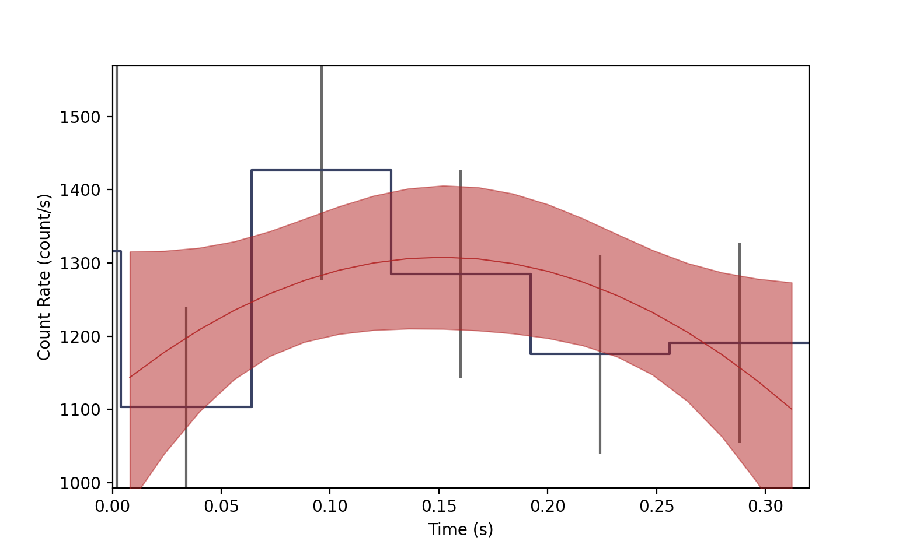

.. _background_fitter:
.. |BackgroundFitter| replace:: :class:`~gdt.core.background.fitter.BackgroundFitter`
.. |BackgroundRates| replace:: :class:`~gdt.core.background.primitives.BackgroundRates`
.. |Polynomial| replace:: :class:`~gdt.core.background.binned.Polynomial`
.. |NaivePoisson| replace:: :class:`~gdt.core.background.unbinned.NaivePoisson`
.. |unbinned| replace:: :ref:`unbinned<background_unbinned_plugins>`
.. |binned| replace:: :ref:`binned<background_binned_plugins>`
.. |phaii| replace:: :ref:`Phaii example<core-phaii>`
.. |tte| replace:: :ref:`PhotonList example<core-tte>`
.. |Phaii| replace:: :class:`~gdt.core.phaii.Phaii`
.. |Lightcurve| replace:: :class:`~gdt.core.plot.lightcurve.Lightcurve`
.. |plot-lightcurve| replace:: :ref:`Plotting Lightcurves<plot-lightcurve>`

**********************************************************
The Background Fitter (:mod:`~gdt.core.background.fitter`)
**********************************************************

Introduction
============
The |BackgroundFitter| class is an interface to binned and unbinned background
fitting/estimation algorithms.  Along with |Polynomial| and |NaivePoisson|, any
fitting algorithm can be designed to be used with this interface by following
the instructions for designing the classes for |binned| and |unbinned| data.

Examples
========
The first example is to fit a polynomial to some binned data.  We can create
and example |Phaii| object (see the |phaii| for more details):

    >>> from gdt.core.data_primitives import TimeEnergyBins, Gti
    >>> from gdt.core.phaii import Phaii
    >>>
    >>> counts = [[ 0,  0,  2,  1,  2,  0,  0,  0],
    >>>           [ 3, 16, 10, 13, 14,  4,  3,  3],
    >>>           [ 3, 23, 26, 13,  8,  8,  5,  5],
    >>>           [ 4, 21, 19, 16, 13,  2,  3,  4],
    >>>           [ 4, 20, 17, 11, 15,  2,  1,  5],
    >>>           [ 6, 20, 19, 11, 11,  1,  4,  4]]
    >>>
    >>> tstart = [0.0000, 0.0039, 0.0640, 0.1280, 0.1920, 0.2560]          
    >>> tstop = [0.0039, 0.0640, 0.1280, 0.1920, 0.2560, 0.320]
    >>> exposure = [0.0038, 0.0598, 0.0638, 0.0638, 0.0638, 0.0638]
    >>> emin = [4.323754, 11.464164, 26.22962, 49.60019, 101.016815,
    >>>         290.46063, 538.1436, 997.2431]
    >>> emax = [11.464164, 26.22962, 49.60019, 101.016815, 290.46063,
    >>>         538.1436, 997.2431, 2000.]
    >>>
    >>> data = TimeEnergyBins(counts, tstart, tstop, exposure, emin, emax)
    >>> gti = Gti.from_list([(0.0000, 0.320)])
    >>> phaii = Phaii.from_data(data, gti=gti, trigger_time=356223561.133346)

Now that we have some data, we can create the background fitter in the following
way:

    >>> from gdt.core.background.fitter import BackgroundFitter
    >>> from gdt.core.background.binned import Polynomial
    >>> fitter = BackgroundFitter.from_phaii(phaii, Polynomial)
    
This initializes the fitter and tells it that we are fitting binned data with
the Polynomial algorithm.  We then do the fit by passing any required 
algorithm-specific parameters:

    >>> fitter.fit(order=1)

Here we are fitting a first-order polynomial. The fitting statistic and 
degrees-of-freedom of the fit can be retrieved:

    >>> fitter.statistic
    array([0.30476203, 0.94114281, 7.21404506, 0.9132082 , 4.56229056,
           3.42242964, 2.64862129, 0.51647908])
    >>> fitter.dof
    array([3., 3., 4., 4., 4., 3., 3., 3.])

Other properties can be retrieve (if defined), such as the fit statistic that
is being used and any parameters passed to the fitter:

    >>> fitter.statistic_name
    'chisq'
    >>> fitter.parameters
    {'order': 1}

If you're not happy with the fit, you can refit with different parameters. For
example, we can fit a second order polynomial instead:

    >>> fitter.fit(order=2)

Most importantly, you can interpolate the background model at any point:

    >>> import numpy as np
    >>> time_interp = np.linspace(0.0, 0.320, 21)
    >>> back_rates = fitter.interpolate_bins(time_interp[:-1], time_interp[1:])
    >>> back_rates
    <BackgroundRates: 10 time bins;
     time range (0.0, 0.256);
     1 time segments;
     8 energy bins;
     energy range (4.323754, 2000.0);
     1 energy segments>

We define new time bin edges we want to interpolate over and it returns a
|BackgroundRates| object containing the model background rates and uncertainty
in each energy channel for each requested time bin.  We can visually show this
by creating a |Lightcurve| plot and adding the background to it (see 
|plot-lightcurve| for details):

    >>> import matplotlib.pyplot as plt
    >>> from gdt.core.plot.lightcurve import Lightcurve
    >>> lcplot = Lightcurve(data=phaii.to_lightcurve(), 
    >>>                     background=back_rates.integrate_energy())
    >>> plt.show()

The blue bins are our lightcurve data with errorbars, and the background model
is the red band, representing the 1-sigma uncertainty, and the model median line.

We can use BackgroundFitter in the same way to fit unbinned data.  For example, 
let's create some TTE data (see the |tte| for more details):

    >>> from gdt.core.data_primitives import EventList, Ebounds, Gti
    >>> # simulated Poisson rate of 1 count/sec
    >>> times = np.random.exponential(1.0, size=100).cumsum()
    >>> # random channel numbers
    >>> channels = np.random.randint(0, 6, size=100)
    >>> # channel-to-energy mapping
    >>> ebounds = Ebounds.from_bounds([10.0, 20.0, 40.0, 80.0, 160.0, 320.0], 
    >>>                               [20.0, 40.0, 80.0, 160.0, 320.0, 640.0])
    >>> data = EventList(times, channels, ebounds=ebounds)

    >>> # construct the good time interval(s)
    >>> gti = Gti.from_list([(0.0000, 100.0)])

    >>> # create the PhotonList object
    >>> from gdt.core.tte import PhotonList
    >>> tte = PhotonList.from_data(data, gti=gti, trigger_time=356223561.,
    >>>                            event_deadtime=0.001, overflow_deadtime=0.1)

Now, since we have TTE data, we can create our fitter this way:

    >>> from gdt.core.background.unbinned import NaivePoisson
    >>> fitter = BackgroundFitter.from_tte(tte, NaivePoisson)

And we can fit with the relevant algorithm parameters

    >>> fitter.fit(window_width=10.0, fast=True)

Reference/API
=============

.. automodapi:: gdt.core.background.fitter
   :inherited-members:

