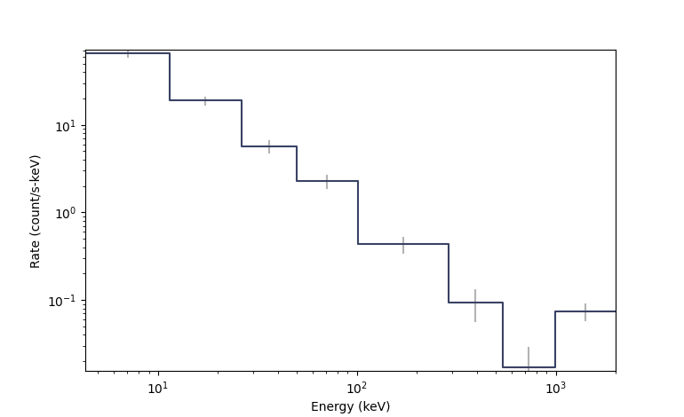

.. _core-pha:
.. |Bak| replace:: :class:`~gdt.core.pha.Bak`
.. |Pha| replace:: :class:`~gdt.core.pha.Pha`
.. |Pha.from_data()| replace:: :meth:`~gdt.core.pha.Pha.from_data`
.. |Pha.rebin_energy()| replace:: :meth:`~gdt.core.pha.Pha.rebin_energy`
.. |Pha.open()| replace:: :meth:`~gdt.core.pha.Pha.open`
.. |Pha._build_headers()| replace:: :meth:`~gdt.core.pha.Pha._build_headers`
.. |Pha._build_hdulist()| replace:: :meth:`~gdt.core.pha.Pha._build_hdulist`
.. |EnergyBins| replace:: :class:`~gdt.core.data_primitives.EnergyBins`
.. |Gti| replace:: :class:`~gdt.core.data_primitives.Gti`
.. |Ebounds| replace:: :class:`~gdt.core.data_primitives.Ebounds`
.. |BackgroundSpectrum| replace:: :class:`~gdt.core.background.primitives.BackgroundSpectrum`
.. |Spectrum| replace:: :class:`~gdt.core.plot.spectrum.Spectrum`
.. |plot-spectrum| replace:: :ref:`Plotting Count Spectra<plot-spectrum>`

********************************************************
PHA (Pulse Height Amplitude) Files (:mod:`gdt.core.pha`)
********************************************************

Introduction
============
Gamma-ray spectra are typically recorded in Pulse Height Amplitude (PHA) files.
To measure the energy spectrum, gamma-ray instruments record an electronic pulse
whose amplitude is proportional to the energy deposited in the active detector.
This pulse is digitized and the amplitude is assigned a "channel" number 
associating it with a recorded energy (or more precisely a recorded energy 
range).  Thus the PHA files record the number of counts in each PHA channel
observed over some exposure.  The count spectrum contained within a PHA file
is not an intrinsic energy spectrum, since the energy deposited in the active
detector for a given photon may not be the full energy of the photon, and the
active detector, such as a scintillator, often has a non-linear energy response.
Therefore, for spectroscopy, a PHA file should be used with a detector response.

The Pha Class
=============
The |Pha| class provides a way to construct, write out, and read standard
PHA files. There are also some functions provided to operate on PHA data. The
Pha base class can be directly used for most standard applications, but you can
also subclass Pha if you wish to read nonstandard files or keep track of/write
additional metadata to PHA files.

Examples
--------
First, we will show how to construct a |Pha| object from a count spectrum.  
The data within a Pha object is an |EnergyBins|, so we will define that.
Additionally, we can define a |Gti|, which is one or multiple Good Time 
Intervals over which the data was integrated to produce the count spectrum.

    >>> from gdt.core.data_primitives import EnergyBins, Gti
    >>> from gdt.core.pha import Pha
    >>> # construct the count spectrum
    >>> counts = [119, 71, 34, 30, 21, 6, 2, 19]
    >>> emin = [4.32, 11.5, 26.2, 49.6, 101., 290., 539., 997.]
    >>> emax = [11.5, 26.2, 49.6, 101., 290., 539., 997., 2000.]
    >>> exposure = 0.255
    >>> data = EnergyBins(counts, emin, emax, exposure)

    >>> # construct the good time interval(s)
    >>> gti = Gti.from_list([(5.0, 5.256)])

    >>> # create the PHA object
    >>> pha = Pha.from_data(data, gti=gti, trigger_time=356223561.)
    >>> pha
    <Pha: 
    trigger time: 356223561.0;
    time range (5.0, 5.256);
    energy range (4.32, 2000.0)>

Setting the GTI is not required, and omitting the GTI will cause a default GTI
to be created with a range (0, ``exposure``).  Also note that we set a trigger
time (also optional), that is used as a time reference for the times in the GTI.

We can visually display the count spectrum stored in the PHA by creating a 
|Spectrum| plot and adding the background to it (see |plot-spectrum| for 
details):

    >>> import matplotlib.pyplot as plt
    >>> from gdt.core.plot.spectrum import Spectrum
    >>> specplot = Spectrum(data=pha.data)
    >>> plt.show()

Now that we have created our Pha object, there are several attributes that are
available to us.  We can directly access the data and GTI we created the object
with, as well as the |Ebounds| object that was constructed upon initialization:
  
    >>> # the PHA data
    >>> pha.data
    <EnergyBins: 8 bins;
    range (4.32, 2000.0);
    1 contiguous segments>
    >>> # the GTI
    >>> pha.gti
    <Gti: 1 intervals; range (5.0, 5.256)>
    >>> # the Ebounds
    >>> pha.ebounds
    <Ebounds: 8 intervals; range (4.32, 2000.0)>
  
There are other attributes that are exposed:
    
    >>> # energy range
    >>> pha.energy_range
    (4.32, 2000.0)
    # the exposure
    >>> pha.exposure
    0.255
    >>> # number of energy channels
    >>> pha.num_chans
    8
    >>> # time range covered by spectrum
    >>> pha.time_range
    (5.0, 5.256)
    >>> # trigger time (if available)
    >>> pha.trigtime
    356223561.0
    >>> # valid channels for spectroscopy
    >>> pha.valid_channels
    array([0, 1, 2, 3, 4, 5, 6, 7])
    >>> # channel mask for valid channels
    >>> pha.channel_mask
    array([ True,  True,  True,  True,  True,  True,  True,  True])
  
The last two attributes are particularly important for spectroscopy, since they
allow the PHA object to track which channels are "valid" or are to be used
for spectral fitting. By default, all channels with non-zero counts are marked
as valid, however we can specify the valid channels on creation by 
assigning a Boolean mask to the ``channel_mask`` keyword argument (see the
|Pha.from_data()| method for more details).

In addition to these attributes, a Pha can be rebinned. For example, we will
rebin our Pha object by a factor of two:

    >>> from gdt.core.binning.binned import combine_by_factor
    >>> rebinned_pha = pha.rebin_energy(combine_by_factor, 2)
    >>> rebinned_pha.num_chans
    4

In this example, we pass the |Pha.rebin_energy()| method the binning function
we want to use along with any parameters required by the binning function (in
this case, the ``2`` will combine bins together by a factor of 2).

You can also slice the Pha object to an energy range or multiple energy ranges:

    >>> sliced_pha = pha.slice_energy((50.0, 300.0))
    >>> sliced_pha.data
    <EnergyBins: 3 bins;
    range (49.6, 539.0);
    1 contiguous segments>

    >>> sliced_pha = pha.slice_energy([(25.0, 50.0), (300.0, 500.0)])
    <EnergyBins: 4 bins;
    range (11.5, 539.0);
    2 contiguous segments>

In the first case, we slice to a single continuous energy range defined by a 
tuple of energies, and in the second case, we slice to two disjoint energy 
ranges, defined as a list of tuples.  Note that the resulting sliced energy 
edges are dependent on the energy edges of the original object, since they 
cannot be changed.

Finally, the Pha object can be written to a fully qualified PHA file following
the standard FITS format.  Before doing so, it should be noted that there is
one more attribute that can be accessed that is important to the resulting 
file to be written.  The file headers:

    >>> pha.headers.keys()
    ['PRIMARY', 'EBOUNDS', 'SPECTRUM', 'GTI']
    >>> pha.headers['PRIMARY']
    CREATOR = 'Gamma-ray Data Tools 1.1.0' / Software and version creating file     
    DATE    = '2022-05-01T15:20:32' / file creation date (YYYY-MM-DDThh:mm:ss UT)   
    TSTART  =                  5.0 / Observation start time                         
    TSTOP   =                5.256 / Observation stop time                          
    TRIGTIME=          356223561.0 / Trigger time                                   
    FILENAME=  / Name of this file

You can access any of the header information as above, and you can even set 
information such as the corresponding response file name to use with this PHA 
file:

    >>> pha.headers['SPECTRUM']['RESPFILE'] = 'my_response_file.rsp'

Note that information such as the exposure, start and stop times, and the
number of energy channels are already auto-populated upon creation (and are
updated if you rebin or slice the Pha).  You should not change these values, 
but you can fill in the other fields as needed.

Once you fill in the necessary header information, you can write the file out
by:

    >>> pha.write('my_dir', filename='my_filename.pha')

where ``my_dir`` is the directory you are writing the file to, and 
``my_filename.pha`` is the name of the file if you did not define it upon 
initialization.

While this example showed how you can create a Pha object from data "manually,"
often you will not need to do this since these objects are usually a reduced
product from other data types or are read from a PHA file on disk.  Regarding
the latter, we can read the file we just wrote to disk with the following:

    >>> pha = Pha.open('my_dir/my_filename.pha')
    >>> pha
    <Pha: my_filename.pha
    trigger time: 356223561.0;
    time range (5.0, 5.256);
    energy range (4.32, 2000.0)>

As mentioned previously, if your needs only require the basic standard 
PHA data formatting and metadata, then you can use the |Pha| class directly.
If your data have extra metadata that need to be saved to the headers or are in
a non-standard format, you can subclass Pha by writing a new |Pha.open()| method
and additionally a new |Pha._build_headers()| private method and a possibly even
a |Pha._build_hdulist()| private method. 

The Bak Class
=============
Similar to the |Pha| class, the |Bak| class contains a single spectrum which
is intended to be a background spectrum.  Traditionally, a PHA file will contain
the total observed spectrum, and the BAK file will contain some background 
model spectrum that can then be used for background subtraction of the observed
spectrum or a coherent analysis with the observed spectrum and background 
spectrum.  Since the data contained within the BAK file is very similar to that
contained within the PHA file, the Bak class inherits directly from the Pha 
class and has all of the same relevant attributes and methods.

Examples
--------
Most often a Bak object will be created by reading from a file, but one can 
be created manually given a few inputs: the data contained in a 
|BackgroundSpectrum| object, and optionally a GTI and other inputs.

    >>> from gdt.core.background.primitives import BackgroundSpectrum
    >>> from gdt.core.data_primitives import Gti
    >>> from gdt.core.pha import Bak
    >>> # construct the background model rate and uncertainty
    >>> rates = [467.40, 278.87, 133.54, 117.83, 82.48, 23.57, 7.86, 75.63]
    >>> uncert = [23.37, 13.94, 6.68, 5.89, 4.12, 1.18, 0.39, 3.73]
    >>> emin = [4.32, 11.5, 26.2, 49.6, 101., 290., 538., 997.]
    >>> emax = [11.5, 26.2, 49.6, 101., 290., 538., 997., 2000.]
    >>> exposure = 2.021
    >>> data = BackgroundSpectrum(rates, uncert, emin, emax, exposure)

    >>> # construct the good time interval(s)
    >>> gti = Gti.from_list([(5.0, 7.048)])

    >>> # create the Bak object
    >>> bak = Bak.from_data(data, gti=gti, trigger_time=356223561.)
    >>> bak
    <Bak: 
     trigger time: 356223561.0;
     time range (5.0, 7.048);
     energy range (4.32, 2000.0)>

      

Reference/API
=============
.. automodapi:: gdt.core.pha
   :inherited-members:

Special Methods
===============
.. automethod:: gdt.core.pha.Pha._build_hdulist 
.. automethod:: gdt.core.pha.Pha._build_headers

