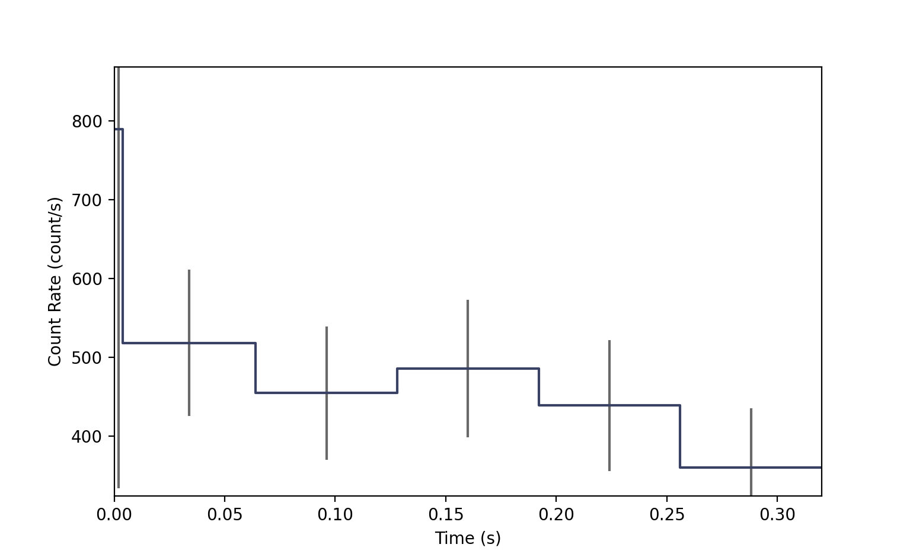
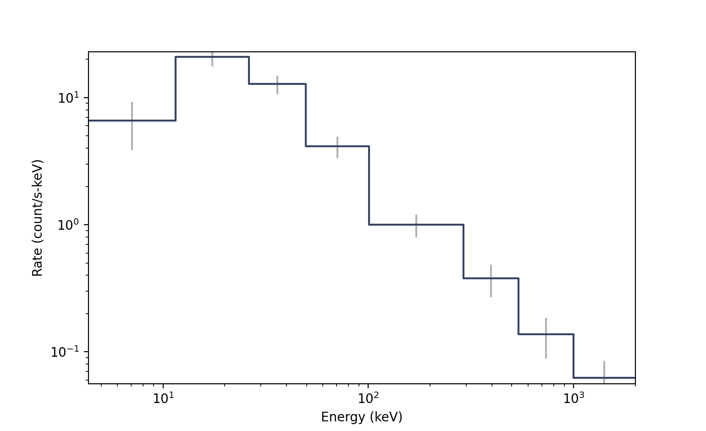
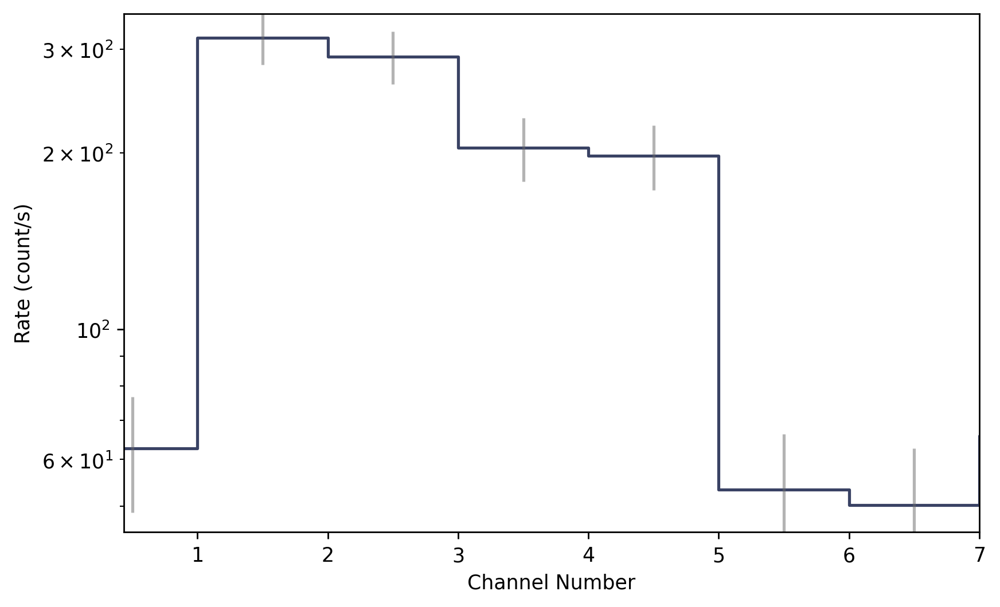

.. _core-phaii:
.. |Phaii| replace:: :class:`~gdt.core.phaii.Phaii`
.. |Pha| replace:: :class:`~gdt.core.pha.Pha`
.. |TimeEnergyBins| replace:: :class:`~gdt.core.data_primitives.TimeEnergyBins`
.. |TimeChannelBins| replace:: :class:`~gdt.core.data_primitives.TimeChannelBins`
.. |TimeBins| replace:: :class:`~gdt.core.data_primitives.TimeBins`
.. |EnergyBins| replace:: :class:`~gdt.core.data_primitives.EnergyBins`
.. |ChannelBins| replace:: :class:`~gdt.core.data_primitives.ChannelBins`
.. |Gti| replace:: :class:`~gdt.core.data_primitives.Gti`
.. |Ebounds| replace:: :class:`~gdt.core.data_primitives.Ebounds`
.. |Phaii.open()| replace:: :meth:`~gdt.core.phaii.Phaii.open`
.. |Phaii.write()| replace:: :meth:`~gdt.core.phaii.Phaii.write`
.. |Phaii._build_hdulist()| replace:: :meth:`~gdt.core.phaii.Phaii._build_hdulist`
.. |Phaii._build_headers()| replace:: :meth:`~gdt.core.phaii.Phaii._build_headers`
.. |FileHeaders| replace:: :class:`~gdt.core.headers.FileHeaders`
.. |Lightcurve| replace:: :class:`~gdt.core.plot.lightcurve.Lightcurve`
.. |Spectrum| replace:: :class:`~gdt.core.plot.spectrum.Spectrum`
.. |plot-lightcurve| replace:: :ref:`Plotting Lightcurves<plot-lightcurve>`
.. |plot-spectrum| replace:: :ref:`Plotting Count Spectra<plot-spectrum>`
.. |core-headers| replace:: :ref:`Data File Headers<core-headers>`

***********************************
PHAII Files (:mod:`gdt.core.phaii`)
***********************************

Introduction
============
As discussed in the :ref:`PHA Documentation<core-pha>`, gamma-ray spectra are 
typically recorded PHA files.  PHA Type-I files (usually just called PHA) 
contain a single spectrum, while PHA Type-II (PHAII) files contain a time series 
of spectra. While the internal organization of the PHAII FITS file is a little 
bit different than the PHA file, the concept is similar.

The Phaii Class
===============
The |Phaii| class provides a way to construct, write out, and read standard
PHAII files. There are also some functions provided to operate on PHAII data. 
Somewhat different from the |Pha| class, the Phaii base class does not have the 
ability to read and write PHAII files.  Phaii is expected to be subclassed to
define the reading and writing portion of the file, however, you can still
programmatically create a Phaii object.  In the following examples, we will 
first create a Phaii object with some data, and then we will walk through how
to subclass Phaii to create a class that can read/write files.

Examples
--------
First, we will show how to construct a |Phaii| object from a time series of 
count spectra. The data within a Phaii object is a |TimeEnergyBins|, which is a
2D array in time and energy, so we will define that. Additionally, we can 
define a |Gti|, which is one or multiple Good Time Intervals over which the 
data can be used for science.

    >>> from gdt.core.data_primitives import TimeEnergyBins, Gti
    >>> from gdt.core.phaii import Phaii
    >>> # construct the time series count spectra (6 time bins, 8 channels)
    >>> counts = [[ 0,  0,  2,  1,  2,  0,  0,  0],
    >>>           [ 3, 16, 10, 13, 14,  4,  3,  3],
    >>>           [ 3, 23, 26, 13,  8,  8,  5,  5],
    >>>           [ 4, 21, 19, 16, 13,  2,  3,  4],
    >>>           [ 4, 20, 17, 11, 15,  2,  1,  5],
    >>>           [ 6, 20, 19, 11, 11,  1,  4,  4]]
    >>> tstart = [0.0000, 0.0039, 0.0640, 0.1280, 0.1920, 0.2560]
    >>> tstop = [0.0039, 0.0640, 0.1280, 0.1920, 0.2560, 0.320]
    >>> exposure = [0.0038, 0.0598, 0.0638, 0.0638, 0.0638, 0.0638]
    >>> emin = [4.32, 11.5, 26.2, 49.6, 101., 290., 539., 997.]
    >>> emax = [11.5, 26.2, 49.6, 101., 290., 539., 997., 2000.]
    >>> data = TimeEnergyBins(counts, tstart, tstop, exposure, emin, emax)

    >>> # construct the good time interval(s)
    >>> gti = Gti.from_list([(0.0000, 0.320)])

    >>> # create the PHAII object
    >>> phaii = Phaii.from_data(data, gti=gti, trigger_time=356223561.)
    >>> phaii
    <Phaii: 
    trigger time: 356223561.0;
    time range (0.0, 0.32);
    energy range (4.32, 2000.0)>

Setting the GTI is not required, and omitting the GTI will cause a default GTI
to be created with a range spanning the full time range of the data.  Also note 
that we set a trigger time (also optional), that is used as a time reference for 
the data.

Now that we have created our Phaii object, there are several attributes that are
available to us.  We can directly access the data and GTI we created the object
with, as well as the |Ebounds| object that was constructed upon initialization:
  
    >>> # the PHAII data
    >>> phaii.data
    <TimeEnergyBins: 6 time bins;
    time range (0.0, 0.32);
    1 time segments;
    8 energy bins;
    energy range (4.32, 2000.0);
    1 energy segments>
    >>> # the GTI
    >>> pha.gti
    <Gti: 1 intervals; range (0.0, 0.32)>
    >>> # the Ebounds
    >>> pha.ebounds
    <Ebounds: 8 intervals; range (4.32, 2000.0)>
  
There are other attributes that are exposed:
    
    >>> # energy range
    >>> phaii.energy_range
    (4.32, 2000.0)
    >>> # number of energy channels
    >>> phaii.num_chans
    8
    >>> # time range covered by data
    >>> phaii.time_range
    (0.0, 0.32)
    >>> # trigger time (if available)
    >>> phaii.trigtime
    356223561.0

In addition to these attributes, we can retrieve the exposure for the full data
contained within the Phaii object or for a time segment of the data contained:

    >>> # full exposure
    >>> phaii.get_exposure()
    0.3188

    >>> # get total exposure for two segments of data
    >>> phaii.get_exposure(time_ranges=[(0.0, 0.1), (0.2, 0.3)])
    0.255

A Phaii object can be rebinned in either the time or energy axis. Here we rebin
each axis by a factor of 2:

    >>> from gdt.core.binning.binned import combine_by_factor
    >>> # rebin energy
    >>> rebinned_energy = phaii.rebin_energy(combine_by_factor, 2)
    >>> rebinned_energy.data
    <TimeEnergyBins: 6 time bins;
    time range (0.0, 0.32);
    1 time segments;
    4 energy bins;
    energy range (4.32, 2000.0);
    1 energy segments>

    >>> # rebin time
    >>> rebinned_time = phaii.rebin_time(combine_by_factor, 2)
    >>> rebinned_time.data
    <TimeEnergyBins: 3 time bins;
    time range (0.0, 0.32);
    1 time segments;
    8 energy bins;
    energy range (4.32, 2000.0);
    1 energy segments>

You can also slice the Phaii object in time or energy.  You can specify one or
multiple ranges to slice over:

    >>> sliced_energy = phaii.slice_energy([(25.0, 35.0), (550.0, 750.0)])
    >>> sliced_energy.data
    <TimeEnergyBins: 6 time bins;
    time range (0.0, 0.32);
    1 time segments;
    3 energy bins;
    energy range (11.5, 997.0);
    2 energy segments>

    >>> sliced_time = phaii.slice_time([(0.0, 0.1), (0.2, 0.3)])
    >>> sliced_time.data
    <TimeEnergyBins: 5 time bins;
    time range (0.0, 0.32);
    2 time segments;
    8 energy bins;
    energy range (4.32, 2000.0);
    1 energy segments>

In both cases, we sliced to two disjoint ranges, defined as a list of tuples.  
Note that the resulting sliced energy edges are dependent on the energy edges 
of the original object, since they cannot be changed.

Because PHAII data are two-dimensional, we often want to display either the data
on the time axis or the energy axis. In fact, the data can be integrated over 
the energy axis to produce a lightcurve represented as a |TimeBins| object, or 
it can be integrated over the time axis to produce a count spectrum, represented
as an |EnergyBins| object.

Here, we create a lightcurve by integrating over the full energy range, or 
a subset of the energy range:

    >>> # integrate over the full energy range
    >>> lightcurve = phaii.to_lightcurve()
    <TimeBins: 6 bins;
    range (0.0, 0.32);
    1 contiguous segments>

    >>> # integrate over a subset of the full energy range
    >>> lightcurve = phaii.to_lightcurve(energy_range=(50.0, 300.0))
    >>> # can also specify the channel range instead
    >>> lightcurve = phaii.to_lightcurve(channel_range=(3, 5))

We can plot the lightcurve using the |Lightcurve| plotting class (see 
|plot-lightcurve| for details).  Plotting the example that integrates over 
channels 3-5 looks like this:

    >>> import matplotlib.pyplot as plt
    >>> from gdt.core.plot.lightcurve import Lightcurve
    >>> lcplot = Lightcurve(data=lightcurve)
    >>> plt.show()

And here we create a count spectrum by integrating over the full time range or
a subset of the time range:

    >>> # integrate over the full time range
    >>> spectrum = phaii.to_spectrum()
    <EnergyBins: 8 bins;
    range (4.32, 2000.0);
    1 contiguous segments>

    >>> # integrate over a subset of the full time range
    >>> spectrum = phaii.to_spectrum(time_range=(0.0, 0.1))

Similar to plotting the lightcurve, we can plot the spectrum using the 
|Spectrum| plotting class (see |plot-spectrum| for details).  Our latest 
example integrating over 0.0-0.1 seconds looks like this:
 
    >>> from gdt.core.plot.spectrum import Spectrum
    >>> specplot = Spectrum(data=spectrum)
    >>> plt.show()

 
We can even directly create a |Pha| object, which integrates over a time range
(or multiple time ranges) and produces a fully qualified object that can then
be written to a FITS file.

    >>> pha = phaii.to_pha(time_ranges=[(0.0, 0.1), (0.2, 0.3)])
    >>> pha
    <Pha: 
    trigger time: 356223561.0;
    time range (0.0, 0.32);
    energy range (4.32, 2000.0)>
    >>> pha.gti
    <Gti: 2 intervals; range (0.0, 0.32)>

Furthermore, you can create a Pha object with only a subset of the energy range,
and it will automatically mask out the channels you are not using:

    >>> pha = phaii.to_pha(energy_range=(50.0, 300.0))
    <Pha: 
    trigger time: 356223561.0;
    time range (0.0, 0.32);
    energy range (4.32, 2000.0)>
    >>> pha.channel_mask
    array([False, False, False, True, True, True, False, False])
    >>> pha.valid_channels
    array([3, 4, 5])

Finally, you can merge multiple Phaii objects together into a single object, as
long as they do not overlap in time:

    >>> phaii1 = phaii.slice_time((0.0, 0.1))
    >>> phaii2 = phaii.slice_time((0.2, 0.3))
    >>> phaii_merged = Phaii.merge([phaii1, phaii2])
    >>> phaii_merged
    <Phaii: 
    trigger time: 356223561.0;
    time range (0.0, 0.32);
    energy range (4.32, 2000.0)>
    >>> phaii_merged.gti
    <Gti: 2 intervals; range (0.0, 0.32)>

No Energy Calibration
=====================
Sometimes PHAII data does not have a native calibration associated with it or
the calibration is applied at a later time.  We can still create a |Phaii| 
object with a |TimeChannelBins| object.

    >>> from gdt.core.data_primitives import TimeChannelBins, Gti
    >>> from gdt.core.phaii import Phaii
    >>> # construct the time series count spectra (6 time bins, 8 channels)
    >>> counts = [[ 0,  0,  2,  1,  2,  0,  0,  0],
    >>>           [ 3, 16, 10, 13, 14,  4,  3,  3],
    >>>           [ 3, 23, 26, 13,  8,  8,  5,  5],
    >>>           [ 4, 21, 19, 16, 13,  2,  3,  4],
    >>>           [ 4, 20, 17, 11, 15,  2,  1,  5],
    >>>           [ 6, 20, 19, 11, 11,  1,  4,  4]]
    >>> tstart = [0.0000, 0.0039, 0.0640, 0.1280, 0.1920, 0.2560]
    >>> tstop = [0.0039, 0.0640, 0.1280, 0.1920, 0.2560, 0.320]
    >>> exposure = [0.0038, 0.0598, 0.0638, 0.0638, 0.0638, 0.0638]
    >>> chan_nums = [0, 1, 2, 3, 4, 5, 6, 7]
    >>> data = TimeChannelBins(counts, tstart, tstop, exposure, chan_nums)

    >>> # construct the good time interval(s)
    >>> gti = Gti.from_list([(0.0000, 0.320)])

    >>> # create the PHAII object
    >>> phaii = Phaii.from_data(data, gti=gti, trigger_time=356223561.)
    >>> phaii
    <Phaii: 
    trigger time: 356223561.0;
    time range (0.0, 0.32);
    energy range None>

All of the functionality is maintained when using uncalibrated PHAII data, 
including merging, slicing, rebinning, and converting to lightcurves and 
spectra, with the exception of creating a PHA object, which requires an 
energy calibration. When converting to a spectrum, a |ChannelBins| object is 
returned instead of an |EnergyBins| object:

    >>> spectrum = phaii.to_spectrum()
    >>> spectrum
    <ChannelBins: 8 bins;
     range (0, 7);
     1 contiguous segments>

We can even plot the channel spectrum, which will look a little bit different
from the earlier count spectrum plot because we don't have an energy calibration:

    >>> from gdt.core.plot.spectrum import Spectrum
    >>> specplot = Spectrum(data=spectrum)
    >>> plt.show()

If, after creating the uncalibrated |Phaii| object, we want to apply an energy
calibration, we can do that by creating an |Ebounds| object containing the 
energy edges.  This will update the data container from a |TimeChannelBins| to
a |TimeEnergyBins|:

    >>> emin = [4.32, 11.5, 26.2, 49.6, 101., 290., 539., 997.]
    >>> emax = [11.5, 26.2, 49.6, 101., 290., 539., 997., 2000.]
    >>> ebounds = Ebounds.from_bounds(emin, emax)
    >>> phaii.set_ebounds(ebounds)
    >>> phaii.data
    <TimeEnergyBins: 6 time bins;
     time range (0.0, 0.32);
     1 time segments;
     8 energy bins;
     energy range (4.32, 2000.0);
     1 energy segments>

For Developers:
===============

Subclassing
-----------
To read and write PHAII FITS files, the |Phaii| class needs to be subclassed. 
This is because the format and metadata of PHAII files can be different from
mission to mission.  When subclassing Phaii to read a PHAII file, the 
|Phaii.open()| method needs to be defined.  To write out a PHAII file, the
private method |Phaii._build_hdulist()| needs to be defined, which defines the
data structure for each extension of the FITS file. Adding header 
information/metadata is not required, however if you do want the header 
information to be tracked when reading in a file and written out when writing a
file to disk, you will need to create the header definitions as explained in
|core-headers| and also define the private method |Phaii._build_headers()|.

To illustrate further, below is a sketch of how the Phaii class should be 
subclassed in the example ``MyPhaii``:

    >>> import astropy.io.fits as fits
    >>> from gdt.core.data_primitives import TimeEnergyBins, Gti
    >>> from gdt.core.phaii import Phaii
    >>>
    >>> class MyPhaii(Phaii):
    >>>     """An example to read and write PHAII files for xxx instrument"""
    >>>     @classmethod
    >>>     def open(cls, file_path, **kwargs):
    >>>         with super().open(file_path, **kwargs) as obj:
    >>>
    >>>             # an example of how to set the headers
    >>>             hdrs = [hdu.header for hdu in obj.hdulist]
    >>>             headers = MyFileHeaders.from_headers(hdrs)
    >>>
    >>>             # an example of how to set the data
    >>>             data = TimeEnergyBins(counts, tstart, tstop, exposure, emin, 
    >>>                                   emax, quality=quality)
    >>>
    >>>             # an example of how to set the GTI
    >>>             gti = Gti.from_bounds(gti_start, gti_end)
    >>>
    >>>         return cls.from_data(data, gti=gti, trigger_time=trigger_time,
    >>>                              filename=obj.filename, headers=headers)
    >>>
    >>>     def _build_hdulist(self):
    >>>         # this is where we build the HDU list (header/data for each extension)
    >>>         hdulist = fits.HDUList()
    >>>
    >>>         # some code to create PRIMARY HDU
    >>>         # ...
    >>>         hdulist.append(primary_hdu)
    >>>
    >>>         # code to create other HDUs and append to hdulist
    >>>         # ...
    >>>
    >>>         return hdulist
    >>>
    >>>     def _build_headers(self, trigtime, tstart, tstop, num_chans):
    >>>         # build the header based on these inputs
    >>>         headers = self.headers.copy()
    >>>         # update header information here
    >>>         # ...
    >>>
    >>>         return headers

To create a Phaii object from a PHAII FITS file, the ``open()`` method should, 
at a minimum, be able to construct a |TimeEnergyBins| object containing the 
data.  Additionally, you can construct a |Gti|, and |FileHeaders|. If the data
has an associated trigger or reference time, you can track that as well.
  
The example creation of ``headers`` takes in a list of the headers from
each extension and assumes you have created a class (in this case 
``MyFileHeaders``) that will read in the header information.

To write the PHAII to disk, the |Phaii._build_hdulist()| defines the list of 
FITS HDUs, and is called by the |Phaii.write()| method.  The 
|Phaii._build_headers()| method is called whenever operations are performed on 
the object, like rebinning or slicing to propagate the header information.

Reference/API
=============
.. automodapi:: gdt.core.phaii
   :inherited-members:

Special Methods
===============
.. automethod:: gdt.core.phaii.Phaii._build_hdulist
.. automethod:: gdt.core.phaii.Phaii._build_headers

