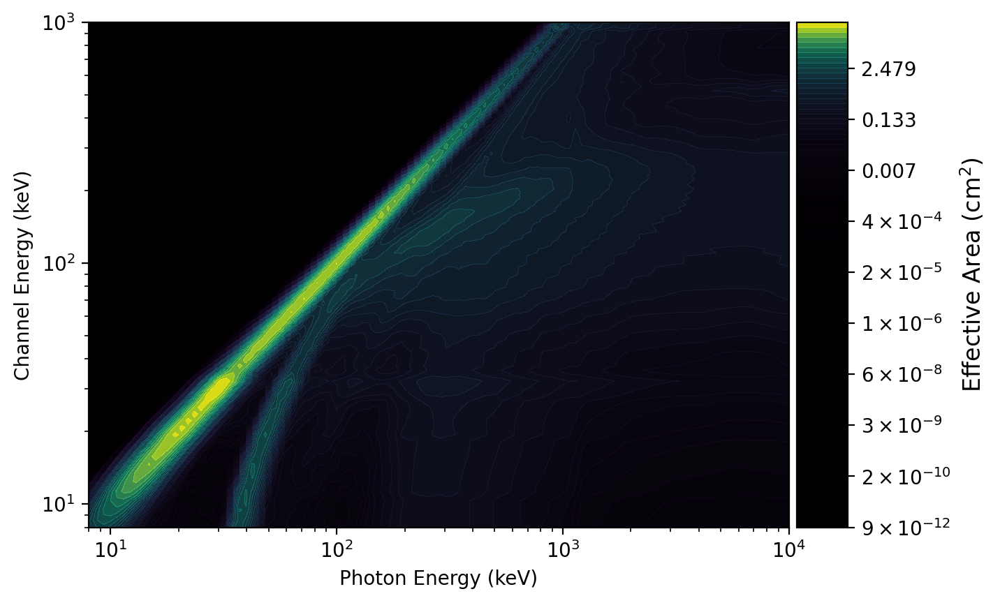
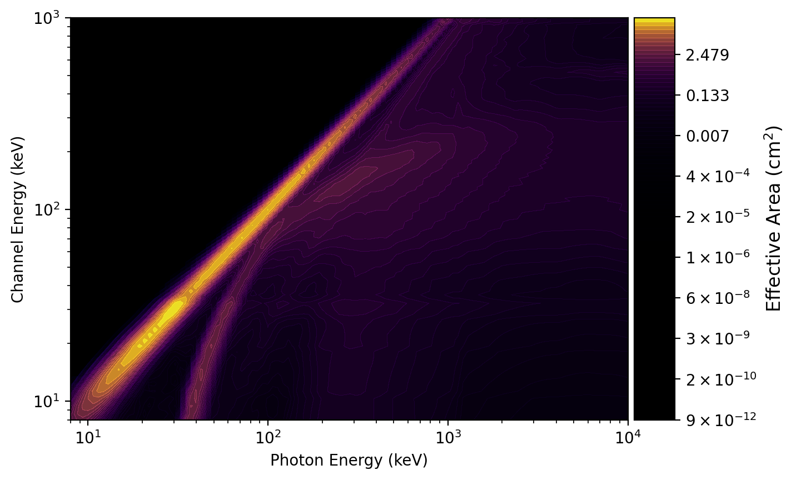
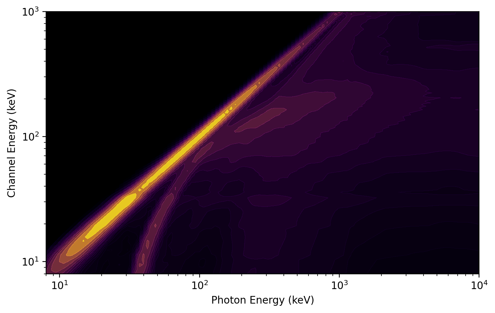
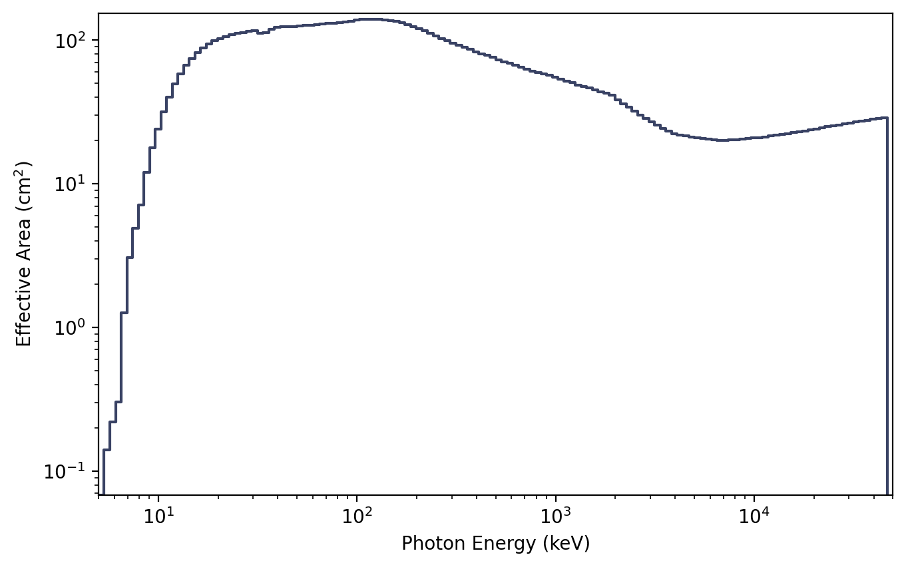
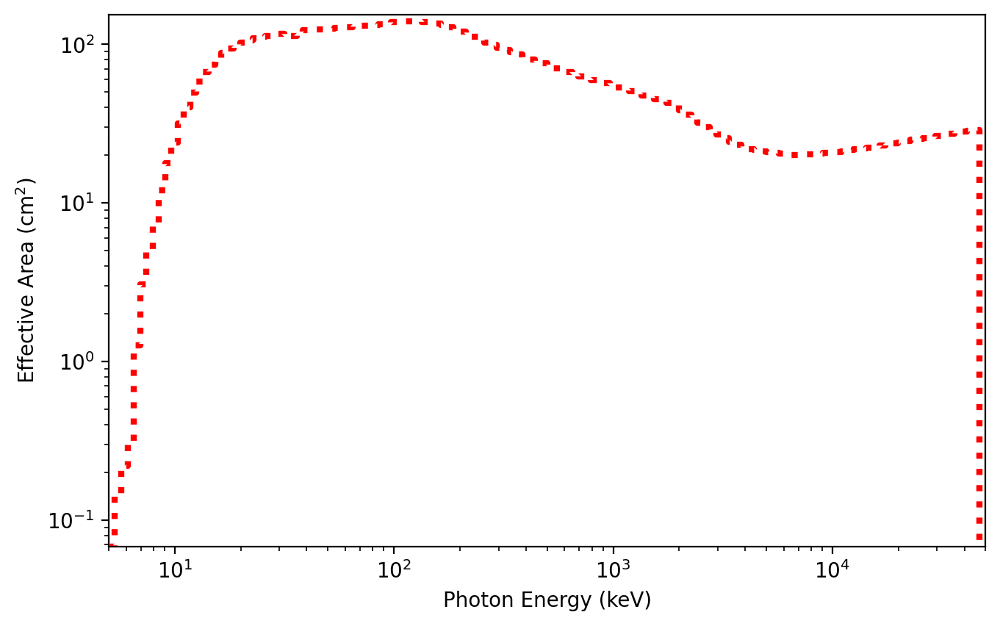
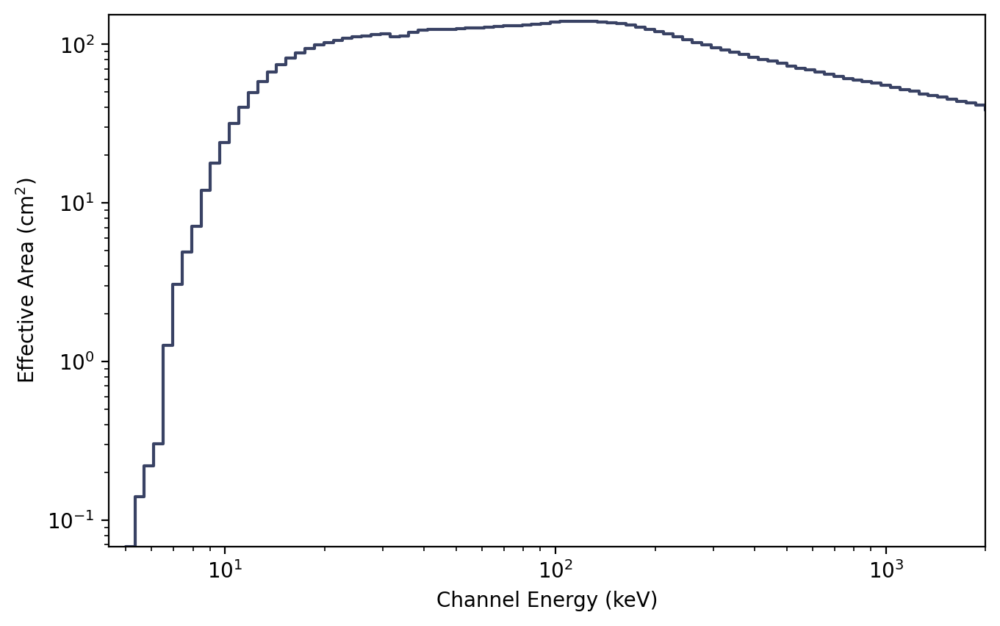

.. _plot-drm:
.. |ResponsePlot| replace:: :class:`~gdt.core.plot.drm.ResponsePlot`
.. |PhotonEffectiveArea| replace:: :class:`~gdt.core.plot.drm.PhotonEffectiveArea`
.. |ChannelEffectiveArea| replace:: :class:`~gdt.core.plot.drm.ChannelEffectiveArea`
.. |Heatmap| replace:: :class:`~gdt.core.plot.plot.Heatmap`
.. |GdtCmap| replace:: :class:`~gdt.core.plot.plot.GdtCmap`
.. |EffectiveArea| replace:: :class:`~gdt.core.plot.plot.EffectiveArea`
.. |core-response| replace:: :ref:`Instrument Responses<core-response>`

************************************************************
Plotting DRMs and Effective Area (:mod:`~gdt.core.plot.drm`)
************************************************************
A response matrix can be plotted by using the |ResponsePlot| plotting class.

We will use an example Fermi GBM response file (see |core-response| for details 
about using responses).

    >>> from gdt.core import data_path
    >>> from gdt.missions.fermi.gbm.response import GbmRsp2
    >>> filepath = data_path.joinpath('fermi-gbm/glg_cspec_n9_bn090131090_v00.rsp2')
    >>> rsp2 = GbmRsp2.open(filepath)
    >>> # the DRM of the first response
    >>> drm = rsp2[0].drm
    
    >>> import matplotlib.pyplot as plt
    >>> from gdt.core.plot.drm import ResponsePlot
    >>> drmplot = ResponsePlot(drm=drm, interactive=True)
    >>> drmplot.xlim = (8.0, 1e4)
    >>> drmplot.ylim = (8.0, 1e3)
    >>> plt.show()
    

Note the x-axis represents the incident photon energy, the y-axis is the 
recorded channel energy, and the color gradient maps to the effective area.
We have also zoomed in slightly along the x and y axes.

We can directly access the main plot element, which is a |Heatmap|:

    >>> drmplot.drm
    <Heatmap: color='viridis';
              norm=PowerNorm;
              num_contours=100;
              colorbar=True>

We can also see the colormap information, which is contained in a |GdtCmap|
object:

    >>> drmplot.drm.color
    <GdtCmap: viridis;
               alpha_min=0.00;
               alpha_max=1.00;
               alpha_scale=linear>

The colormap object is specialized to not only produce a color gradient, but 
also an alpha gradient.  We can update any of these values, in particular, we
can change the colormap to another valid matplotlib colormap by setting the 
``name`` attribute:

    >>> drmplot.drm.color.name = 'plasma'

You can also disable the colorbar on initialization and specify the number of
plot contours:

    >>> drmplot = ResponsePlot(drm=drm, colorbar=False, num_contours=50)
    >>> drmplot.xlim = (8.0, 1e4)
    >>> drmplot.ylim = (8.0, 1e3)
    >>> plt.show()

The effective area curve can also be plotted by integrating over either axis
using |PhotonEffectiveArea| or |ChannelEffectiveArea|.  For example, here
is the effective area integrated over the energy channel axis:

    >>> from gdt.core.plot.drm import PhotonEffectiveArea
    >>> photplot = PhotonEffectiveArea(drm=drm, interactive=True)

We can also access the plot element, which is an |EffectiveArea| class:

    >>> photplot.drm
    <EffectiveArea: color=#394264;
                    alpha=None;
                    linestyle='-';
                    linewidth=1.5>

And change some of the properties:

    >>> photplot.drm.color = 'red'
    >>> photplot.drm.linestyle = ':'
    >>> photplot.drm.linewidth = 3.0

Similarly, we can make the effective area curve integrated over incident photon
energy:

    >>> from gdt.core.plot.drm import ChannelEffectiveArea
    >>> chanplot = ChannelEffectiveArea(drm=drm)

Reference/API
=============

.. automodapi:: gdt.core.plot.drm
   :inherited-members:

