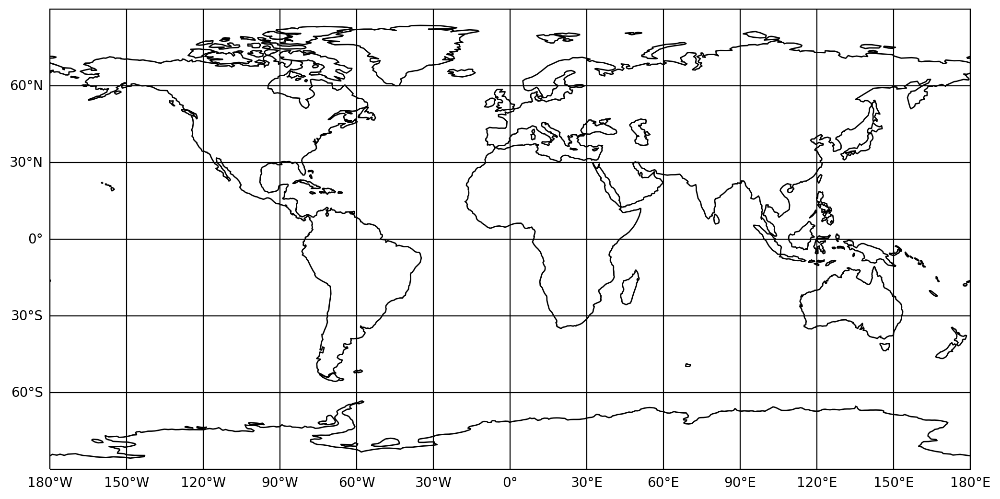
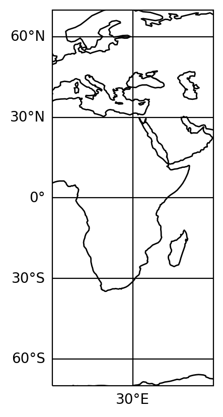
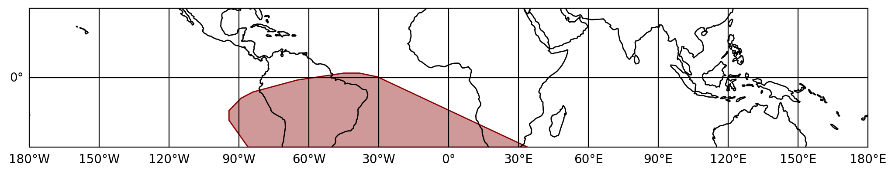
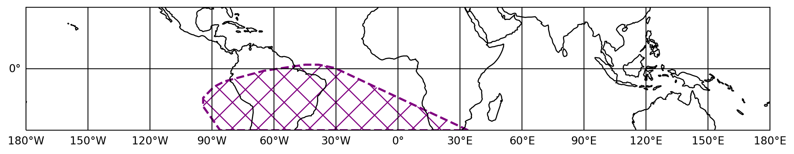
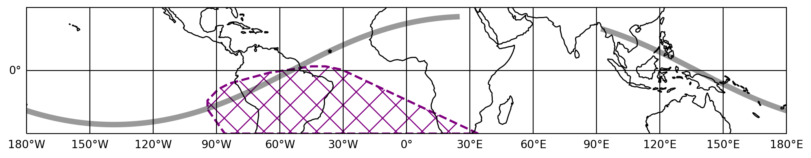
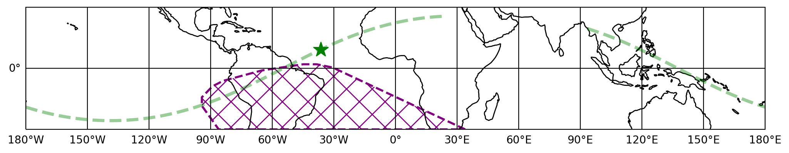
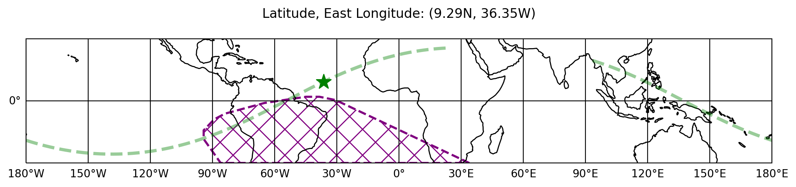

.. _plot-earthplot:
.. |EarthPlot| replace:: :class:`~gdt.core.plot.earthplot.EarthPlot`
.. |SAA| replace:: :class:`~gdt.core.plot.plot.SAA`
.. |EarthPoints| replace:: :class:`~gdt.core.plot.plot.EarthPoints`
.. |EarthLine| replace:: :class:`~gdt.core.plot.plot.EarthLine`
.. |SpacecraftFrame| replace:: :class:`~gdt.core.coords.SpacecraftFrame`
.. |Cartopy| replace:: Cartopy
.. _Cartopy: https://scitools.org.uk/cartopy/docs/latest/
.. |core-geomagnetic| replace:: :ref:`Geomagnetic Module<core-geomagnetic>`
.. |core-coords| replace:: :ref:`Spacecraft Attitude, Position, and Coordinates<core-coords>`

********************************************************************
Plotting Spacecraft in Earth Orbit (:mod:`~gdt.core.plot.earthplot`)
********************************************************************

A plot of a spacecraft in orbit can be made by using the |EarthPlot| plotting 
class. This plot class takes advantage of the |Cartopy|_ API. To initialize the
class, we can do the following:

    >>> import matplotlib.pyplot as plt
    >>> from gdt.core.plot.earthplot import EarthPlot
    >>> earthplot = EarthPlot(interactive=True)
    >>> plt.show()

This creates a plot of the Earth in a cylindrical projection.  You can also 
easily create an image of a section of the Earth by defining ``lat_range`` and
``lon_range``:

    >>> earthplot = EarthPlot(lat_range=(-70.0, 70.0), lon_range=(0.0, 60.0), interactive=True)
    

We can also add a polygon representing a defined region for the South Atlantic
Anomaly (SAA).  This example uses the SAA region defined for Fermi GBM (see the
|core-geomagnetic| for more info about defining the SAA).

    >>> from gdt.missions.fermi.gbm.saa import GbmSaa
    >>> earthplot = EarthPlot(lat_range=[-30.0, 30.0], saa=GbmSaa(), interactive=True)

The |SAA| plot polygon object can be accessed:

    >>> earthplot.saa
    <SAA: color='darkred';
          alpha=0.4;
          linestyle='solid';
          linewidth=1.0>

And its properties can be modified:
    
    >>> earthplot.saa.color = 'purple'
    >>> earthplot.saa.fill = False
    >>> earthplot.saa.linestyle = '--'
    >>> earthplot.saa.linewidth = 2
    >>> earthplot.saa.hatch = 'x'
    

Now, we want to show the orbit of our spacecraft and perhaps even plot the 
position of the spacecraft at a particular time.  For this example, we will read
from a Fermi GBM Position History file and use the |SpacecraftFrame| object (see  
|core-coords| for details about using the SpacecraftFrame class).  This file
contains the position history of Fermi for an entire day.  We will select a
time range over which to display the orbit.

    >>> from gdt import test_data
    >>> from gdt.missions.fermi.gbm.poshist import GbmPosHistFile
    >>> # get the spacecraft frame from the position history file
    >>> filepath = test_data['fermi-gbm'].joinpath('glg_poshist_all_170101_v01.fit')
    >>> with GbmPosHistFile(filepath) as poshist:
    >>>     frame = poshist.get_spacecraft_frame()
    
    >>> earthplot.add_spacecraft_frame(frame, tstart=frame.obstime[0], tstop=5000., 
    >>>                                trigtime=frame.obstime[4000], marker='*')

What we did here was specified a time range that began at the start of the file
(``frame.obstime[0]``) and stop time that extends 5,000 seconds from the start
time.  We also set ``trigtime=frame.obstime[4000]``, which means that we set 
our time of interest to be at that particular time.  Since Fermi GBM provides 
the frame sampling at 1 Hz, this means that we set our time of interest at 
4,000 seconds after the start time.  Finally, we told Matplotlib we wanted our
spacecraft marker to be a star (``marker='*'``).

The resulting plot has a very small black star, so we probably want to make it
bigger.  You can access that plot element, which is an |EarthPoints| object:

    >>> earthplot.spacecraft
    <EarthPoints: 1 points;
                  color='black';
                  alpha=1.0>
                  
We can make the spacecraft marker larger, change the color, and bring it to the
front:

    >>> earthplot.spacecraft.sizes = 200
    >>> earthplot.spacecraft.color = 'green'
    >>> earthplot.spacecraft.zorder = 5

Similarly, the orbital plot element, am |EarthLine| object, can be accessed:

    >>> earthplot.orbit
    <EarthLine: color=black;
                alpha=0.4;
                linestyle='-';
                linewidth=5.0>

And we can also update the plot settings for the orbit:

    >>> earthplot.orbit.linestyle = '--'
    >>> earthplot.orbit.linewidth = 3
    >>> earthplot.orbit.color = 'green'

    
Finally, we can a simple title to the plot that lists the coordinates for the
spacecraft position:
    
    >>> earthplot.standard_title()

Reference/API
=============

.. automodapi:: gdt.core.plot.earthplot
   :inherited-members:

