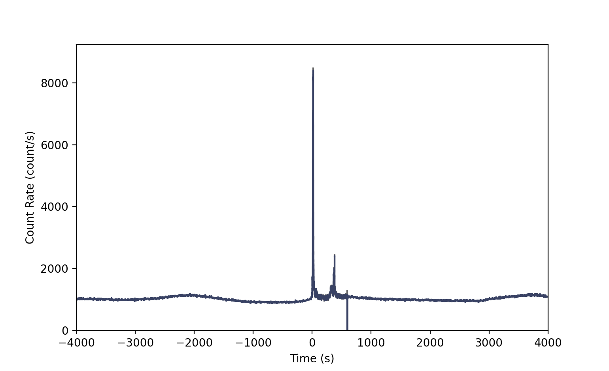
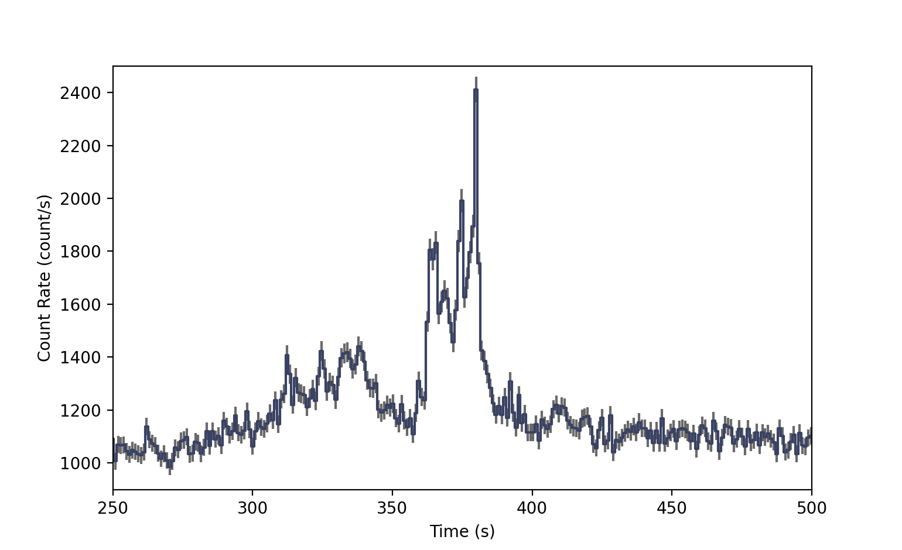
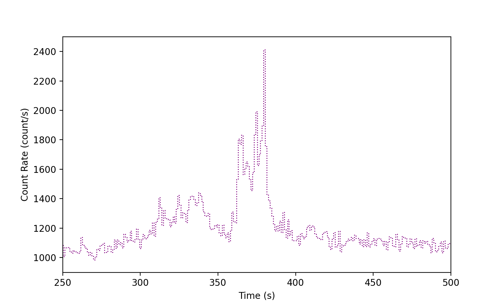
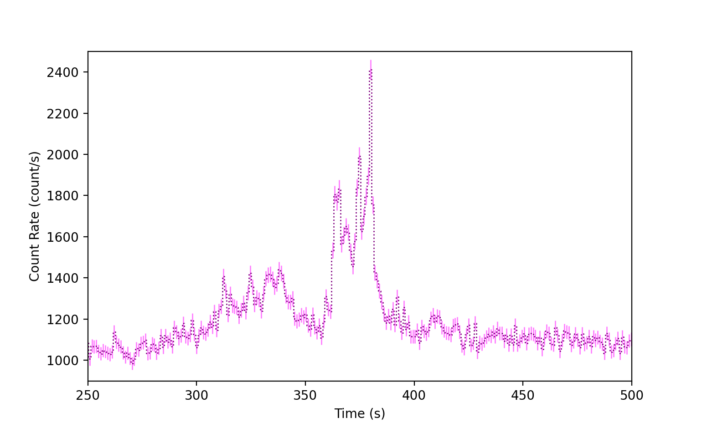
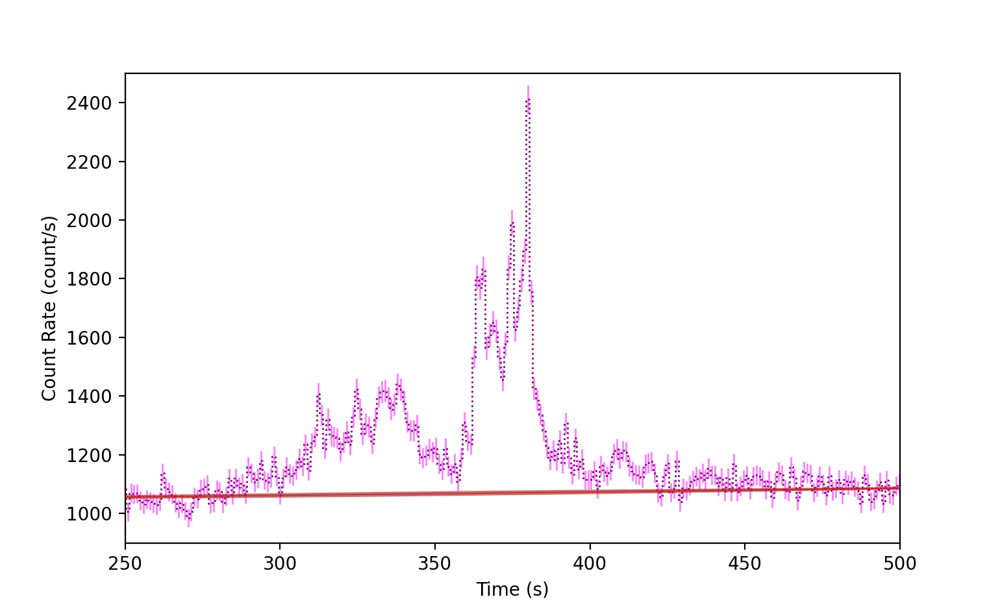
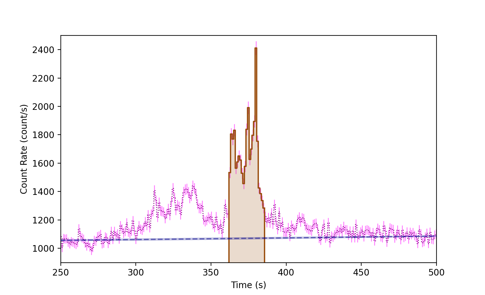
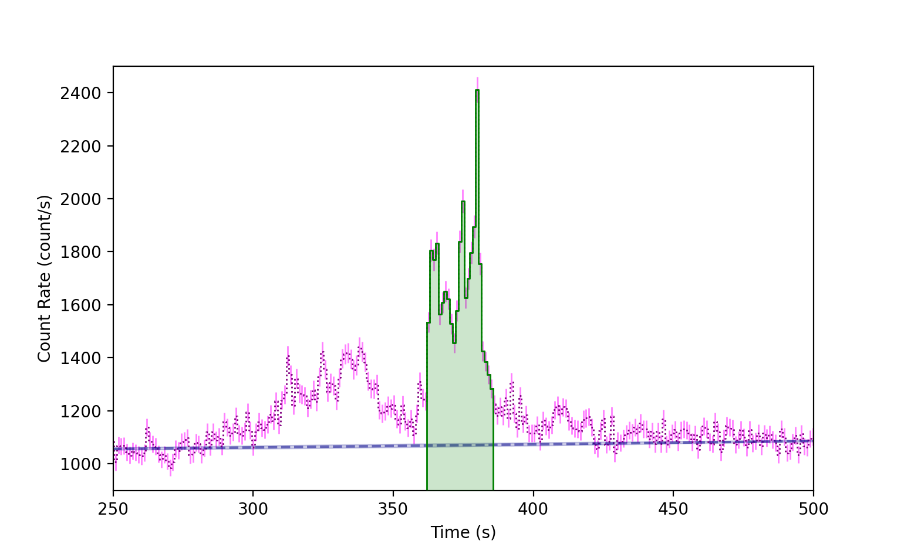

.. _plot-lightcurve:
.. |Lightcurve| replace:: :class:`~gdt.core.plot.lightcurve.Lightcurve`
.. |Histo| replace:: :class:`~gdt.core.plot.plot.Histo`
.. |HistoErrorbars| replace:: :class:`~gdt.core.plot.plot.HistoErrorbars`
.. |HistoFilled| replace:: :class:`~gdt.core.plot.plot.HistoFilled`
.. |LightcurveBackground| replace:: :class:`~gdt.core.plot.plot.LightcurveBackground`
.. |BackgroundRates| replace:: :class:`~gdt.core.background.primitives.BackgroundRates`
.. |core-phaii| replace:: :ref:`PHAII Data<core-phaii>`
.. |background_fitter| replace:: :ref:`Background Fitter<background_fitter>`

*******************************************************
Plotting Lightcurves (:mod:`~gdt.core.plot.lightcurve`)
*******************************************************
A lightcurve can be plotted by using the |Lightcurve| plotting class.

We will use an example Fermi GBM PHAII file (see |core-phaii| for details 
about PHAII data).

    >>> from gdt.core import data_path
    >>> from gdt.missions.fermi.gbm.phaii import Cspec
    >>> filepath = data_path.joinpath('fermi-gbm/glg_cspec_n0_bn160509374_v01.pha')
    >>> phaii = Cspec.open(filepath)
    
    >>> import matplotlib.pyplot as plt
    >>> from gdt.core.plot.lightcurve import Lightcurve
    >>> lcplot = Lightcurve(data=phaii.to_lightcurve(), interactive=True)
    >>> plt.show()

There are some things to note in the image.  First, while we plotted the full
time range of the data, we could also specify a time range for plotting in 
``phaii.to_lightcurve``.  Second, there appears to be a feature at ~T0+600 s.  
This feature is an aspect of the data where there is a small gap between data
bins where the data changes temporal resoluton. Finally, the histogrammed data is shown, by default,
in  blue, and the standard Poisson error bars are displayed in gray.  It is 
difficult to see what is going on, let's zoom in on the second peak:

    >>> lcplot.xlim = (250.0, 500.0)
    >>> lcplot.ylim = (900.0, 2500.0)

We can access the lightcurve and lightcurve errorbars objects, which are |Histo|
and |HistoErrorBars| objects, respectively:

    >>> lcplot.lightcurve
    <Histo: color=#394264;
            alpha=None;
            linestyle='-';
            linewidth=1.5>

    >>> lcplot.errorbars
    <HistoErrorbars: color=dimgrey;
                     alpha=None;
                     linewidth=1.5>

We can customize several properties of the lightcurve in this way:

    >>> # toggle off the errorbars
    >>> lcplot.errorbars.toggle()
    >>> # change lightcurve plot properties
    >>> lcplot.lightcurve.color = 'purple'
    >>> lcplot.lightcurve.linewidth = 1
    >>> lcplot.lightcurve.linestyle = ':'

     
We can also modify the errorbar properties in a similar way:

    >>> # toggle errorbars back on
    >>> lcplot.errorbars.toggle()
    >>> lcplot.errorbars.color = 'fuchsia'
    >>> lcplot.errorbars.alpha = 0.5
    >>> lcplot.errorbars.linewidth = 1

A background model can also be added to the plot.  See |background_fitter| for
fitting/estimating background.  To add a background model, we require a 
|BackgroundRates| object, which is an output of the background fitter, 
integrated over the same energy range as the lightcurve.

    >>> # back_rates is the BackgroundRates object
    >>> lcplot.set_background(back_rates)

Notice the reddish background line that appears on the plot.  Although not 
easily seen in this figure, if we zoom in, there is a median background line
and and uncertainty band that represents the 1-sigma background model 
uncertainty.  We can access the background plot element, which is a 
|LightcurveBackground| object:

    >>> lcplot.background
    <LightcurveBackground: color=firebrick;
                           alpha=0.85;
                           band_alpha=0.5;
                           linestyle='-';
                           linewidth=0.75>

We can also adjust the background element properties:

    >>> lcplot.background.color='darkblue'
    >>> lcplot.background.alpha=0.5
    >>> lcplot.background.band_alpha=0.2
    >>> lcplot.background.linewidth = 1.5
    >>> lcplot.background.linestyle = '--'

.. image:: lightcurve_figs/lcfig6.png

Finally, we can add selections to the lightcurve plot, which are shown as 
highlighted regions of the lightcurve by default.  To do so, we need to take
a time slice of our lightcurve:

    >>> lc_select = phaii.to_lightcurve(time_range=(362., 385.0))
    >>> lcplot.add_selection(lc_select)
    

We can add multiple selections to the plot, so they are stored as a list of
|HistoFilled| objects:

    >>> lcplot.selections
    [<HistoFilled: color=#9a4e0e;
                   alpha=None;
                   fill_alpha=0.2;
                   linestyle='-';
                   linewidth=1.5>]
                   
As with the other plot elements, we can also change the selection plot element
properties:

    >>> lcplot.selections[0].color='green'
    >>> lcplot.selections[0].linewidth = 1

Reference/API
=============

.. automodapi:: gdt.core.plot.lightcurve
   :inherited-members:

