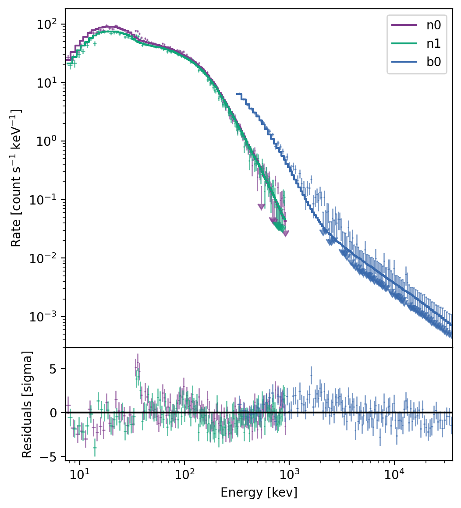
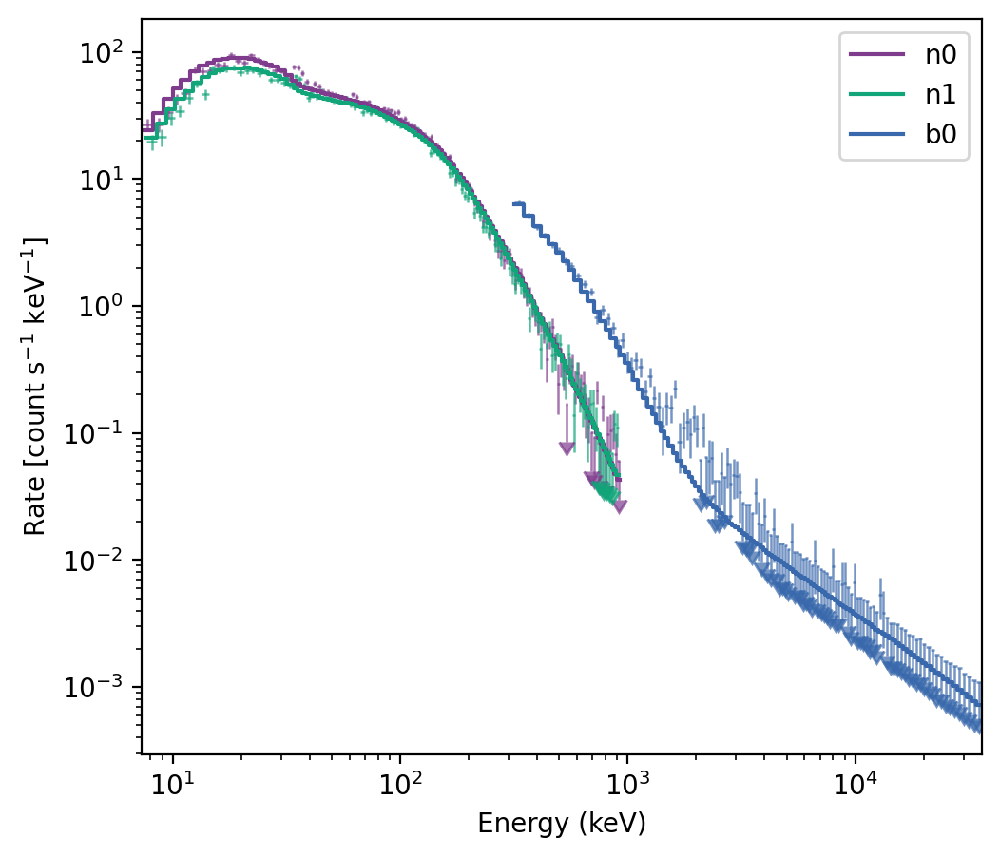
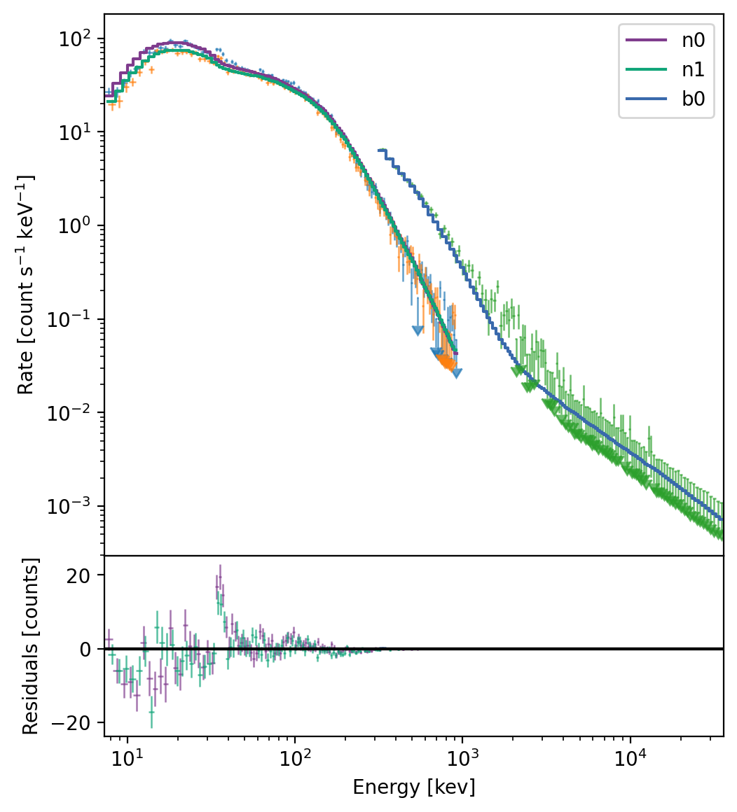
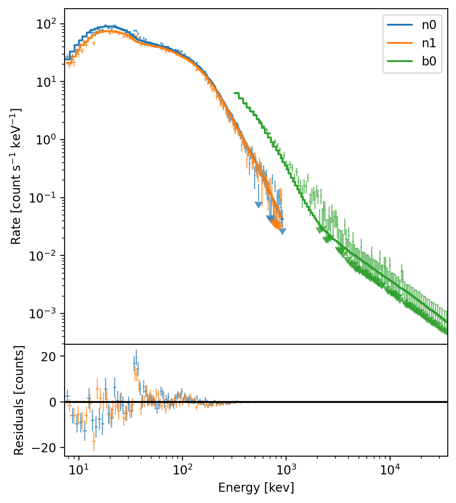
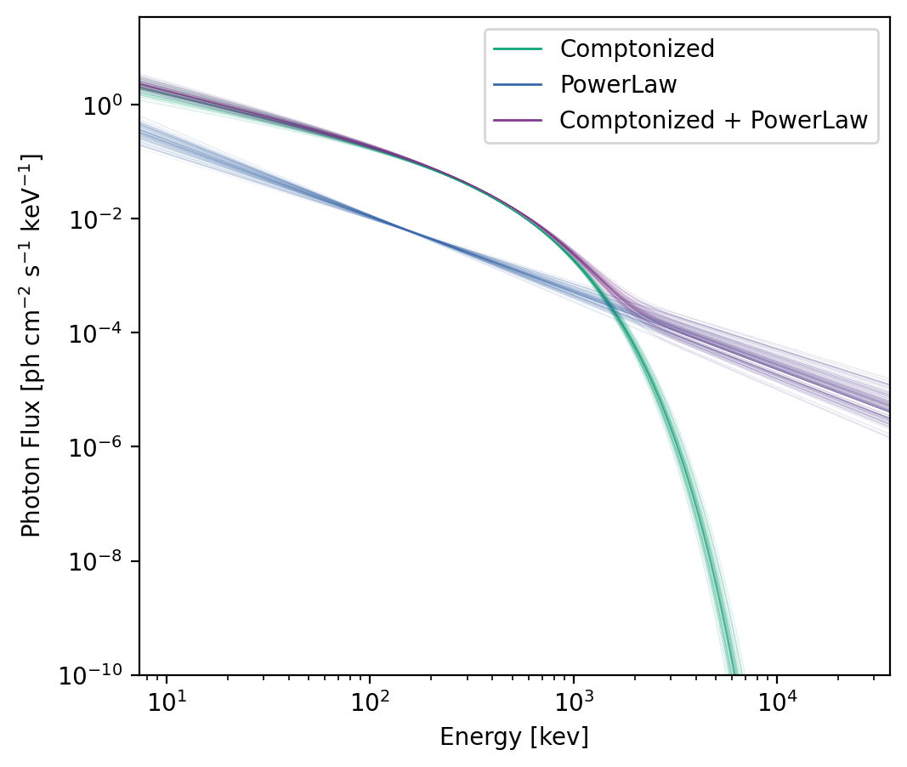
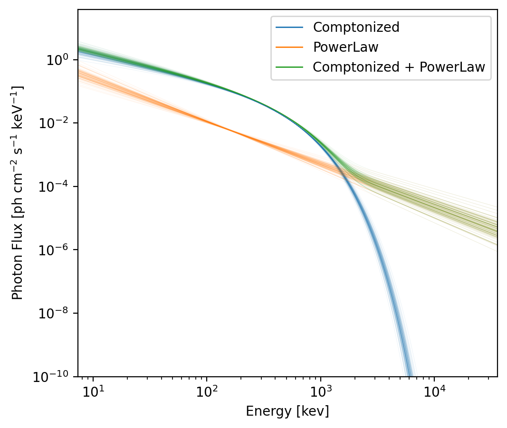

.. _plot-model:
.. |SpectralFitter| replace:: :class:`~gdt.core.spectra.fitting.SpectralFitter`
.. |ModelFit| replace:: :class:`~gdt.core.plot.model.ModelFit`
.. |PlotElementCollection| replace:: :class:`~gdt.core.plot.plot.PlotElementCollection`
.. |Histo| replace:: :class:`~gdt.core.plot.plot.Histo`
.. |ModelData| replace:: :class:`~gdt.core.plot.plot.ModelData`
.. |ModelSamples| replace:: :class:`~gdt.core.plot.plot.ModelSamples`

******************************************************************
Plotting of Spectral Fits and Models (:mod:`~gdt.core.plot.model`)
******************************************************************
Spectral fits resulting from using |SpectralFitter| (see 
:ref:`Spectral Fitting<spectra-fitting>` for details), can be plotted with the 
|ModelFit| plot class. This class will plot the fit results, and can show the 
resulting photon model in photon, energy, or :math:`\nu F_\nu` space.

We will load an example spectral fit to demonstrate the plot capabilities:

    >>> import os
    >>> from gdt.core import data_path
    >>> from gdt.core.spectra.fitting import SpectralFitterPgstat
    >>> saved_fit = data_path.joinpath('specfit.npz')
    >>> specfitter = SpectralFitterPgstat.load(saved_fit)
    Fit loaded from 2023-03-01 20:41:59
    
    >>> import matplotlib.pyplot as plt
    >>> from gdt.core.plot.model import ModelFit
    >>> modelplot = ModelFit(fitter=specfitter, interactive=True)
    >>> plt.show()

    
The default plot shows the different data sets, in this case data from three 
different Fermi GBM detectors.  The histograms are the count rate spectral 
models, and the data points are the count rate data. By default, data points 
that are below the model variance are shown as 2 sigma upper limits.  In the 
lower panel are the residuals in units of model standard deviation.

We can hide the residuals:

    >>> modelplot.hide_residuals()
    

    

Or change the residuals to units of counts:

    >>> modelplot.show_residuals(sigma=False)

.. image:: model_figs/modelfig3.png

There are three collections of plot objects on this plot: The count rate model
which is stored as a |PlotElementCollection| of |Histo| objects, the
count rate data, and the residuals, both of which are collections of |ModelData|
objects.

    >>> modelplot.count_models
    <PlotElementCollection: 3 Histo objects>
    
    >>> modelplot.count_data
    <PlotElementCollection: 3 ModelData objects>
    
    >>> modelplot.residuals
    <PlotElementCollection: 3 ModelData objects>

Each of the plot elements can be accessed by the detector name they belong to:

    >>>  modelplot.count_data.items
    ['n0', 'n1', 'b0']
    >>> modelplot.count_data.get_item('n0')
    <ModelData: color='#7F3C8D';
                alpha=0.7>
    >>> modelplot.count_data.n1
    <ModelData: color='#11A579';
                alpha=0.7>

If we want to change the colors, we can do so by iterating over the items in
the collection:

    >>> colors = ['C0', 'C1', 'C2']
    >>> for item, color in zip(modelplot.count_data, colors):
    >>>     item.color = color

    
Of course, we need to update the colors for the count rate model and the 
residuals:

    >>> for item, color in zip(modelplot.count_models, colors):
    >>>     item.color = color

    >>> for item, color in zip(modelplot.residuals, colors):
    >>>     item.color = color
    
And unfortunately since Matplotlib doesn't currently support updating the 
legend when the corresponding plot elements are changed, we need to update the
legend as well:

    >>> for item, color in zip(modelplot.ax.get_legend().legendHandles, colors):
    >>>     item.set_color(color)

So far, we have only shown the count rate spectrum *view*, which is only one
of four views that we can show on the plot.  We can also plot the modeled photon
spectrum:

    >>> modelplot.photon_spectrum()

This view shows the differential photon flux as a function of energy.  In our
example, we have fit a multi-component model, and each component is shown, 
along with the combined model.  Each component has several instances of the 
spectrum drawn from the covariance matrix of the fit.  These are stored as 
a collection of |ModelSamples| objects:

    >>> modelplot.spectrum_model
    <PlotElementCollection: 3 ModelSamples objects>

We can change the colors in the same way we changed the colors in in the count
spectrum view.  And again, we will have to update the legend.

    >>> colors = ['C0', 'C1', 'C2']
    >>> for item, color in zip(modelplot.spectrum_model, colors):
    >>>     item.color = color

    >>> for item, color in zip(modelplot.ax.get_legend().legendHandles, colors):
    >>>     item.set_color(color)

We can also plot the energy spectrum view.  By default, multiple components are
shown in each view, but we can turn those off.  Also be default, 100 model 
samples are drawn to create the plot, but we can also changes this.

    >>> modelplot.energy_spectrum(plot_components=False, num_samples=1000)

.. image:: model_figs/modelfig8.png

And finally, we can plot the :math:`\nu F_\nu` spectrum:

    >>> modelplot.nufnu_spectrum(num_samples=1000)
    >>> modelplot.ylim = (0.1, 1e4)
    
.. image:: model_figs/modelfig9.png
    

Reference/API
=============

.. automodapi:: gdt.core.plot.model
   :inherited-members:

