.. _plot-sky:
.. |SkyPlot| replace:: :class:`~gdt.core.plot.sky.SkyPlot`
.. |EquatorialPlot| replace:: :class:`~gdt.core.plot.sky.EquatorialPlot`
.. |GalacticPlot| replace:: :class:`~gdt.core.plot.sky.GalacticPlot`
.. |SpacecraftPlot| replace:: :class:`~gdt.core.plot.sky.SpacecraftPlot`
.. |SkyCircle| replace:: :class:`~gdt.core.plot.plot.SkyCircle`
.. |DetectorPointing| replace:: :class:`~gdt.core.plot.plot.DetectorPointing`
.. |PlotElementCollection| replace:: :class:`~gdt.core.plot.plot.PlotElementCollection`
.. |Sun| replace:: :class:`~gdt.core.plot.plot.Sun`
.. |GalacticPlane| replace:: :class:`~gdt.core.plot.plot.GalacticPlane`
.. |SkyHeatmap| replace:: :class:`~gdt.core.plot.plot.SkyHeatmap`
.. |SkyLine| replace:: :class:`~gdt.core.plot.plot.SkyLine`
.. |SkyPolygon| replace:: :class:`~gdt.core.plot.plot.SkyPolygon`
.. |SpacecraftFrame| replace:: :class:`~gdt.core.coords.SpacecraftFrame`
.. |HealPixLocalization| replace:: :class:`~gdt.core.healpix.HealPixLocalization`
.. |HealPixEffectiveArea| replace:: :class:`~gdt.core.healpix.HealPixEffectiveArea`
.. |core-coords| replace:: :ref:`Spacecraft Attitude, Position, and Coordinates<core-coords>`
.. |core-healpix| replace:: :ref:`The HealPix Module<core-healpix>`

*******************************************************************************************
Plotting Sky Maps, Localizations, and Wide-field Effective Area (:mod:`~gdt.core.plot.sky`)
*******************************************************************************************

A plot of the observing scenario for an observatory condenses a lot of 
information into a single figure.  The GDT provides a |SkyPlot| base class
for the purpose of creating such a plot.  There are three derived classes that
plot the instrument observing conditions and data in different general frames:

  * |EquatorialPlot| - Plotting the sky in the equatorial frame (GCRS)
  * |GalacticPlot| - Plotting the sky in the Galactic frame
  * |SpacecraftPlot| - Plotting the sky in the spacecraft inertial frame 

In addition to these different frames, the sky plots can be made with the 
current compatible projections:

  * Aitoff
  * Hammer
  * Lambert
  * Mollweide
  * Polar

Sky Maps
========
A sky map shows the observing scenario for the observatory instrument(s).  This
includes default plotting of Earth occultation, the location of the sun, the
Galactic Plane, and the instrument pointings.  In order to make such a plot, we
will need a |SpacecraftFrame| object containing the spacecraft orientation
information.  As an example, we will read in a Fermi GBM position history file
that contains this information (see |core-coords| for details about using the 
SpacecraftFrame class).

    >>> from gdt import test_data
    >>> from gdt.missions.fermi.gbm.poshist import GbmPosHistFile
    >>> # get the spacecraft frame from the position history file
    >>> filepath = test_data['fermi-gbm'].joinpath(('glg_poshist_all_170101_v01.fit')
    >>> with GbmPosHistFile(filepath) as poshist:
    >>>     frame = poshist.get_spacecraft_frame()

Now we will initialize the plot and add one of the frames to the plot.  Let's
plot in equatorial coordinates.

    >>> import matplotlib.pyplot as plt
    >>> from gdt.core.plot.sky import EquatorialPlot
    >>> eqplot = EquatorialPlot(interactive=True)
    >>> # add the first frame from the Fermi position history file
    >>> eqplot.add_frame(frame[0])
    >>> plt.show()
    
.. image:: sky_figs/sky1.png

There are several things on this plot to note.  First, the blue blob is the 
region occulted by the Earth, and we can access the plot element, which is a 
|SkyCircle|:

    >>> eqplot.earth
    <SkyCircle: face_color=deepskyblue;
                face_alpha=0.25;
                edge_color=deepskyblue;
                edge_alpha=0.5;
                linestyle='solid';
                linewidth=1.0>

We can change the plot settings in the following way:

    >>> eqplot.earth.color = 'purple'
    >>> eqplot.earth.face_alpha = 0.5
    >>> eqplot.earth.linewidth = 2

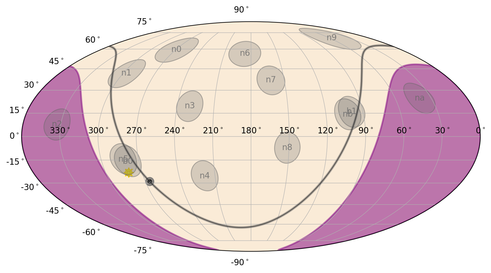

Next, the Fermi GBM detector pointings are shown in gray and are annotated with
the detector numbers.  Each detector is a |DetectorPointing| object, and they
are all stored in a |PlotElementCollection| so that the properties can be set as 
a group. We can access each individual detector by using their name as the 
attribute of the collection.

    >>> # the collection
    >>> eqplot.detectors
    <PlotElementCollection: 14 DetectorPointing objects>
    >>> # the plot object for the 'n0' detector
    >>> eqplot.detectors.n0
    <DetectorPointing: 'n0';
                   face_color=dimgray;
                   face_alpha=0.25;
                   edge_color=dimgray;
                   edge_alpha=0.5;
                   linestyle='solid';
                   linewidth=1.0;
                   fontsize=10;
                   font_color=dimgray;
                   font_alpha=0.8>
                   
We can update the plot properties for all detectors at once by setting the 
corresponding attribute of the collection.  Note that when we set an attribute
of the collection, we must call it as a method:

    >>> eqplot.detectors.face_color('green')
    >>> eqplot.detectors.face_alpha(0.5)
    >>> eqplot.detectors.edge_color('forestgreen')
    >>> eqplot.detectors.font_color('purple')
    >>> eqplot.detectors.fontsize(12)

We can update the properties of individual detectors, too:

    >>> eqplot.detectors.n3.color = 'salmon'
    >>> eqplot.detectors.n3.font_color = 'black'
    
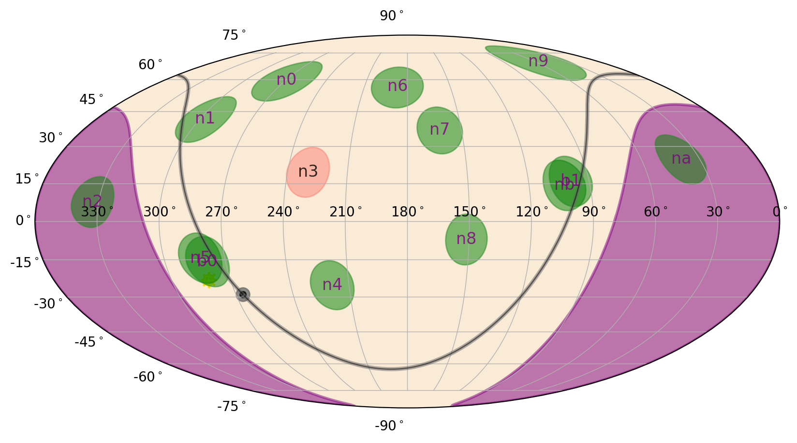

The next item on the plot is the sun, which is now unfortunately hidden behind
our darker detector circles.  We can fix that by accessing the |Sun| plot
element:

    >>> eqplot.sun
    <Sun: alpha=1.0;
      size=150.0>

    >>> eqplot.sun.zorder = 10
    >>> eqplot.sun.size = 300

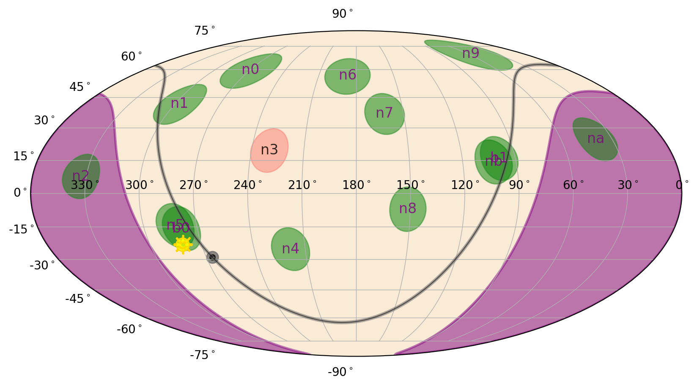

Finally, the stylized galactic plane plot element is a |GalacticPlane| object:

    >>> eqplot.galactic_plane
    <GalacticPlane: outer_color=dimgray;
                    inner_color=black;
                    line_alpha=0.5;
                    center_alpha=0.75;

And we can similarly update the plot properties:

    >>> eqplot.galactic_plane.outer_color = 'red'
    >>> eqplot.galactic_plane.inner_color = 'darkred'
    >>> eqplot.galactic_plane.line_alpha = 0.7
    >>> eqplot.galactic_plane.zorder = 0

We can also make the plot in the Galactic frame:

    >>> from gdt.core.plot.sky import GalacticPlot
    >>> galplot = GalacticPlot(interactive=True)
    >>> galplot.add_frame(frame[0])

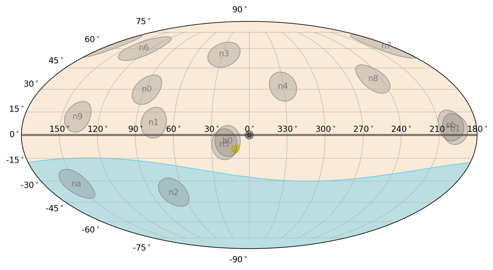

And also in the spacecraft frame, where the longitudinal coordinates are the
spacecraft azimuth and the latitudinal coordinates are relative to spacecraft
zenith (i.e. zenith=0 is often the "top" or boresight of the observatory).

    >>> from gdt.core.plot.sky import SpacecraftPlot
    >>> scplot = SpacecraftPlot(interactive=True)
    >>> scplot.add_frame(frame[0])

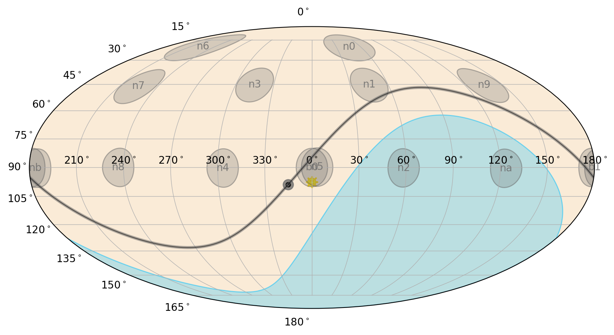

Localizations
=============
We can also visualize localizations on these sky maps by adding a 
|HealPixLocalization| object to our plot.  In our example, we will read in 
a Fermi GBM localization (see |core-healpix| for more information about using
HealPixLocalization objects).

    >>> from gdt.missions.fermi.gbm.localization import GbmHealPix
    >>> filepath = test_data['fermi-gbm'].joinpath('glg_healpix_all_bn190915240_v00.fit')
    >>> loc = GbmHealPix.open(filepath)
    
Now we simply create our plot and add the localization"

    >>> eqplot = EquatorialPlot(interactive=True)
    >>> eqplot.add_localization(loc, gradient=True, clevels=[0.5, 0.9])
    
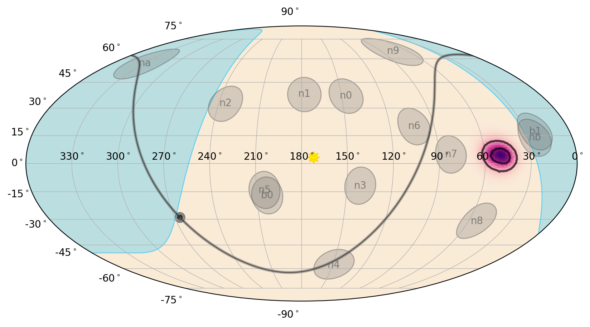

In this example, we have set the localization posterior to be plotted as a 
gradient and have marked the 50% and 90% confidence regions. The posterior, 
which is a |SkyHeatmap| object, can be accessed and updated:

    >>> eqplot.loc_posterior
    <SkyHeatmap: color='RdPu';
                 norm=PowerNorm>
               
    >>> from matplotlib.colors import PowerNorm
    >>> # effectively decrease the sharpness of the color gradient norm
    >>> eqplot.loc_posterior.norm = PowerNorm(gamma=0.2)  
    >>> eqplot.loc_posterior.color.name = 'Greens'

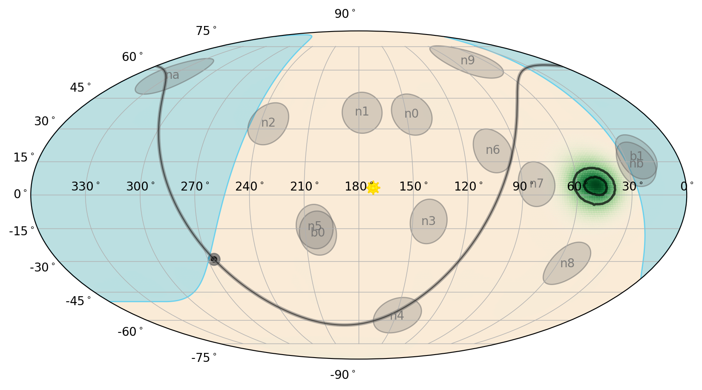

The localization contours are stored in a |PlotElementCollection| as
|SkyLine| objects and can be updated in a similar way to how we updated the 
detectors:

    >>> eqplot.loc_contours.color('purple')
    >>> eqplot.loc_contours.alpha(1.0)
    >>> eqplot.loc_contours.linewidth(1.5)
    >>> eqplot.loc_contours.linestyle('--')
    
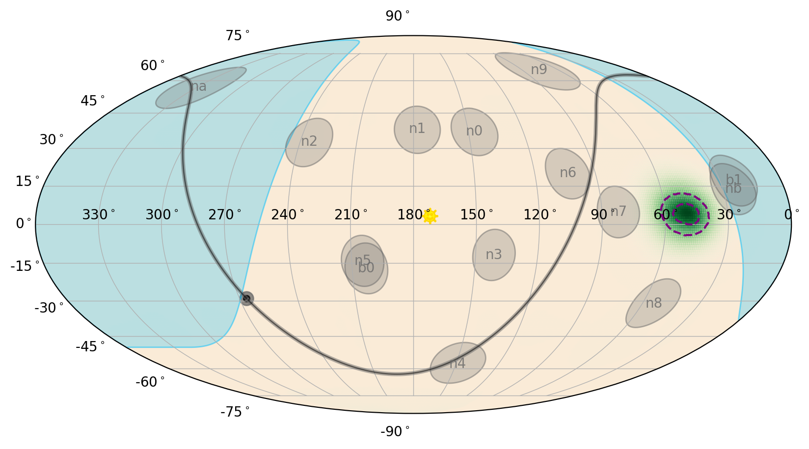

Instead of plotting the gradient of the localization posterior, we can plot
stacked filled contours instead:

    >>> eqplot = EquatorialPlot(interactive=True)
    >>> eqplot.add_localization(loc, gradient=False, clevels=[0.5, 0.9, 0.99])

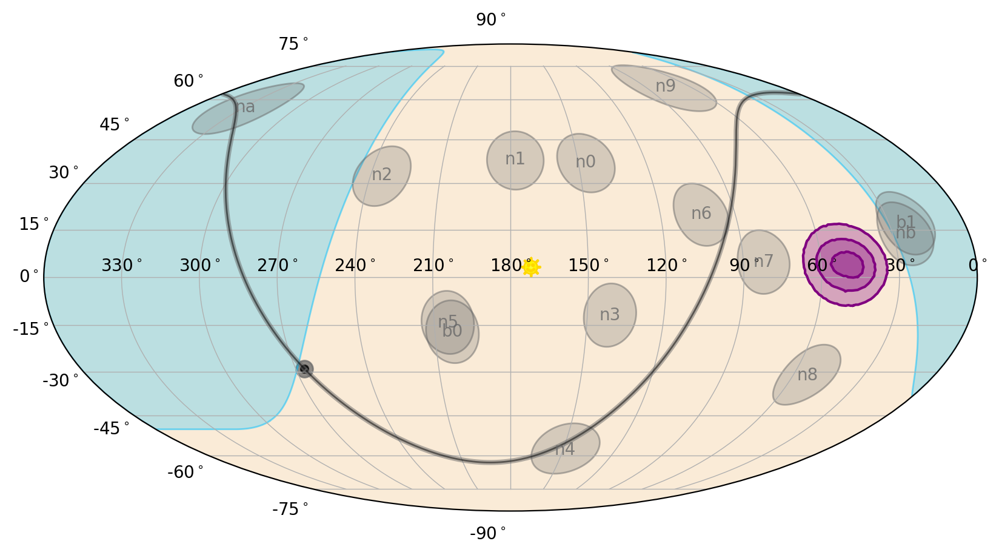

As with the non-filled contours, these are stored in a |PlotElementCollection|,
but are |SkyPolygon| objects:

    >>> eqplot.loc_contours
    <PlotElementCollection: 3 SkyPolygon objects>
    >>> eqplot.loc_contours.items
    ['0.5_0', '0.9_0', '0.99_0']
    
.. Note::
    The item names here are ``<clevel>_<segment number>`` where 
    ``segment number`` may be > 0 when the contour is split across the sky 
    meridian.  Because these names have a period in them, they cannot be 
    accessed as an attribute, so use the standard ``get_item()`` method.

    >>> eqplot.loc_contours.get_item('0.5_0')
    <SkyPolygon: face_color=purple;
                 face_alpha=0.3;
                 edge_color=purple;
                 edge_alpha=None;
                 linestyle='-';
                 linewidth=1.5>

We can update the contour properties in the normal way:

    >>> eqplot.loc_contours.face_color('green')
    >>> eqplot.loc_contours.edge_color('green')
    >>> eqplot.loc_contours.linestyle('--')
    
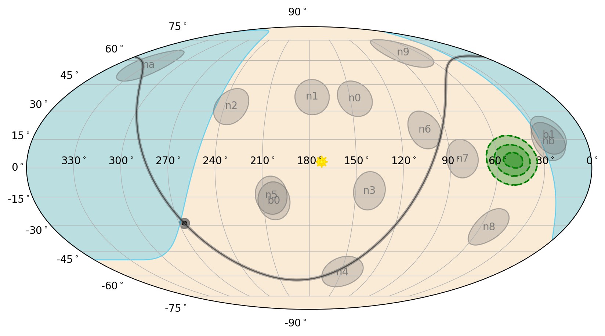

Finally, we can demonstrate plotting the localization in a different projection
altogether.  Let's plot the localization in the spacecraft frame and in a polar
projection:

    >>> # reduce the polar tick resolution
    >>> scplot = SpacecraftPlot(interactive=True, projection='polar', yticks_res=30)
    >>> scplot.add_localization(loc, gradient=False, clevels=[0.5, 0.9, 0.99])

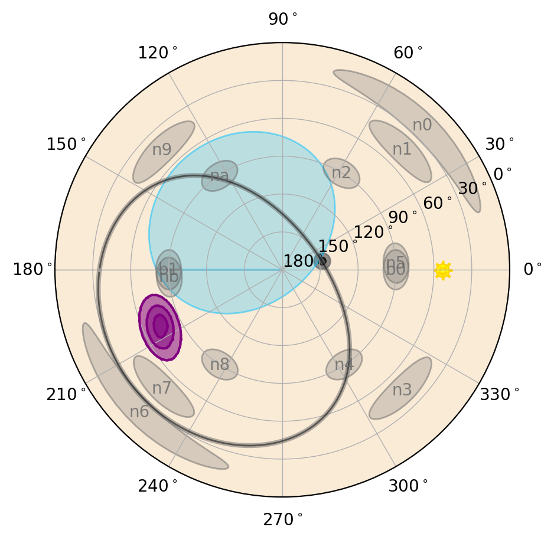

Effective Area
==============
All-sky or wide-field angular responses can be plotted on a sky map as well.
To do so, we utilize the |HealPixEffectiveArea| class, which contains the 
effective area on the sky (see |core-healpix| for more information about using
HealPixEffectiveArea objects).

For our example, we will create a cosine-like idealized response:

    >>> from gdt.core.healpix import HealPixEffectiveArea
    >>> # peak effective area of 100 cm^2 at az=60, zen=90
    >>> effarea = HealPixEffectiveArea.from_cosine(60.0, 90.0, 100.0, coeff=2.0)
    
Next we can add it a sky plot.  Let's plot in spacecraft coordinates:

    >>> scplot = SpacecraftPlot(interactive=True)
    >>> scplot.add_effective_area(effarea)

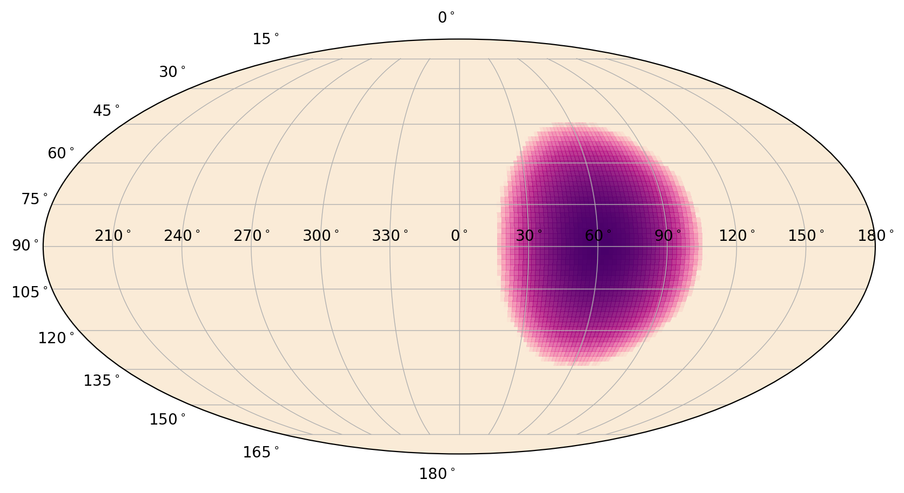

Similar to the localization posterior gradient, the effective area is a 
|SkyHeatmap| object and the same properties can be set:

    >>> scplot.effective_area
    <SkyHeatmap: color='RdPu';
                 norm=PowerNorm>

To plot in other coordinate frames, we need to provide a |SpacecraftFrame| so 
that the effective area can be rotated into that frame.  We can also plot all
of the normal things on the sky as well:

    >>> galplot = GalacticPlot(interactive=True)
    >>> galplot.add_effective_area(effarea, frame=frame[0], earth=True, sun=True,
    >>>                            galactic_plane=True)

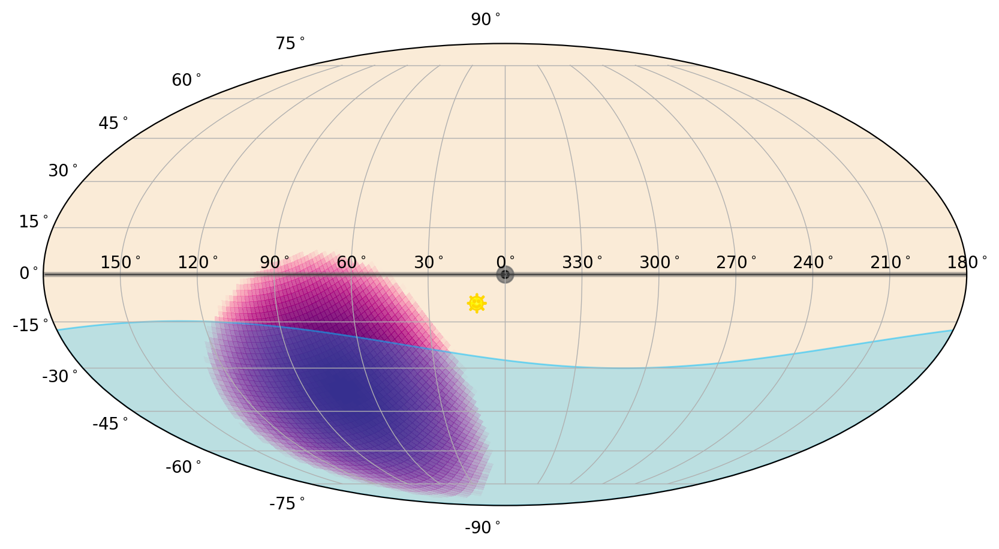

Reference/API
=============

.. automodapi:: gdt.core.plot.sky
   :inherited-members:

