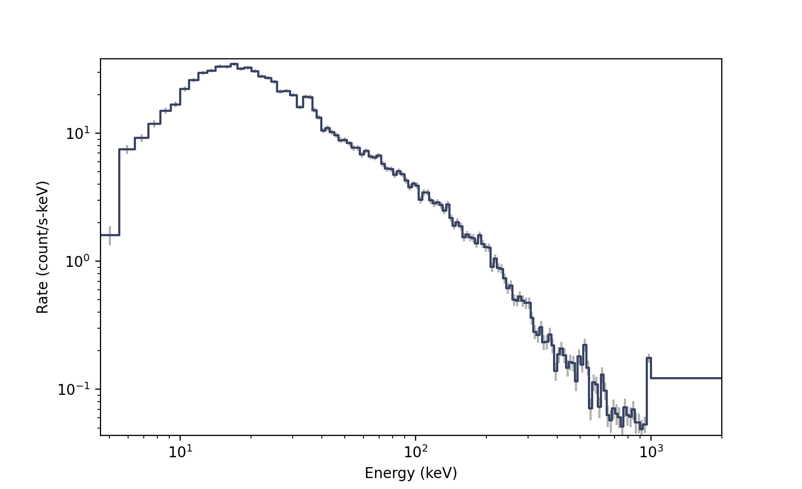
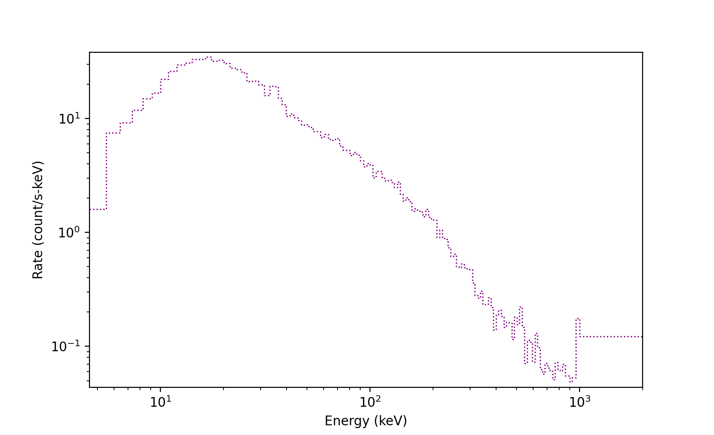
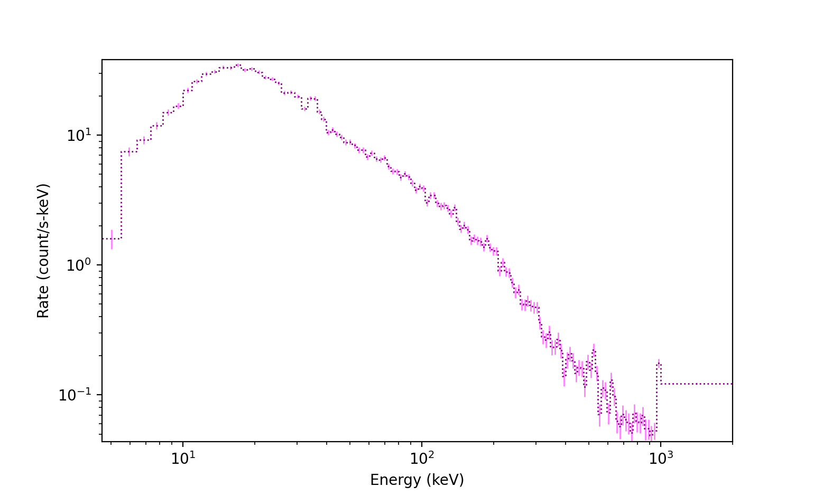
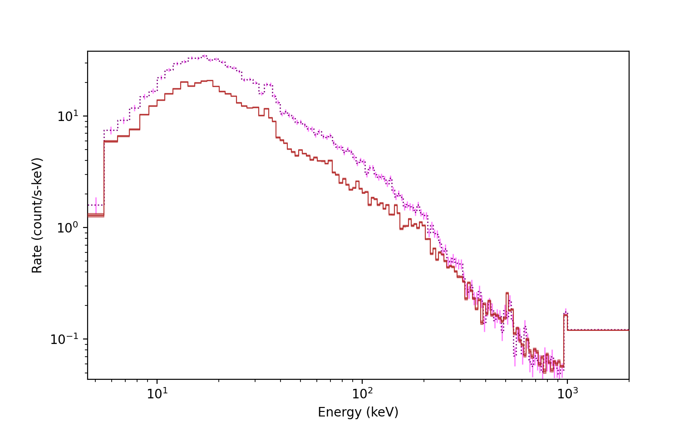
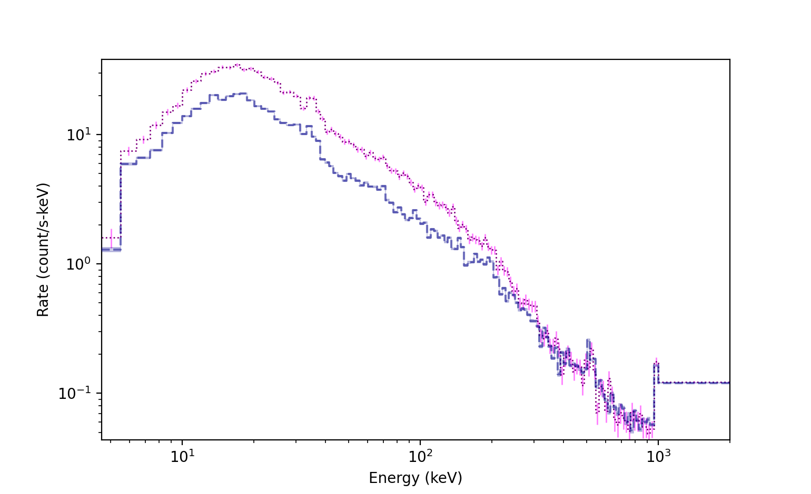
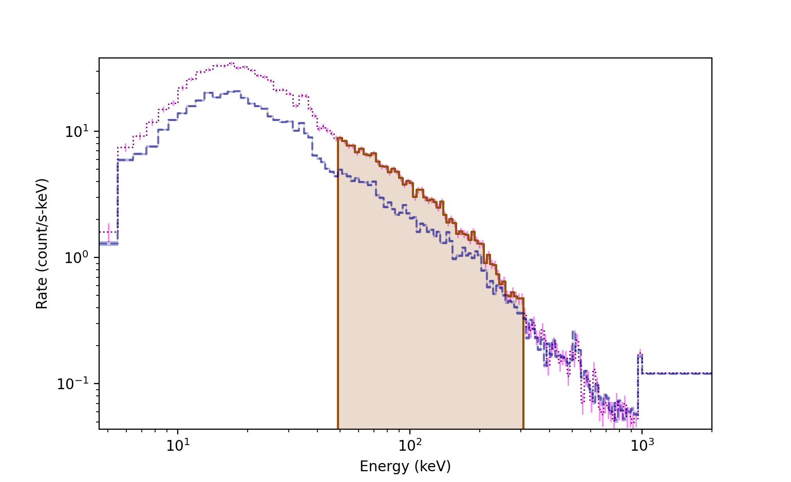
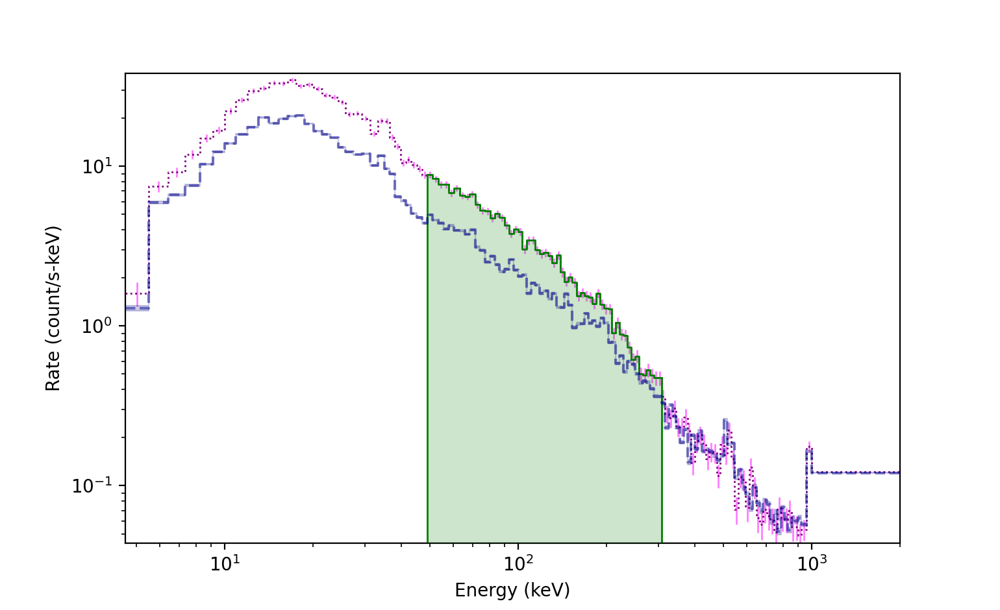
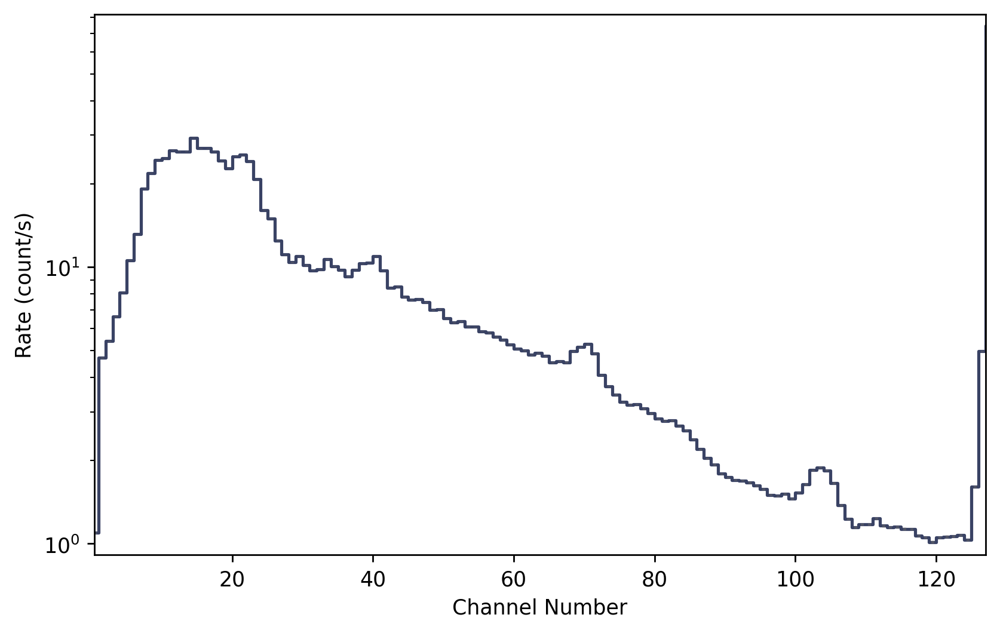

.. _plot-spectrum:
.. |Spectrum| replace:: :class:`~gdt.core.plot.spectrum.Spectrum`
.. |Histo| replace:: :class:`~gdt.core.plot.plot.Histo`
.. |HistoErrorbars| replace:: :class:`~gdt.core.plot.plot.HistoErrorbars`
.. |HistoFilled| replace:: :class:`~gdt.core.plot.plot.HistoFilled`
.. |SpectrumBackground| replace:: :class:`~gdt.core.plot.plot.SpectrumBackground`
.. |BackgroundSpectrum| replace:: :class:`~gdt.core.background.primitives.BackgroundSpectrum`
.. |core-phaii| replace:: :ref:`PHAII Data<core-phaii>`
.. |background_fitter| replace:: :ref:`Background Fitter<background_fitter>`
.. |ChannelBins| replace:: :class:`~gdt.core.data_primitives.ChannelBins`

******************************************************
Plotting Count Spectra (:mod:`~gdt.core.plot.spectra`)
******************************************************
A count spectrum can be plotted by using the |Spectrum| plotting class.

Energy-Calibrated Spectrum
==========================

We will use an example Fermi GBM PHAII file (see |core-phaii| for details 
about PHAII data).

    >>> from gdt.core import data_path
    >>> from gdt.missions.fermi.gbm.phaii import Cspec
    >>> filepath = data_path.joinpath('fermi-gbm/glg_cspec_n0_bn160509374_v01.pha')
    >>> phaii = Cspec.open(filepath)
    
    >>> import matplotlib.pyplot as plt
    >>> from gdt.core.plot.spectrum import Spectrum
    >>> specplot = Spectrum(data=phaii.to_spectrum(time_range=(362.0, 385.0)), 
    >>>                     interactive=True)
    >>> plt.show()

There are a few things to note in the image.  First, we specified a time range
when creating the spectrum, representing the time range over which we are 
integrating the data.  If this is not specified, the full time range of the 
data will be integrated over.  Second, while we plotted the full energy range of 
the data, we could also specify a range for plotting in 
``phaii.to_spectrum``.  Also, the histogrammed data is shown, by default,
in  blue, and the standard Poisson error bars are displayed in gray.  

We can access the spectrum and spectrum errorbars objects, which are |Histo|
and |HistoErrorBars| objects, respectively:

    >>> specplot.spectrum
    <Histo: color=#394264;
            alpha=None;
            linestyle='-';
            linewidth=1.5>

    >>> specplot.errorbars
    <HistoErrorbars: color=dimgrey;
                     alpha=None;
                     linewidth=1.5>

We can customize several properties of the spectrum in this way:

    >>> # toggle off the errorbars
    >>> specplot.errorbars.toggle()
    >>> # change spectrum plot properties
    >>> specplot.spectrum.color = 'purple'
    >>> specplot.spectrum.linewidth = 1
    >>> specplot.spectrum.linestyle = ':'

     
We can also modify the errorbar properties in a similar way:

    >>> # toggle errorbars back on
    >>> specplot.errorbars.toggle()
    >>> specplot.errorbars.color = 'fuchsia'
    >>> specplot.errorbars.alpha = 0.5
    >>> specplot.errorbars.linewidth = 1

A background model can also be added to the plot.  See |background_fitter| for
fitting/estimating background.  To add a background model, we require a 
|BackgroundSpectrum| object, which is an output of the background fitter, 
integrated over the same time range as the spectrum.

    >>> # back_spec is the BackgroundSpectrum object
    >>> specplot.set_background(back_spec)

Notice the reddish background line that appears on the plot.  Although not 
easily seen in this figure, if we zoom in, there is a median background line
and and uncertainty band that represents the 1-sigma background model 
uncertainty.  We can access the background plot element, which is a 
|SpectrumBackground| object:

    >>> specplot.background
    <SpectrumBackground: color=firebrick;
                         alpha=0.85;
                         band_alpha=0.5;
                         linestyle='-';
                         linewidth=0.75>

We can also adjust the background element properties:

    >>> specplot.background.color='darkblue'
    >>> specplot.background.alpha=0.5
    >>> specplot.background.band_alpha=0.2
    >>> specplot.background.linewidth = 1.5
    >>> specplot.background.linestyle = '--'

Finally, we can add selections to the spectrum plot, which are shown as 
highlighted regions of the lightcurve by default.  To do so, we need to take
an energy slice of our spectrum:

    >>> spec_select = phaii.to_spectrum(time_range=(362.0, 385.0), energy_range=(50.0, 300.0))
    >>> specplot.add_selection(spec_select)
    

We can add multiple selections to the plot, so they are stored as a list of
|HistoFilled| objects:

    >>> specplot.selections
    [<HistoFilled: color=#9a4e0e;
                   alpha=None;
                   fill_alpha=0.2;
                   linestyle='-';
                   linewidth=1.5>]
                   
As with the other plot elements, we can also change the selection plot element
properties:

    >>> specplot.selections[0].color='green'
    >>> specplot.selections[0].linewidth = 1

Uncalibrated Energy Channel Spectrum
====================================
If we have a count spectrum but no energy calibration, then we simply want to
plot the number of counts in each energy channel. This is represented by the
|ChannelBins| data object, and |Spectrum| can be used to plot these as well.

As an example, let's create an uncalibrated energy channel spectrum from the
Fermi GBM data we used earlier:

    >>> from gdt.core.data_primitives import ChannelBins
    >>> spectrum = phaii.to_spectrum()
    >>> # create a list of channel numbers
    >>> chan_nums = list(range(spectrum.size))
    >>> chan_bins = ChannelBins.create(spectrum.counts, chan_nums, spectrum.exposure)
    >>> chan_bins
    <ChannelBins: 128 bins;
     range (0, 127);
     1 contiguous segments>

Now we can plot it:

    >>> import matplotlib.pyplot as plt
    >>> from gdt.core.plot.spectrum import Spectrum
    >>> specplot = Spectrum(data=chan_bins)
    >>> plt.show()

Notice that by default, the x-axis is plotted in linear channel space, and the
spectrum is no longer differential like it is displayed when we have an 
energy calibration.

Reference/API
=============

.. automodapi:: gdt.core.plot.spectrum
   :inherited-members:

