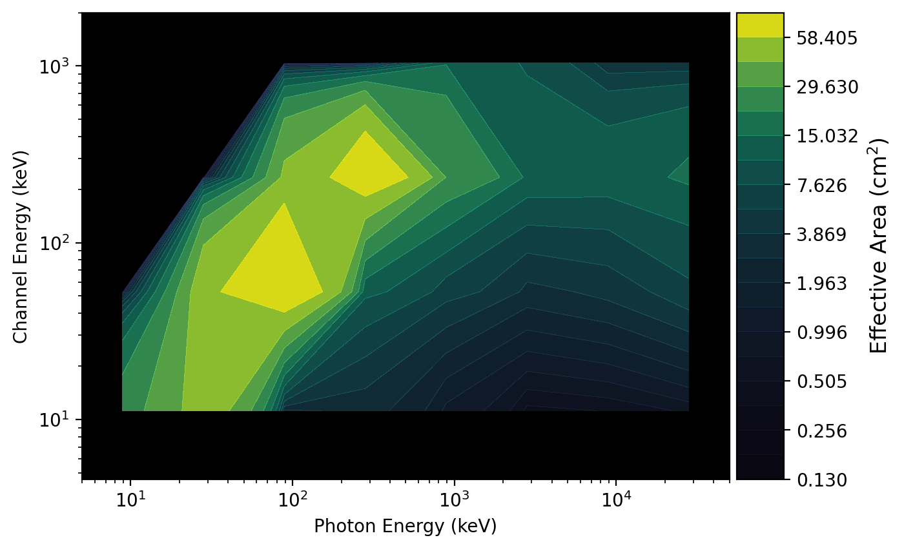
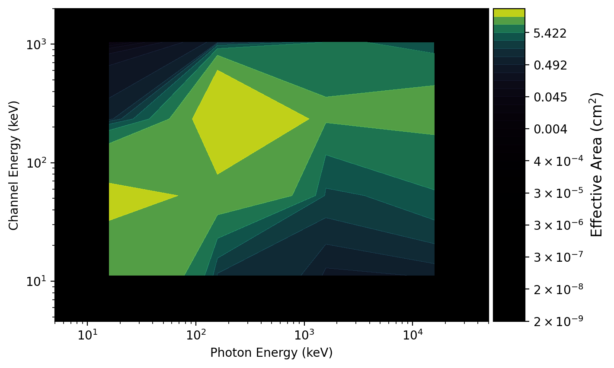

.. _core-response:
.. |Rsp| replace:: :class:`~gdt.core.response.Rsp`
.. |Rsp2| replace:: :class:`~gdt.core.response.Rsp2`
.. |ResponseMatrix| replace:: :class:`~gdt.core.data_primitives.ResponseMatrix`
.. |EnergyBins| replace:: :class:`~gdt.core.data_primitives.EnergyBins`
.. |Ebounds| replace:: :class:`~gdt.core.data_primitives.Ebounds`
.. |PowerLaw| replace:: :class:`~gdt.core.spectra.functions.PowerLaw`
.. |Rsp.open()| replace:: :meth:`~gdt.core.response.Rsp.open`
.. |Rsp.write()| replace:: :meth:`~gdt.core.response.Rsp.write`
.. |Rsp._build_hdulist()| replace:: :meth:`~gdt.core.response.Rsp._build_hdulist`
.. |Rsp._build_headers()| replace:: :meth:`~gdt.core.response.Rsp._build_headers`
.. |FileHeaders| replace:: :class:`~gdt.core.headers.FileHeaders`
.. |ResponsePlot| replace:: :class:`~gdt.core.plot.drm.ResponsePlot`
.. |plot-drm| replace:: :ref:`Response DRMs<plot-drm>`
.. |core-headers| replace:: :ref:`Data File Headers<core-headers>`

***********************************************
Instrument Responses (:mod:`gdt.core.response`)
***********************************************
    

Introduction
============
The instrument response for hard X-ray and gamma-ray detectors are generally
represented as a matrix mapping the incident photon energy to the energy of
the recorded _counts_.  This matrix combines two primary factors: the effective
area as a function of energy (which often includes other factors like 
efficiency), and the photon energy redistribution.  A photon model can then
be "folded" through this Detector Response Matrix (DRM) via matrix 
multiplication to produce the recorded counts in each detector energy channel.
As a general rule, the DRM is not an invertible matrix because the energy 
redistribution causes the DRM to have significant off-diagonal contributions.  
This causes the matrix to be nearly singular and non-invertible. Even if the 
DRM could be inverted, data have statistical fluctuations so backing out a 
photon spectrum from a count spectrum will not work well.

A particular DRM is valid for a particular incidence direction. If multiple
incidence directions are required for an analysis, then DRMs corresponding to
those directions are needed.  For example, in the case that the source-detector 
angle changes significantly during a time-resolved spectral analysis, it may
be necessary to use a time series of DRMs.  The GDT contains classes to work
with single-DRM response files (|Rsp|) and multi-DRM response files (|Rsp2|).

The Rsp Class
=============
The |Rsp| class provides a way to construct, write out, and read single-DRM
response files. There are also some useful functions to rebin, resample, and
fold a model through the response. The Rsp base class does not have the 
ability to read and write files.  Rsp is expected to be subclassed to
define the reading and writing portion of the file, however, you can still
programmatically create a Rsp object.  In the following examples, we will 
first create a Rsp object with a DRM, and then we will walk through 
how to subclass Rsp to create a class that can read/write files.

Examples
--------
First, we will show how to construct a |Rsp| object from a DRM defined in a
|ResponseMatrix| object. In our example, we will construct a response with a 
DRM that has 8 input photon bins and 4 output energy channels.

    >>> from gdt.core.data_primitives import ResponseMatrix
    >>> # 8 photon bins x 4 energy channels
    >>> matrix = [[25.2,  0.0,  0.0,  0.0],
    >>>           [51.8, 54.9,  0.0,  0.0],
    >>>           [2.59, 82.0, 44.8,  0.0],
    >>>           [3.10, 11.6, 77.0, 0.13],
    >>>           [1.26, 6.21, 29.3, 14.6],
    >>>           [0.45, 3.46, 13.8, 9.98],
    >>>           [0.52, 4.39, 13.3, 3.93],
    >>>           [0.79, 7.14, 16.1, 3.92]]
    >>> emin = [5.00, 15.8, 50.0, 158., 500., 1581, 5000, 15811]
    >>> emax = [15.8, 50.0, 158., 500., 1581, 5000, 15811, 50000]
    >>> chanlo = [4.60, 27.3, 102., 538.]
    >>> chanhi = [27.3, 102., 538., 2000]
    >>> drm = ResponseMatrix(matrix, emin, emax, chanlo, chanhi)

    >>> from gdt.core.response import Rsp  
    >>> tstart = 524666421.47
    >>> tstop = 524666521.47
    >>> trigtime = 524666471.47
    >>> rsp = Rsp.from_data(drm, start_time=tstart, stop_time=tstop, 
    >>>                     trigger_time=trigtime, detector='det0')
    >>> rsp
    <Rsp: 
    trigger time: 524666471.47;
    time range (-50.0, 50.0);
    8 energy bins; 4 channels>
   
In this example, note that we constructed the Rsp object with a ResponseMatrix
and some metadata, namely the the times over which the response is valid and
a reference "trigger" time. While not required, it is strongly suggested that
``start_time`` and ``stop_time`` be defined, especially if this response is used
in a time series analysis. And the detector name should be defined if this 
response is used in a multi-detector analysis.

We can plot it to see what it looks like using the |ResponsePlot| class (see
|plot-drm| for details):

    >>> import matplotlib.pyplot as plt
    >>> from gdt.core.plot.drm import ResponsePlot
    >>> drmplot = ResponsePlot(drm=rsp.drm, num_contours=20)
    >>> plt.show()
    

Now that we have created our Rsp object, there are several attributes 
that are available to us.  We can directly access the DRM and times we created 
the object with:

    >>> # the DRM
    >>> rsp.drm
    <ResponseMatrix: 8 energy bins; 4 channels>
    >>> # start time
    >>> rsp.tstart
    -50.0
    >>> # stop time
    >>> rsp.tstop
    50.0
    >>> # reference time
    >>> rsp.trigtime
    524666471.47
    >>> rsp.detector
    'det0'
    
There are other attributes that are exposed:

    >>> # the energy channel ebounds
    >>> rsp.ebounds
    <Ebounds: 4 intervals; range (4.6, 2000.0)>
    >>> # number of energy channels
    >>> rsp.num_chans
    4
    >>> # number of photon bins
    >>> rsp.num_ebins
    8
    >>> # center of valid time interval
    >>> rsp.tcent
    0.0

The single most important function of the Rsp object is the ability to fold
a photon spectrum through the response and get out a count rate.  While the 
lower-level |ResponseMatrix| object does the heavy lifting of the folding,
the Rsp object formats the output into an |EnergyBins| object containing a 
count rate spectrum and incorporating an exposure. In our example, we will
use the built-in |PowerLaw| function to fold a -2.2 power law through the 
response matrix:

    >>> from gdt.core.spectra.functions import PowerLaw
    >>> pl = PowerLaw()
    >>> # amplitude = 0.01; index = -2.2; 2.5 s exposure
    >>> count_spectrum = rsp.fold_spectrum(pl.fit_eval, (0.01, -2.2), exposure=2.5)
    >>> count_spectrum
    <EnergyBins: 4 bins;
    range (4.6, 2000.0);
    2 contiguous segments>
    >>> count_spectrum.rates
    array([852.91654884, 425.86251321,  92.80740883,   1.58433796])

Other functions include rebinning energy channel axis and resampling the 
the input photon axis of the response.  You can rebin the energy channel axis 
in two ways: either by specifying a binning factor at which to downscale the
axis resolution (e.g. a rebinning factor of ``2`` combines the energy channels
by a factor of two) or by specifying the energy channel edges that should 
remain in the rebinned axis.

    >>> # rebin by a factor of 2
    >>> rebinned_rsp = rsp.rebin(factor=2)
    >>> rebinned_rsp.ebounds.intervals
    [<EnergyRange: (4.6, 102.0)>, 
    <EnergyRange: (102.0, 2000.0)>]

    >>> # rebin by only showing the specified edges (defined by edge index)
    >>> rebinned_rsp = rsp.rebin(edge_indices=[0, 1, 2, 4])
    >>> rebinned_rsp.ebounds.intervals
    [<EnergyRange: (4.6, 27.3)>,
    <EnergyRange: (27.3, 102.0)>,
    <EnergyRange: (102.0, 2000.0)>]

Resampling the input axis of the response allows a lot more flexibility; you
can increase the resolution of the input axis, decrease the resolution, or 
just redefine the energy edges as long as the edges are still contained within
the bounds of the original response.  This can all be done with two options: 
specifying the number in input photon bins, or specifying the photon bin edges.
If you specify the number of photon bins, they will be logarithmically spaced
between the bounds of the original response.

    >>> # resample by specifying 10 logarithmically-spaced bins
    >>> resampled_rsp = rsp.resample(num_photon_bins=10)
    >>> resampled_rsp.drm.photon_bins.intervals
    [<EnergyRange: (5.000000000000001, 12.559432157547903)>,
    <EnergyRange: (12.559432157547903, 31.54786722400968)>,
    <EnergyRange: (31.54786722400968, 79.2446596230557)>,
    <EnergyRange: (79.2446596230557, 199.05358527674863)>,
    <EnergyRange: (199.05358527674863, 499.99999999999994)>,
    <EnergyRange: (499.99999999999994, 1255.943215754791)>,
    <EnergyRange: (1255.943215754791, 3154.786722400968)>,
    <EnergyRange: (3154.786722400968, 7924.4659623055695)>,
    <EnergyRange: (7924.4659623055695, 19905.358527674885)>,
    <EnergyRange: (19905.358527674885, 49999.99999999999)>]

    >>> # resample by specifying the photon bin edges
    >>> resampled_rsp = rsp.resample(photon_bin_edges=[5.0, 50.0, 500.0, 5000., 50000.])
    >>> resampled_rsp.drm.photon_bins.intervals
    [<EnergyRange: (5.0, 50.0)>,
    <EnergyRange: (50.0, 500.0)>,
    <EnergyRange: (500.0, 5000.0)>,
    <EnergyRange: (5000.0, 50000.0)>]

The plot of the second resampled DRM is shown below:

    >>> drmplot = ResponsePlot(drm=resampled_rsp.drm, num_contours=40)
    >>> plt.show()

Subclassing
-----------
To read and write single-DRM RSP files, the |Rsp| class needs to be 
subclassed. This is because the format and metadata of the files can be 
different from mission to mission.  When subclassing Rsp to read a 
file, the |Rsp.open()| method needs to be defined.  To write out a file, 
the private method |Rsp._build_hdulist()| needs to be defined, which 
defines the data structure for each extension of the FITS file. Adding header 
information/metadata is not required, however if you do want the header 
information to be tracked when reading in a file and written out when writing a
file to disk, you will need to create the header definitions as explained in
|core-headers| and also define the private method |Rsp._build_headers()|.

To illustrate further, below is a sketch of how the Rsp class should be 
subclassed in the example ``MyRsp``:

    >>> import astropy.io.fits as fits
    >>> from gdt.core.data_primitives import ResponseMatrix
    >>> from gdt.core.response import Rsp
    >>>
    >>> class MyRsp(Rsp):
    >>>     """An example to read and write Rsp files for xxx instrument"""
    >>>     @classmethod
    >>>     def open(cls, file_path, **kwargs):
    >>>         with super().open(file_path, **kwargs) as obj:
    >>>
    >>>             # an example of how to set the headers
    >>>             hdrs = [hdu.header for hdu in obj.hdulist]
    >>>             headers = MyFileHeaders.from_headers(hdrs)
    >>>
    >>>             # an example of how to set the DRM
    >>>             # Note: Some DRMs may be stored in a compressed format.
    >>>             #       You will need to perform the decompression.
    >>>             drm = ResponseMatrix(matrix, emin, emax, chan_lo, chan_hi)
    >>>
    >>>             return cls.from_data(drm, start_time=tstart, stop_time=tstop,
    >>>                                  trigger_time=trigger_time,
    >>>                                  filename=obj.filename, headers=headers)
    >>>
    >>>     def _build_hdulist(self):
    >>>         # this is where we build the HDU list (header/data for each extension)
    >>>         hdulist = fits.HDUList()
    >>>
    >>>         # some code to create PRIMARY HDU
    >>>         # ...
    >>>         hdulist.append(primary_hdu)
    >>>
    >>>         # code to create other HDUs and append to hdulist
    >>>         # ...
    >>>
    >>>         return hdulist
    >>>
    >>>     def _build_headers(self, num_chans, num_ebins):
    >>>         # build the header based on these inputs
    >>>         headers = self.headers.copy()
    >>>         # update header information here
    >>>         # ...
    >>>
    >>>         return headers

To create a Rsp object from a FITS file, the ``open()`` method should, 
at a minimum, be able to construct a |ResponseMatrix| object containing the 
DRM.  Additionally, you can construct a |FileHeaders| and define the relevant
time range. If the data has an associated trigger or reference time, you can 
track that as well.

The example creation of ``headers`` takes in a list of the headers from
each extension and assumes you have created a class (in this case 
``MyFileHeaders``) that will read in the header information.

To write the data to disk, the |Rsp._build_hdulist()| defines the list of 
FITS HDUs, and is called by the |Rsp.write()| method.  The 
|Rsp._build_headers()| method is called whenever operations are performed 
on the object, like rebinning or slicing to propagate the header information.

The Rsp2 Class
==============
Often it is useful to write several DRMs, in a time sequence, to a single file.
For analyses that require studying the spectrum on a timescale over which the 
instrument pointing relative to the source in consideration has changed, then
a different DRM may be needed for different time segments of the analysis. For
this purpose, RSP2 files contain two or more DRMs that are each associated with 
a GTI.  An analysis can then use the appropriate DRM, or weigh the different 
DRMs based on the time interval(s) of interest.  The |Rsp2| class provides the 
functionality for creating, reading, and writing RSP2 files and extracting 
individual DRMs, interpolating DRMs, and weighting DRMs.

Examples
--------
For simplicity, let's use the DRM we defined above and simply create two more 
DRMs that are just scalar increases from the original:

    >>> import numpy as np
    >>> matrix = np.copy(drm.matrix)
    >>> drm_2 = ResponseMatrix(matrix*1.1, emin, emax, chanlo, chanhi)
    >>> drm_3 = ResponseMatrix(matrix*1.2, emin, emax, chanlo, chanhi)

Now we create the response objects with the GTI for each response

    >>> rsp_2 = Rsp.from_data(drm_2, start_time=tstart+100.0, stop_time=tstop+100.0, 
    >>>                       trigger_time=trigtime)
    >>> rsp_3 = Rsp.from_data(drm_3, start_time=tstart+200.0, stop_time=tstop+200.0, 
    >>>                       trigger_time=trigtime)

Now we can create a Rsp2 object from these three responses:

    >>> from gdt.core.response import Rsp2
    >>> rsp2 = Rsp2.from_rsps([rsp, rsp_2, rsp_3])
    >>> rsp2
    <Rsp2: 
     trigger time: 524666471.47; 3 DRMs;
     time range (-50.0, 250.0)>

Once created, we can retrieve the |Ebounds| that is common to all the DRMs, as
well as the number of channels, number of energy bins, and number of DRMs:

    >>> rsp2.ebounds
    <Ebounds: 4 intervals; range (4.6, 2000.0)>

    >>> rsp2.num_chans
    4
    
    >>> rsp2.num_ebins
    8
    
    >>> rsp2.num_drms
    3

We can also retrieve the times over which each DRM can be used:

    >>> rsp2.tstart
    array([-50.,  50., 150.])

    >>> rsp2.tstop
    array([ 50., 150., 250.])
    
    >>> rsp2.tcent
    array([  0., 100., 200.])
    
Each individual DRM can be extracted in a number of ways. The |Rsp2| object is
indexed, which means that we can retrieve each individual response by index:

    >>> rsp2[1]
    <Rsp: 
     trigger time: 524666471.47;
     time range (50.0, 150.0);
     8 energy bins; 4 channels>
     
You can also use ``extract_drm()`` to return individual responses by index or
by time:

    >>> rsp2.extract_drm(index=0)
    <Rsp: 
     trigger time: 524666471.47;
     time range (-50.0, 50.0);
     8 energy bins; 4 channels>
    
    >>> # get the response for T0+175.0
    >>> rsp2.extract_drm(atime=175.0)
    <Rsp: 
     trigger time: 524666471.47;
     time range (150.0, 250.0);
     8 energy bins; 4 channels>

Instead of simply extracting an existing response, we can interpolate using 
our current list of responses and return a new response:

    >>> # interpolate at T0+175
    >>> rsp2.interpolate(atime=175.0)
    <Rsp: 
     trigger time: 524666471.47;
     time range (175.0, 175.0);
     8 energy bins; 4 channels>

An alternative, especially for long-duration time-integrated analysis, is to
generate a weighted response.  This is done by providing a time history of 
observed counts (lightcurve) which is used to weight each appropriate DRM, and
then the sum of the weighted DRMs are provided in a new response object.

As an example, let us consider that we have 20 s time bins containing counts
from T0 to T0+200 s.

    >>> from gdt.core.data_primitives import TimeBins    
    >>> times = np.linspace(0.0, 200.0, 11)
    >>> counts = [100, 110, 90, 150, 220, 70, 50, 140, 410, 230]
    >>> exposure = [19.9]*10
    >>> bins = TimeBins(counts, times[:-1], times[1:], exposure)
    >>> bins
    <TimeBins: 10 bins;
     range (0.0, 200.0);
     1 contiguous segments>

Now we use this to create a weighted response.  We can choose to use 
interpolation when weighting, too.

    >>> weighted1 = rsp2.weighted(bins, interpolate=False)
    >>> weighted1.drm.matrix
    array([[28.77936306,  0.        ,  0.        ,  0.        ],
           [59.15757962, 62.69789809,  0.        ,  0.        ],
           [ 2.95787898, 93.64713376, 51.1633121 ,  0.        ],
           [ 3.54031847, 13.24764331, 87.93694268,  0.14846497],
           [ 1.43896815,  7.09205732, 33.46171975, 16.67375796],
           [ 0.5139172 ,  3.95145223, 15.76012739, 11.3975414 ],
           [ 0.59385987,  5.01354777, 15.18910828,  4.48821019],
           [ 0.90221019,  8.15415287, 18.38681529,  4.47678981]])

    >>> weighted2 = rsp2.weighted(bins, interpolate=True)
    >>> weighted2.drm.matrix
    array([[28.21276433,  0.        ,  0.        ,  0.        ],
           [57.99290446, 61.46352229,  0.        ,  0.        ],
           [ 2.89964522, 91.80343949, 50.15602548,  0.        ],
           [ 3.47061783, 12.98682803, 86.20566879,  0.14554204],
           [ 1.41063822,  6.95243121, 32.80293631, 16.34549045],
           [ 0.50379936,  3.87365732, 15.44984713, 11.17315032],
           [ 0.58216815,  4.91484268, 14.89007006,  4.39984777],
           [ 0.88444777,  7.99361656, 18.02482166,  4.38865223]])

Reference/API
=============

.. automodapi:: gdt.core.response
   :inherited-members:

Special Methods
===============
.. automethod:: gdt.core.response.Rsp._build_hdulist
.. automethod:: gdt.core.response.Rsp._build_headers

