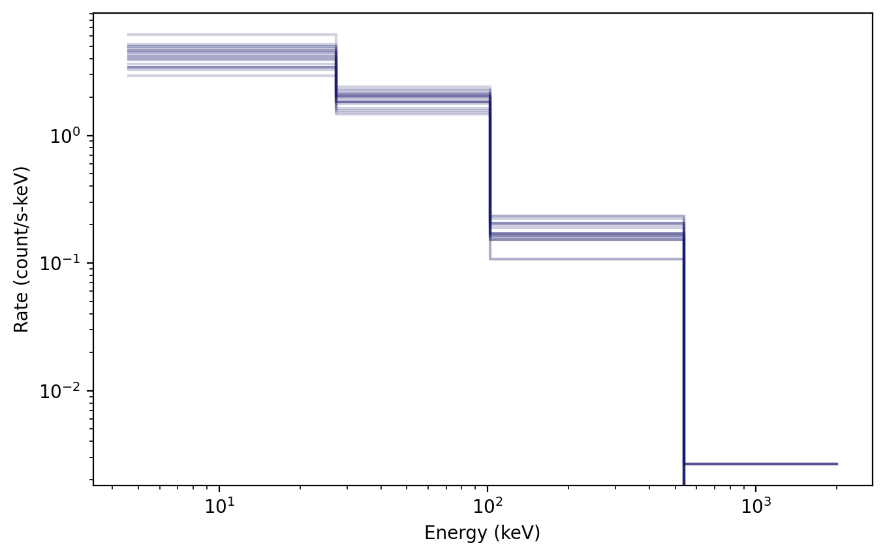
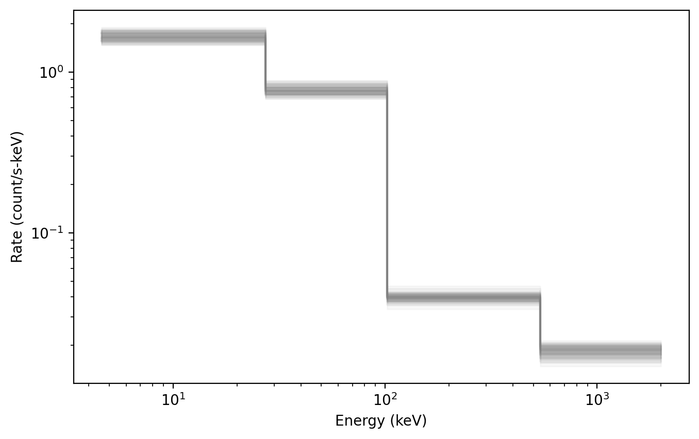
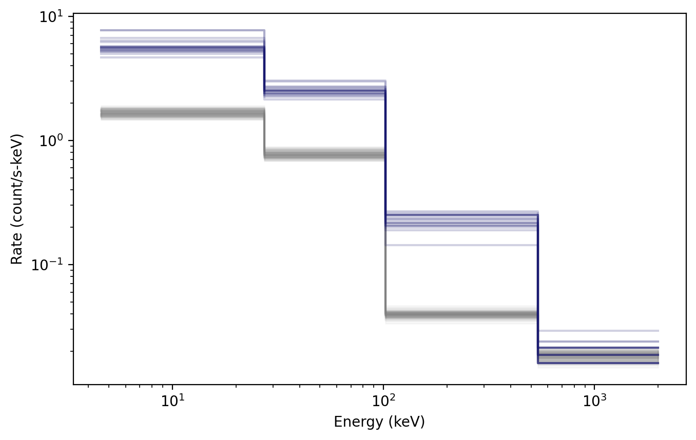
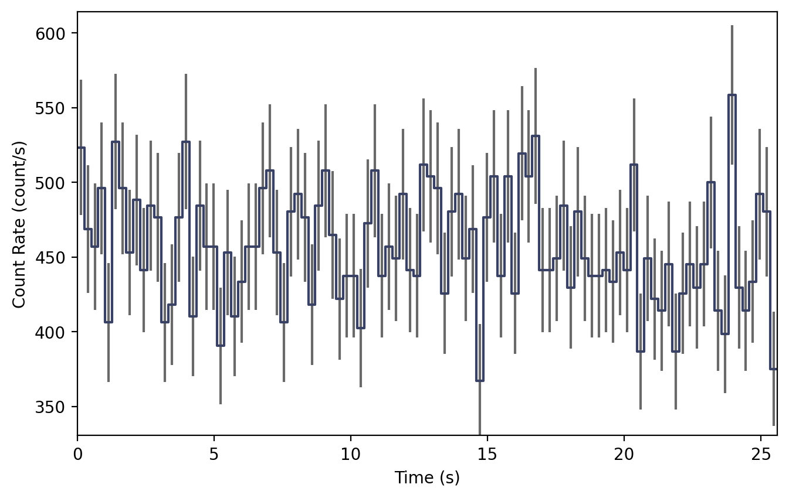

.. _sim-pha:
.. |PhaSimulator| replace:: :class:`~gdt.core.simulate.pha.PhaSimulator`
.. |Band| replace:: :class:`~gdt.core.spectra.functions.Band`
.. |BackgroundSpectrum| replace:: :class:`~gdt.core.background.primitives.BackgroundSpectrum`
.. |EnergyBins| replace:: :class:`~gdt.core.data_primitives.EnergyBins`
.. |Spectrum| replace:: :class:`~gdt.core.plot.spectrum.Spectrum`
.. |Histo| replace:: :class:`~gdt.core.plot.plot.Histo`
.. |SpectrumBackground| replace:: :class:`~gdt.core.plot.plot.SpectrumBackground`
.. |Bak| replace:: :class:`~gdt.core.pha.Bak`
.. |Pha| replace:: :class:`~gdt.core.pha.Pha`
.. |Phaii| replace:: :class:`~gdt.core.phaii.Phaii`
.. |Lightcurve| replace:: :class:`~gdt.core.plot.lightcurve.Lightcurve`
.. |rsp| replace:: :ref:`The Rsp Class<core-response>`
.. |functions| replace:: :ref:`Spectral Functions<spectra-functions>`
.. |plot-spectrum| replace:: :ref:`Plotting Count Spectras<plot-spectrum>`
.. |set_background| replace:: :meth:`~gdt.core.simulate.pha.PhaSimulator.set_background`
.. |set_rsp| replace:: :meth:`~gdt.core.simulate.pha.PhaSimulator.set_rsp`
.. |set_source| replace:: :meth:`~gdt.core.simulate.pha.PhaSimulator.set_source`
.. |set_rng| replace:: :meth:`~gdt.core.simulate.pha.PhaSimulator.set_rng`

************************************************************
Simulating PHA Spectral Data (:mod:`~gdt.core.simulate.pha`)
************************************************************
This module enables the simulation of spectral data including mixtures of 
background and source, which is handled by |PhaSimulator|.

For source simulation, a detector response and photon model are required as
the photon model must be folded through the response to produce a count 
spectrum.  That count spectrum is then sampled from to produce Poisson deviates 
of the count spectrum.

Because folding an inherent photon/particle spectrum through the full-sky
response and integrating over the sky is a very complex and fraught process, the
background simulation is handled in a different way.  The simulator assumes that
you already have some estimate of the background count spectrum.  This can 
either be produced directly from real background data, derived (fit) to real
background data, or created manually. The input background spectrum is then 
used to produce Poisson or Gaussian deviates of the background.

As an example to demonstrate how to produce such simulations, we will use the
example detector response constructed in |rsp|, and then we will use a 
|Band| function (see |functions| for more information on photon models). For the
input background spectrum, we must provide a |BackgroundSpectrum| object, which 
we will manually create in this example:

    >>> from gdt.core.background.primitives import BackgroundSpectrum
    >>> rates = [37.5, 57.5, 17.5, 27.5]
    >>> rate_uncert = [1.896, 2.889, 0.919, 1.66]
    >>> emin = [4.60, 27.3, 102., 538.]
    >>> emax = [27.3, 102., 538., 2000]
    >>> exposure = 0.256
    >>> back_spec = BackgroundSpectrum(rates, rate_uncert, emin, emax, exposure)

Now we are set to initialize our PHA simulator:

    >>> from gdt.core.simulate.pha import PhaSimulator
    >>> from gdt.core.spectra.functions import Band
    >>> band_params = (0.01, 300.0, -1.0, -2.8)
    >>> sim = PhaSimulator(rsp, Band(), band_params, 0.256, back_spec, 'Gaussian')

Here, we specified our detector response (``rsp``), the spectral function and
parameters, the exposure (``0.256``), the background spectrum, and the 
distribution from which to draw background deviates (either ``'Gaussian'`` or
``'Poisson'``)

.. note::
    The exposure on initialization of PhaSimulator does NOT have to match the 
    exposure in the BackgroundSpectrum.  The BackgroundSpectrum will be scaled 
    to the corresponding exposure used in the simulations.

Now we can generate deviates of the source signal in the following way:

    >>> source_devs = sim.simulate_source(20)
    >>> source_devs[0]
    <EnergyBins: 4 bins;
     range (4.6, 2000.0);
     1 contiguous segments>

In the above, we generated 20 Poisson deviates of the source spectrum, which are
packaged in |EnergyBins| objects. To visualize what these deviates look like,
we can plot them using the |Spectrum| plotting class and |Histo| 
plotting elements (see |plot-spectrum| for more information).

    >>> import matplotlib.pyplot as plt
    >>> from gdt.core.plot.spectrum import Spectrum
    >>> from gdt.core.plot.plot import Histo
    >>> # initialize
    >>> specplot = Spectrum()
    >>> # add each deviate to the plot
    >>> source_dev_plt = [Histo(source_dev, specplot.ax, color='midnightblue', 
    >>>                   alpha=0.2) for source_dev in source_devs]
    >>> plt.show()

We can also generate deviates of the background in a similar manner:

    >>> bkgd_devs = sim.simulate_background(20)
    >>> bkgd_devs[0]
    <BackgroundSpectrum: 4 bins;
     range (4.6, 2000.0);
     1 contiguous segments>

This can also plotted using the |SpectrumBackground| plot element:

    >>> from gdt.core.plot.plot import SpectrumBackground
    >>> specplot = Spectrum()
    >>> bkgd_dev_plt = [SpectrumBackground(bkgd_dev, specplot.ax, color='gray', 
    >>>                 alpha=0.1, band_alpha=0.05) for bkgd_dev in bkgd_devs]
    >>> plt.show()

Of most use is to combine the background and source together to create deviates
of the observed spectrum, which are, again, returned as |EnergyBins| objects.

    >>> sum_devs = sim.simulate_sum(20)
    >>> sum_devs[0]
    <EnergyBins: 4 bins;
     range (4.6, 2000.0);
     1 contiguous segments>
     
A particularly useful plot is to show the total spectral deviates and the
background spectral deviates, which basically combines the plot commands from
earlier:

    >>> specplot = Spectrum()
    >>> bkgd_dev_plt = [SpectrumBackground(bkgd_dev, specplot.ax, color='gray', 
    >>>                 alpha=0.1, band_alpha=0.05) for bkgd_dev in bkgd_devs]
    >>> sum_dev_plt = [Histo(sum_dev, specplot.ax, color='midnightblue', 
    >>>                alpha=0.2) for sum_dev in sum_devs]
    >>> plt.show()
    

As can be seen in the plot, the total observed spectral deviates are clearly
above the background in all but the last energy channel, which indicates the
signal is too weak to be distinguished from background in the last channel.

In addition to generating the deviates in GDT-native objects, the background
deviates can be generated into |Bak| objects, and the total observed spectrum
can be generated into |Pha| objects so that they can be written to file to be
used in external analyses:

    >>> sim.to_bak(1)
    [<Bak: 
      time range (0.0, 0.256);
      energy range (4.6, 2000.0)>]

    >>> sim.to_pha(1)
    [<Pha: 
      time range (0.0, 0.256);
      energy range (4.6, 2000.0)>]

We can also concatenate a series of observed spectral deviates into a 
time-series |Phaii| object, which can also be written to file:

    >>> phaii = sim.to_phaii(100)
    >>> phaii
    <Phaii: 
     time range (0.0, 25.6);
     energy range (4.6, 2000.0)>

We can plot the energy-integrated "lightcurve" of these simulations using the
|Lightcurve| plotting class:

    >>> from gdt.core.plot.lightcurve import Lightcurve
    >>> lcplot = Lightcurve(phaii.to_lightcurve())
    >>> plt.show()

Note that each bin of this "lightcurve" corresponds to a single spectral 
deviate, and so the variation seen results from the Poisson variance of the 
source spectrum as well as the Poisson/Gaussian variance of the background 
spectrum.

Once initialized, the background, response, and source spectrum can
be updated using |set_background|, |set_rsp|, and |set_source|, respectively.

.. _sim-pha-seed:

Seeding PHA Data
================
Users can set the random generator used to create each simulation with the
``rng`` keyword when initializing the |PhaSimulator| class:

    >>> import numpy as np
    >>> rng = np.random.default_rng(seed=1)
    >>> sim = PhaSimulator(rsp, Band(), band_params, 0.256, back_spec, 'Gaussian', rng=rng)

This is useful in cases where reproducibility with a known seed is desired,
such as for publicly shared simulation results.

Additionally, the random generator can be modified after initialization
with the |set_rng| function:

    >>> sim.set_rng(rng)

In cases where the user does not provide their own generator, |PhaSimulator| uses
``np.random.default_rng()`` to create a default generator seeded by the
computer's clock time. This default generator will produce a different result
whenever the simulation is performed at a different time. Simulations run at
the same time will produce the same result, which can be problematic for users
trying to run simulations as parallel processes. To avoid this, users should
provide unique seeds to each simulation process when running in parallel.
Below is an example of this for two parallel processes launched within a main
function using Python's ``multiprocessing`` module:

    >>> import numpy as np
    >>> import multiprocessing
    >>>
    >>> from gdt.core.data_primitives import ResponseMatrix
    >>> from gdt.core.response import Rsp
    >>> from gdt.core.background.primitives import BackgroundSpectrum
    >>> from gdt.core.simulate.pha import PhaSimulator
    >>> from gdt.core.spectra.functions import Band
    >>>
    >>> def simulate(proc_id: int, n: int, rng: np.random.Generator, results: dict, sim: PhaSimulator):
    >>>     sim.set_rng(rng)
    >>>     results[proc_id] = sim.simulate_source(n)
    >>>
    >>> if __name__ == "__main__":
    >>>
    >>>     rsp = ...
    >>>     back_spec = ...
    >>>     band_params = ...
    >>>
    >>>     sim = PhaSimulator(rsp, Band(), band_params, 0.256, back_spec, 'Gaussian')
    >>>
    >>>     manager = multiprocessing.Manager()
    >>>     results = manager.dict()
    >>>
    >>>     # perform 20 simulations split across 2 parallel processes
    >>>     rngs = np.random.default_rng().spawn(2)
    >>>     procs = [multiprocessing.Process(target=simulate, args=(i, 10, rng, results, sim))
    >>>              for i, rng in enumerate(rngs)]
    >>>     [proc.start() for proc in procs]
    >>>     [proc.join() for proc in procs]
    >>>
    >>>     for proc_id in sorted(results.keys()):
    >>>         print(proc_id, results[proc_id])

Note that this requires the ``simulate()`` target method to be defined outside
the main scope. Users looking for more flexibility or the ability to perform
parallel processing within a Notebook should consider using the
`multiprocess <https://pypi.org/project/multiprocess/>`_
dependency instead. This dependency is an extension of ``mulitprocessing``
that allows ``Manager()`` and ``Process()`` to be used in more scenarios,
including within Notebooks.

Reference/API
=============

.. automodapi:: gdt.core.simulate.pha
   :inherited-members:

