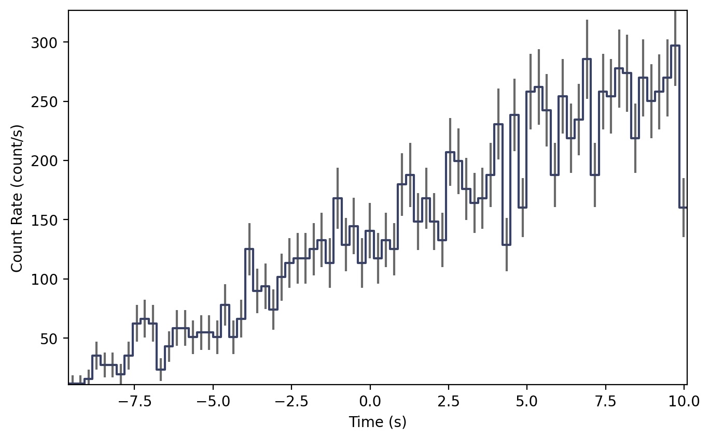
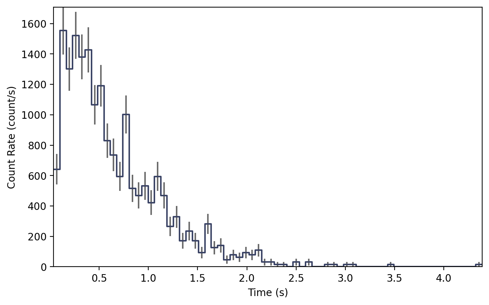
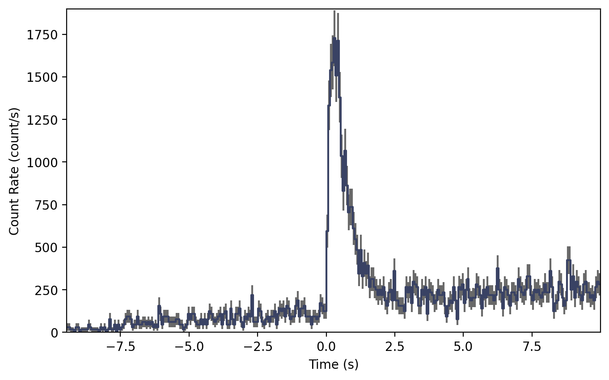

.. _sim-tte:
.. |TteBackgroundSimulator| replace:: :class:`~gdt.core.simulate.tte.TteBackgroundSimulator`
.. |TteSourceSimulator| replace:: :class:`~gdt.core.simulate.tte.TteSourceSimulator`
.. |PhaSimulator| replace:: :class:`~gdt.core.simulate.pha.PhaSimulator`
.. |EventList| replace:: :class:`~gdt.core.data_primitives.EventList`
.. |PhotonList| replace:: :class:`~gdt.core.tte.PhotonList`
.. |Phaii| replace:: :class:`~gdt.core.phaii.Phaii`
.. |Lightcurve| replace:: :class:`~gdt.core.plot.lightcurve.Lightcurve`
.. |Band| replace:: :class:`~gdt.core.spectra.functions.Band`
.. |Norris| replace:: :class:`~gdt.core.simulate.profiles.norris`
.. |sim-pha| replace:: :ref:`Simulating PHA Spectral Data<sim-pha>`
.. |rsp| replace:: :ref:`The Rsp Class`
.. |functions| replace:: :ref:`Spectral Functions<spectra-functions>`

*****************************************************
Simulating Event Data (:mod:`~gdt.core.simulate.tte`)
*****************************************************
This module contains two classes for simulating background and source event data:
|TteBackgroundSimulator| and |TteSourceSimulator|, respectively. Unlike the PHA
simulations, these event simulations contain a full temporal-spectral simulation
given source/background spectra and temporal profiles.

Similar to |PhaSimulator|, these simulations rely on the underlying spectral 
shape; however, simulating event data allows the amplitude of the spectrum to
change according to a temporal *profile*.  The temporal profile could be as
simple as a constant background and a tophat-shaped signal or as complex as a
high order polynomial background and a parametric pulse shape. The simulation
process first draws deviates from the spectrum to determine the count rate in
each energy channel during a small slice of time (a sampling period).  The 
number of counts in each channel is determined from the duration of the 
sampling period, and then arrival times are simulated for the events based on 
an exponential distribution. The duration of the sampling period for the event 
simulation is considered the timescale above which the generated events are 
indistinguishable from a non-stationary Poisson process.  For example, if we 
wish to simulate a signal with temporal structure exhibited on 1 ms timescales, 
then we should choose a sampling period of < 1 ms.

An additional parameter in the event data simulators is the ``deadtime``.  
Real-world instruments incur a "dead time" during which the instrument cannot
detect photons.  This dead time can have multiple sources including the 
temporal response limit of the scintillation crystal to the speed of the 
electronics when recording an event in memory. Often this dead time is incurred
for each photon detected.  For example, Fermi GBM incurs a dead time of 
approximately 2.6 microseconds for each observed "count", which means that if
the rate of incident photons is higher than 1 per 2.6 microseconds, the 
GBM detectors will not be able to record all of the counts, and some will be
lost.  By default ``deadtime=0``, but setting the ``deadtime > 0`` allows us to
simulate the effects of dead time.

Simulating Background Event Data
================================
To simulate background event data, we will use the |TteBackgroundSimulator|
class.  As with the background in |sim-pha|, we must define a background 
count spectrum and specify if it should be sampled as a Poisson or Gaussian
distribution.  We need to also specify a function and associated parameters 
that describe the temporal variation of the background.

For the background spectrum, we will use this example 4-channel spectrum:

    >>> from gdt.core.background.primitives import BackgroundSpectrum
    >>> rates = [37.5, 57.5, 17.5, 27.5]
    >>> rate_uncert = [1.896, 2.889, 0.919, 1.66]
    >>> emin = [4.60, 27.3, 102., 538.]
    >>> emax = [27.3, 102., 538., 2000]
    >>> exposure = 0.256
    >>> back_spec = BackgroundSpectrum(rates, rate_uncert, emin, emax, exposure)

For the background temporal profile, we will specify a linear function.

    >>> from gdt.core.simulate.profiles import linear
    >>> from gdt.core.simulate.tte import TteBackgroundSimulator
    >>> back_sim = TteBackgroundSimulator(back_spec, 'Gaussian', linear, (1.0, 0.1), deadtime=1e-6)

Here, we specified the background should be sampled as a Gaussian, and the 
linear temporal variation evolves as ``y = 1.0 + 0.1 x``.  We also specified
a dead time.

Now we can simulate some event data.  To do so, we must specify a start and stop
time (relative to time=0.0 s).

    >>> back_events = back_sim.simulate(-10.0, 10.0)
    >>> back_events
    <EventList: 2699 events;
     time range (-9.3817072561707, 10.00005523783275);
     channel range (0, 3)>

We are returned an |EventList| object that contains the times and associated
energy channels of each simulated event.

We can even generate a higher-order |PhotonList| object that contains metadata
and can be written as a FITS file: 

    >>> back_tte = back_sim.to_tte(-10.0, 10.0)
    >>> back_tte
    <PhotonList: 
     time range (-9.60766334160834, 9.995043831126903);
     energy range (4.6, 2000.0)>

To illustrate what this looks like, we can bin the event data into a |Phaii|
class and plot it.  In this example, we will bin the data into 256 ms bins:

    >>> from gdt.core.binning.unbinned import bin_by_time
    >>> phaii = back_tte.to_phaii(bin_by_time, 0.256)

And now we can plot it as a lightcurve, integrated over all energies, with the 
|Lightcurve| plotting class:

    >>> import matplotlib.pyplot as plt
    >>> from gdt.core.plot.lightcurve import Lightcurve
    >>> lcplot = Lightcurve(data=phaii.to_lightcurve())
    >>> plt.show()

    

Simulating Source Event Data
============================
To simulate source event data, we will use the |TteSourceSimulator| class.
We must specify a detector response, spectral function and parameters, and
temporal function and parameters. For the detector response, we will use the
example detector response constructed in |rsp|, and then we will use a 
|Band| function (see |functions| for more information on photon models). We
will use the |Norris| pulse model for the temporal function.

    >>> from gdt.core.spectra.functions import Band
    >>> from gdt.core.simulate.profiles import norris
    >>> from gdt.core.simulate.tte import TteSourceSimulator
    >>> 
    >>> # (amplitude, Epeak, alpha, beta)
    >>> band_params = (0.01, 300.0, -1.0, -2.8)
    >>> # (amplitude, tstart, trise, tdecay)
    >>> norris_params = (0.05, 0.0, 0.1, 0.5)
    >>> src_sim = TteSourceSimulator(rsp, Band(), band_params, norris, norris_params,
    >>>                              deadtime=1e-6)

Now to simulate some data.  To do so, we must specify a start and stop
time (relative to time=0.0 s).

    >>> src_events = src_sim.simulate(-10.0, 10.0)
    >>> src_events
    <EventList: 1245 events;
     time range (0.033597988692527656, 4.708158280056014);
     channel range (0, 3)>

Notice that even though we specified our simulation to span from T0-10 s to 
T0+10 s, that our data only starts at about T0 and ends about 5 s later.  This
is because we specified the start time to be at T0 (hence no source events
prior to T0), and the Norris parameters lead to no events beyond T0+5 s.

As with the background we can also generate a higher-level |PhotonList| object:

    >>> src_tte = src_sim.to_tte(-10.0, 10.0)
    >>> src_tte
    <PhotonList: 
     time range (0.03792640604679924, 4.349491130015022);
     energy range (4.6, 2000.0)>

To illustrate what this looks like, we can bin the event data into a |Phaii|
object and plot it.  In this example, we will bin the data into 64 ms bins:

    >>> from gdt.core.binning.unbinned import bin_by_time
    >>> phaii = src_tte.to_phaii(bin_by_time, 0.064)

And now we can plot it as a lightcurve, integrated over all energies, with the 
|Lightcurve| plotting class:

    >>> lcplot = Lightcurve(data=phaii.to_lightcurve())
    >>> plt.show()

Simulating Background + Source Event Data
=========================================
Usually we want to simulate the background and source combined.  This is 
relatively easy to do once we have the our source and background simulators 
set up.  All we need to do is merge the two simulated PhotonLists produced by
the respective simulators:

    >>> from gdt.core.tte import PhotonList
    >>> back_tte = back_sim.to_tte(-10.0, 10.0)
    >>> src_tte = src_sim.to_tte(-10.0, 10.0)
    >>> total_tte = PhotonList.merge([back_tte, src_tte])

And finally, we can bin it into a Phaii object and plot:

    >>> phaii = tte_total.to_phaii(bin_by_time, 0.064)
    >>> lcplot = Lightcurve(data=phaii.to_lightcurve())
    >>> plot.show()

Reference/API
=============

.. automodapi:: gdt.core.simulate.tte
   :inherited-members:

