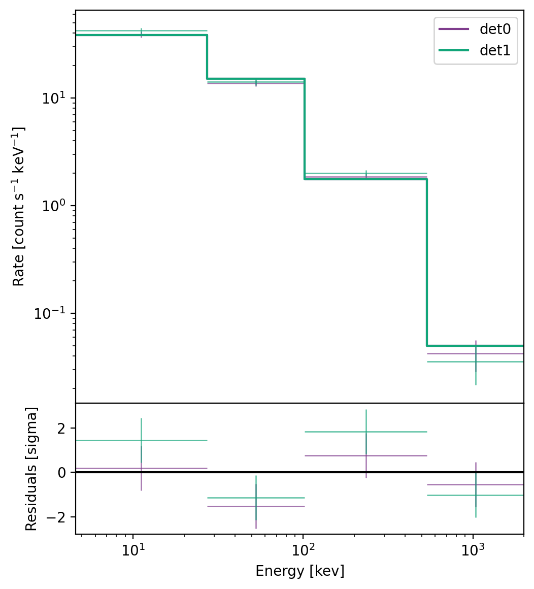
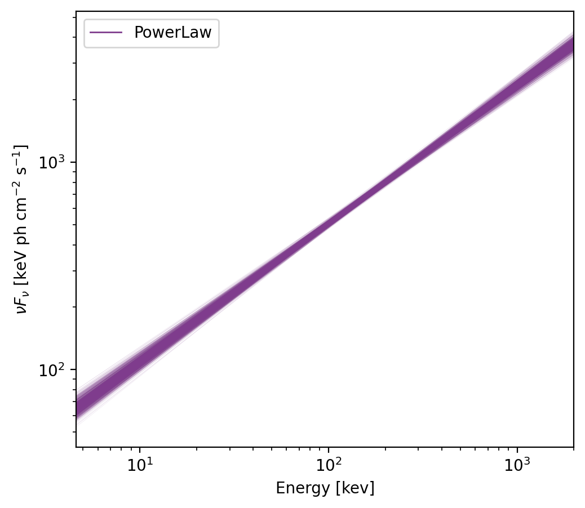

.. _spectra-fitting:
.. |SpectralFitter| replace:: :class:`~gdt.core.spectra.fitting.SpectralFitter`
.. |Pha| replace:: :class:`~gdt.core.pha.Pha`
.. |PowerLaw| replace:: :class:`~gdt.core.spectra.functions.PowerLaw`
.. |BlackBody| replace:: :class:`~gdt.core.spectra.functions.BlackBody`
.. |ModelFit| replace:: :class:`~gdt.core.plot.model.ModelFit`
.. |scipy.optimize.minimize| replace:: scipy.optimize.minimize
.. _scipy.optimize.minimize: https://docs.scipy.org/doc/scipy/reference/generated/scipy.optimize.minimize.html
.. |rsp| replace:: :ref:`The Rsp Class<core-response>`
.. |sim-pha| replace:: :ref:`Simulating PHA Spectral Data<sim-pha>`
.. |plot-model| replace:: :ref:`Plotting of Spectral Fits and Models<plot-model>`
.. |spectra-functions| replace:: :ref:`Spectral Functions<spectra-functions>`
.. |SuperFunction| replace:: :ref:`The SuperFunction Class<spectra-functions-superfunction>`

***************************************************
Spectral Fitting (:mod:`~gdt.core.spectra.fitting`)
***************************************************
The spectral fitting module contains the base class spectral fitter 
|SpectralFitter|, which acts an interface the minimizers in 
|scipy.optimize.minimize|_ and is used to find the maximum likelihood solution
of the spectral fit. This module also contains a number of likelihoods that 
can be used in the fitter.  There is a derived SpectralFitter class to be used 
with each likelihood.

The SpectralFitter can handle multiple datasets, each of which must have an
observed spectrum, an associated background model, and an associated detector
response.  The datasets can be overlapping in energy completely distinct.
The log-likelihood is calculated for each dataset individually and their sum is 
used in the fitting of the spectrum.

Likelihoods
===========
Each likelihood is a function that accepts a set of inputs, typically at least
the total observed counts, modeled background counts, modeled source rate, and
source exposure. The output is the negative log-likelihood value.  Here is an
example of how to construct a likelihood function:

    >>> def my_likelihood(obs_counts, back_rates, model_rates, src_exp, back_exp):
    >>>     """
    >>>     Args:
    >>>         obs_counts (np.array): The total observed counts
    >>>         back_rates (np.array): The background model count rates
    >>>         model_rates (np.array): The model source rates
    >>>         src_exp (float): The source exposure
    >>>         back_exp (float): The background exposure
    >>>     Returns:
    >>>         (float)
    >>>     """     
    >>>     # do likelihood calculation here...
    >>>
    >>>     # log_likelihood is summed over all bins
    >>>     return -log_likelihood

Creating a Fitter
=================
For each likelihood, there is an associated fitter class.  This is because
some likelihoods may need more specialized inputs that what is generally 
provided by the |SpectralFitter| base class.  In general, a fitter must accept
a list of PHA spectra, a list of corresponding background models, and a list of 
corresponding detector responses.  Other inputs can be defined and must be 
handled in the derived class' ``__init__`` method.  A derived fitter must also
define an ``_eval_stat`` that takes as input the index of the dataset being
evaluated and the source model rate for that set.  It should use the proper
variables from the given data set and the source model rate to calculate the
-log-likelihood and return it.  Below is an example of how to construct a 
derived SpectralFitter class that uses our example likelihood from above:

    >>> class MySpectralFitter(SpectralFitter):
    >>>     def __init__(self, pha_list, bkgd_list, rsp_list, back_exp, **kwargs):
    >>>         # we need a special parameter for background exposure
    >>>         super().__init__(pha_list, bkgd_list, rsp_list, my_likelihood, **kwargs)
    >>>         self._back_exp = back_exp
    >>>
    >>>     def _eval_stat(self, set_num, src_model):
    >>>     """Evaluate the statistic for a single set.
    >>>        Args:
    >>>             set_num (int): The index number of the set
    >>>             src_model (np.array): The source model rates for the set
    >>>         Returns:
    >>>             (float)
    >>>     """
    >>>     return my_likelihood(self._data[set_num], self._back_rates[set_num],
    >>>                          src_model, self._exposure[i], self._back_exp)

Fitter Basics
=============

To demonstrate using the spectral fitter, we need to set up some of the inputs
first.  For this demonstration, we will use the example detector response 
constructed in |rsp|, the following PHA spectra:
    
    >>> from gdt.core.data_primitives import EnergyBins, Gti
    >>> from gdt.core.pha import Pha
    >>> counts = [235, 276, 212,  24]
    >>> emin = [  4.6,  27.3, 102. , 538. ]
    >>> emax = [  27.3,  102. ,  538. , 2000. ]
    >>> exposure = 0.256
    >>> data = EnergyBins(counts, emin, emax, exposure)
    >>> gti = Gti.from_list([(0.0, 0.256)])
    >>> pha1 = Pha.from_data(data, gti=gti)

    >>> counts = [255, 283, 228,  22]
    >>> emin = [  4.6,  27.3, 102. , 538. ]
    >>> emax = [  27.3,  102. ,  538. , 2000. ]
    >>> exposure = 0.256
    >>> data = EnergyBins(counts, emin, emax, exposure)
    >>> gti = Gti.from_list([(0.0, 0.256)])
    >>> pha2 = Pha.from_data(data, gti=gti)

and the following background models:

    >>> from gdt.core.background.primitives import BackgroundSpectrum
    >>> from gdt.core.pha import Bak
    >>> rates = [37.444, 53.728, 16.440, 31.637]
    >>> uncert = [1.896, 2.889, 0.919, 1.66 ]
    >>> emin = [  4.6,  27.3, 102. , 538. ]
    >>> emax = [  27.3,  102. ,  538. , 2000. ]
    >>> exposure = 0.256
    >>> data = BackgroundSpectrum(rates, uncert, emin, emax, exposure)
    >>> gti = Gti.from_list([(0.0, 0.256)])
    >>> bak1 = Bak.from_data(data, gti=gti)

    >>> rates = [40.611, 55.211, 19.381, 33.978]
    >>> uncert = [1.896, 2.889, 0.919, 1.66 ]
    >>> emin = [  4.6,  27.3, 102. , 538. ]
    >>> emax = [  27.3,  102. ,  538. , 2000. ]
    >>> exposure = 0.256
    >>> data = BackgroundSpectrum(rates, uncert, emin, emax, exposure)
    >>> gti = Gti.from_list([(0.0, 0.256)])
    >>> bak2 = Bak.from_data(data, gti=gti)

The two |Pha| objects defined here are the result of generating simulated power 
law spectra (``amp=0.05``; ``index=-1.3``) from the example response (see 
|sim-pha| for details on simulating data).

Now we are ready to initialize the fitter.  For this example, let's choose the
Chi-squared likelihood since our total counts in each channel are in the 
Gaussian regime and our background model has Gaussian errors. We do the 
following:

    >>> from gdt.core.spectra.fitting import SpectralFitterChisq
    >>> fitter = SpectralFitterChisq([pha1, pha2], [bak1, bak2], [rsp1, rsp2], method='TNC')

Note that we provided a list of PHA spectra, a list of background model spectra,
and a list of responses.  In this example, we are using the same response for
both observed spectra (but assigning different detector names), but typically 
we will require different responses for the different observations.  We 
specified the fitting method to be 'TNC', which is the Truncated Newton 
algorithm and allows us to impose constraints and bounds on the parameters 
when fitting.

Now that the fitter has been initialized, we can fit a spectral function to the
data.  Since we know the data was simulated from a power law, let's fit the 
|PowerLaw| function to the data to make sure we can recover the spectrum we 
simulated (see |spectra-functions| for details on specifying, using and 
defining spectral functions).

    >>> from gdt.core.spectra.functions import PowerLaw
    >>> fitter.fit(PowerLaw())

The fit is done. We can check that the fit completed successfully and return
any message the fitting algorithm produced:

    >>> fitter.success
    True
    >>> fitter.message
    'Converged (|f_n-f_(n-1)| ~= 0)'
    
Obviously, the thing we're most interested in is what parameter values the
fitter converged to and the resulting uncertainties.  We can retrieve the 
maximum likelihood solution found be the fitter and the symmetric parameter
uncertainties (:math:`1 \sigma`) *assuming local normality of the likelihood*:

    >>> fitter.parameters
    array([ 0.05052416, -1.33362602])
    
    >>> fitter.symmetric_errors
    array([0.0010173 , 0.01773929])

Thus, we find the best-fit parameters (``amp``:math:`=0.051 \pm 0.001`; 
``index``:math:`=-1.334 \pm 0.018`). We can even retrieve the covariance matrix:

    >>> fitter.covariance
    array([[ 1.03489528e-06, -5.94069485e-06],
           [-5.94069485e-06,  3.14682477e-04]])

Since the assumption of local normality of the likelihood about it's maximum
can often be a faulty one, the covariance and resulting symmetric uncertainties 
may not be a good description of the true variance-covariance of the parameters.
As an alternative, we can compute the asymmetric uncertainties, which does not
make an assumption about the shape of the likelihood around the maximum:

    >>> # default is to calculate the 68.3% bounds
    >>> fitter.asymmetric_errors()
    array([[0.00145609, 0.00145609],
           [0.02528244, 0.02550788]])
    
    >>> # 90% bounds
    >>> fitter.asymmetric_errors(cl=0.9)
    array([[0.00206141, 0.00206141],
           [0.03565049, 0.03618557]])

From this, we can see that the best-fit parameters with 90% uncertainties are
(``amp``:math:`=0.051 \pm 0.002`; ``index``:math:`=-1.334 \pm 0.036`).

Often we also want to know the resulting fit statistic (max log-likelihood) and 
the degrees-of-freedom:

    >>> fitter.statistic
    >>> 11.019251444999886
    
    >>> fitter.dof
    6
    
There are also several other properties that can be retrieved:

    >>> # full energy range of fit
    >>> fitter.energy_range
    (4.6, 2000.0)
    
    >>> # function name
    >>> fitter.function_name
    'PowerLaw'
    
    >>> # Hessian matrix
    >>> fitter.hessian
    array([[-1083723.49797418,   -20458.94214667],
           [  -20458.94214667,    -3564.03807941]])

    >>> # Jacobian vector
    >>> fitter.jacobian
    array([-0.00039792,  0.00171039])
    
    >>> # number of data sets
    >>> fitter.num_sets
    2

We can also sample parameter vectors from the fitted parameters/uncertainties:

    >>> fitter.sample_parameters(size=5)
    array([[ 0.05105374, -1.35694203],
           [ 0.05141827, -1.34301859],
           [ 0.0495263 , -1.35467714],
           [ 0.04910859, -1.32077073],
           [ 0.0508459 , -1.32073295]])

Or sample the flux from the fit:
    
    >>> # photon flux over 50-300 keV
    >>> fitter.sample_flux((50.0, 300.0), num_samples=5)
    [8.44236747410071,
     8.611214570406599,
     8.646780270284818,
     8.59455007254835,
     8.78347851454541]

    >>> # energy flux over 50-300 keV
    >>> fitter.sample_flux((50.0, 300.0), num_samples=5, energy=True)
    [1.7670894864768715e-06,
     1.7585181629667496e-06,
     1.7440372216857354e-06,
     1.782161833889333e-06,
     1.7555887975312162e-06]

.. warning::
    The ``sample_parameters()`` and ``sample_flux`` functions assume normality 
    of the likelihood and uses the covariance matrix.

Multi-Component Fits
====================

Models with multiple components can be fit.  Specifically, functions can be
added and multiplied together and fit to one or more data sets.  As an example,
we will add a |BlackBody| function to our |PowerLaw| and try to fit this 
two-component model (see |SuperFunction| for details about creating and working
with multi-component functions).

    >>> from gdt.core.spectra.functions import BlackBody
    >>> # constrain the max power-law index to be 10.0
    >>> PowerLaw().max_values[1] = 10.0
    >>> pl_bb = PowerLaw() + BlackBody()

Here we have also imposed a constraint on the power-law index so that it is
easier to fit the this multi-component model to the limited data in our example
(and remember, our data was simulated with only a power law...)

Now we can run the fit again with our new model:

    >>> fitter.fit(pl_bb)
    >>> fitter.success
    True
    >>> fitter.parameters
    array([ 5.05241377e-02, -1.33362658e+00,  1.00000000e-10,  2.99907866e+01])

Note that the parameters are listed in the order of the combined functions.
When in doubt, we can print the model we're fitting to get the order of the 
parameters

    >>> print(pl_bb)
    <PowerLaw + BlackBody: 5 parameters;
     Defaults: PowerLaw: A = 0.1 ph/s/cm^2/keV;
               PowerLaw: index = -2.0 ;
               *PowerLaw: Epiv = 100.0 keV;
               BlackBody: A = 0.01 ph/s/cm^2/keV;
               BlackBody: kT = 30.0 keV>

As we can see, the fitter successfully fit the power law and found a near-zero
amplitude for the black body component (``1e-10`` value is actually the 
default minimum value allowed for that parameter).

The fitter keeps track of the number of components (and their names) that are
being fitted:

    >>> fitter.num_components
    2
    
    >>> fitter.function_components
    ['PowerLaw', 'BlackBody']

Advanced Functions
==================
The SpectralFitter class also provides more advanced functions that are 
primarily intended to work with the |ModelFit| plot class but can be utilized
for other purposes.

Once the fit has been performed, we can retrieve the model source count 
spectrum for each of the fitted data sets:

    >>> fitter.model_count_spectrum()
    [<EnergyBins: 4 bins;
      range (4.6, 2000.0);
      1 contiguous segments>,
     <EnergyBins: 4 bins;
      range (4.6, 2000.0);
      1 contiguous segments>]
      
We can also retrieve the model variance for each data set, which accounts for 
the variance of the observed data as well as the variance from the background 
model:

    >>> fitter.model_variance()
    [array([6.88126931e+00, 8.28505579e-01, 1.61530741e-02, 1.92604529e-04]),
    array([6.90527387e+00, 8.29544321e-01, 1.62135044e-02, 1.96883373e-04])]

The data source count spectrum can also be retrieved, which is generally 
(total - background) along with the associated observed source spectrum
errors.  The following function returns several items: 

    * The energy channel centroids
    * The energy channel half-widths (in log-space)
    * The differential source count spectrum
    * The 1-sigma errors on the differential source count spectrum
    * A Boolean mask representing if a bin is represented as an upper limit

A bin is marked as an upper limit if the data source counts is less than the
model variance.  Each item is returned for each data set being fit.

    >>> ecent, ewidths, count_spec, count_spec_errs, ul_mask = fitter.data_count_spectrum()
    >>> ecent
    [array([  11.20624826,   52.76930926,  234.25626993, 1037.30419839]),
     array([  11.20624826,   52.76930926,  234.25626993, 1037.30419839])]
    >>> ewidths
    [array([[  6.60624826,  25.46930926, 132.25626993, 499.30419839],
            [ 16.09375174,  49.23069074, 303.74373007, 962.69580161]]),
     array([[  6.60624826,  25.46930926, 132.25626993, 499.30419839],
            [ 16.09375174,  49.23069074, 303.74373007, 962.69580161]])]
    >>> count_spec
    [array([38.78962317, 13.71348634,  1.86166339,  0.04248483]),
    array([4.20917578e+01, 1.40596698e+01, 1.99826703e+00, 3.55396725e-02])]
    >>> count_spec_errs
    [array([2.62321736, 0.91022282, 0.12709474, 0.0138782 ]),
     array([2.62778878, 0.91079324, 0.12733226, 0.01403151])]
    >>> ul_mask
    [array([False, False, False, False]), 
    array([False, False, False, False])]

We can also retrieve the fit residuals, which have the following outputs:

    * The energy channel centroids
    * The energy channel widths
    * The fit residuals
    * The fit residual uncertainties

We can retrieve the fit residuals in terms of sigma or counts:

    >>> # retrieve fit residuals in terms of sigma
    >>> ecent, ewidth, resid, resid_uncert = fitter.residuals(sigma=True)
    >>> resid
    [array([ 0.18727401, -1.51868724,  0.76260929, -0.53893739]),
     array([ 1.44356924, -1.13764605,  1.83399926, -1.02801749])]
    >>> resid_uncert
    [array([1., 1., 1., 1.]), 
    array([1., 1., 1., 1.])]

    >>> # retrieve fit residuals in terms of counts
    >>> ecent, ewidth, resid, resid_uncert = fitter.residuals(sigma=False)
    >>> resid
    [array([ 0.49126044, -1.38234378,  0.09692363, -0.00747948]),
     array([ 3.79339506, -1.03616033,  0.23352727, -0.01442464])]
    >>> resid_uncert
    [array([2.62321736, 0.91022282, 0.12709474, 0.0138782 ]),
     array([2.62778878, 0.91079324, 0.12733226, 0.01403151])]

Often we want to know what the spectral shape looks like.  We can evaluate the 
total photon, energy, or :math:`\nu F_\nu` spectrum for the best-fit parameter
values.

    >>> # photon spectrum
    >>> x, y_tot = fitter.spectrum('photon', num_points=100, components=False)
    
    >>> # energy spectrum
    >>> x, y_tot = fitter.spectrum('energy', num_points=100, components=False)
    
    >>> # nuFnu spectrum
    >>> x, y_tot = fitter.spectrum('nufnu', num_points=100, components=False)

The function returns the energies (``x``) at which the total spectrum is 
evaluated (``y_tot``).  If we set ``components=True``, then the function 
returns a list of evaluations for each spectral component.

    >>> x, y_comps = fitter.spectrum('photon', num_points=100, components=True)

Instead of just evaluating the spectrum at the best-fit parameter values, we
can draw samples from the fit using the covariance matrix and evaluate the 
spectrum based on those samples.  For example:

    >>> x, y_tots = fitter.sample_spectrum('photon', num_samples=10, num_points=100, components=False)
    >>> y_tots.shape
    (10, 100)
    
And we can create samples for each component:

    >>> x, y_tots = fitter.sample_spectrum('photon', num_samples=10, num_points=100, components=True)
    >>> y_tots.shape
    (10, 2, 100)

Finally, we can save the fitter state to a compressed numpy file and load it
at a later date:

    >>> fitter.save('my_fit.npz')
    
    >>> fitter2 = SpectralFitterChisq.load('my_fit.npz)
    Fit loaded from 2023-01-22 13:04:23
    
    >>> fitter2.parameters
    array([ 5.05241377e-02, -1.33362658e+00,  1.00000000e-10,  2.99907866e+01])

Plotting the Fit
================
We can plot the fit using the |ModelFit| plot class (see |plot-model| for 
details).  Here we will plot the first power-law-only fit:

    >>> from gdt.core.plot.model import ModelFit
    >>> import matplotlib.pyplot as plt
    >>> modelplot = ModelFit(fitter=fitter, interactive=True)
    >>> plt.show()

The fit shows the *data* source rate spectrum as the four-channel histogram (the
two data sets have similar spectra, so are overlapping on this plot), and the
error bars are the *modeled* source rate.  The residuals in units of sigma
are also shown.

We can also change plot views to the photon, energy, or :math:`\nu F_\nu` 
spectrum.  Here is the :math:`\nu F_\nu` spectrum:

    >>> modelplot.nufnu_spectrum(num_samples=1000)

This plot shows the spectrum with 1000 deviates drawn from the covariance 
matrix.

Reference/API
=============

.. automodapi:: gdt.core.spectra.fitting
   :inherited-members:

