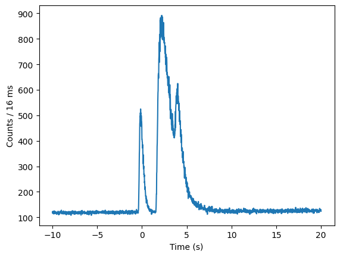

.. _core-phaii:
.. |TimeBins| replace:: :class:`~gdt.core.data_primitives.TimeBins`
.. _background_binned:
.. |BackgroundFitter| replace:: :class:`~gdt.core.background.fitter.BackgroundFitter`

*************************************************
Duration  (:mod:`gdt.core.duration`)
*************************************************

Durations are critical in the analysis of astrophysical transients. The duration module allows the user to pass a list
of |TimeBins| using detector data, and a separate list of BackgroundRates using the |BackgroundFitter| class, which
correspond to the detectors in the |TimeBins| list. The user is also required to pass a duration interval, a tuple with
a lower and upper bound that they wish to use. For example, to calculate the T90, they would enter a duration_interval
of (0.05,0.95).

The class is initialized using these three attributes, which are the user inputs:

    >>> class Duration:
    >>>
    >>>def __init__(self, timebins_list, bkgds_list, duration_interval):
    >>>    # intializes with a list of TimeBins and BackgroundRates
    >>>    # this only checks that the inputs are valid

    >>>    self.timebins_list = timebins_list
    >>>    self.bkgds_list = bkgds_list
    >>>    self.duration_interval = duration_interval

The calculate method performs the calculation using the previously given attributes. The duration calculation is
performed by subtracting the background counts from the source counts, using the TimeBins and BackgroundRates lists,
which we have called 'timebins_list' and 'bkgs_list.' A loop runs over each item in the list, creating a new list of
centroids (usually time, x-axis) and a list of counts (y-axis). Plotting this will give something like this:

This is performed separately for both the TimeBins (Source) and the BackgroundRates (background) lists. After this has
been performed, the user will be left with a background-subtracted counts-based lightcurve, which can be plotted like this:

Then, numpy's cumulative sum function is used, which we result in an "s-curved" counts spectrum, with time along the
x-axis:

.. image:: duration_figs/cumulative_sum.png
    :height: 400

A 3-tuple is produced with the resulting duration, the positive error and the negative error. The errors are handled
in the method, 'calculate.'

>>>    def calculate(self, num_sims, confidence):
>>>        # Performs the calculation. The user must specify the duration interval they
>>>        # want to calculate (e.g. (0.05, 0.95)). The user can also define the number
>>>        # of sims and confidence region for the uncertainty calculation. This
>>>        # will return a 3-tuple: (value, - error, + error)

The errors are calculated and propagated in the following way. Using the numpy.random.poisson routine, samples are drawn
from a Poisson distribution, using the y-axis (counts) in 'timebins_list', which is set as the parameter 'lambda/lam.'
The and 'size' is the expected output shape, or number of simulations/samples, which is specified by the user with the
parameter 'num_sims.'

More information on how the samples are drawn from a Poisson distribution can be found here:
https://numpy.org/doc/stable/reference/random/generated/numpy.random.poisson.html

To calculate the background rates, the code does the following. It iterates over the items in the background list
'bkgds_list', provided by the user. For each item in the list, the count and count uncertainty of each item in the list
is pulled and saved in two new lists, 'list_bkg_cts' and 'list_bkg_cts_err.' The former list is summed and subtracted
from the counts in 'timebins_list', creating a background subtracted lightcurve. The cumulative sum routine is then run
over this array, which is effectively, the duration calculation.

The background counts (br) and errors (be_err) on the background are folded into a numpy.random.normal (Gaussian)
routine. The input parameters are the mean, sigma, and size. The sum of the background counts in each item of the
BackgroundRates list (bkgs_list) are treated as the mean input. The standard deviation, or spread in the width of the
mean counts, is the sum of the background errors from each of the items in the list, which have undergone error
propagation. The 'size' is the expected output shape, or number of simulations/samples, which is specified by the user
with the parameter 'num_sims.'

More information on how the samples are drawn from a Gaussian/normal distribution can be found here:
https://numpy.org/doc/stable/reference/random/generated/numpy.random.normal.html

The list of samples drawn from the poisson distribution, used to estimate the variance in the transient rate, is then
subtracted from the list of samples (defined by num_sims), drawn from a normal distribution, which is used to estimate or
model the background. We then use numpy's cumulative sum routine to create a background-subtracted duration curve,
num_sims times. For example, if num_sims=10,000, then we have 10,000 background-subtracted duration curves, which can be
plotted like this:

.. image:: duration_figs/cumulative_sum_errors.png
    :height: 400

The code then identifies the lower and upper times on the code as specified by the 'duration_interval' parameter.

>>> f_err_lower=[]
>>> for i in range(num_sims):
>>>     h_err_lower = np.where(arr2[i] <= duration_interval[0]*np.max(arr2[i]))
>>>     g_err_lower = np.max(timbins2[h_err_lower[0]])
>>>     f_err_lower.append(g_err_lower)

>>> f_err_higher=[]
>>> for i in range(num_sims):
>>>     h_err_higher = np.where(arr2[i] <= duration_interval[1]*np.max(arr2[i]))
>>>     g_err_higher = np.max(timbins2[h_err_higher[0]])
>>>     f_err_higher.append(g_err_higher)

In the code above, the lists are used to create the lower and upper bounds (in this case, on the simulated duration curve).
The array arr2 is the list of cumulative sums or duration curves, and timebins2 is the list of centroids (times).

The confidence region of the uncertainties that are calculated is provided by the user using the 'confidence' parameter.
For example, if the user wants the 95% confidence region, then they would use 0.95. Similarly, if they want 1-sigma, they
would use 0.67. The code will take 1-((1+0.67)/2), for example, to determine the lower uncertainty on the calculated duration.

>>> tupp_err_loconf = np.quantile(f_err_higher,((1+confidence)/2))
>>> tupp_err_hiconf = np.quantile(f_err_higher,(1-((1+confidence)/2)))

>>> tlow_err_loconf = np.quantile(f_err_lower,((1+confidence)/2))
>>> tlow_err_hiconf = np.quantile(f_err_lower,(1-((1+confidence)/2)))

>>> tdiff_upp_lo_err = t_higher - tupp_err_loconf
>>> tdiff_upp_hi_err = t_higher - tupp_err_hiconf

>>> tdiff_low_lo_err = t_lower - tlow_err_loconf
>>> tdiff_low_hi_err = t_lower - tlow_err_hiconf

Above, we see in the first and second block of the codes how the uncertainty on the times of the upper and lower bounds
of the duration intervals are calculated, using the confidence parameter. These are subtracted from the calculated duration
to give upper and lower, asymmetric errors. The list of errors are then averaged and propagated into the final numbers
provided by the code in the 3-tuple.

Example
--------

For this example, a GRB is picked. In this example, we read in the Fermi-GBM TTE data for some detectors, define the energy and time ranges,
integrating over the former energy ranges to create a list of TimeBins, which we creatively have called 'timebins'.

>>> import gdt.core
>>> import numpy as np
>>> from gdt.core import data_path
>>> from gdt.missions.fermi.gbm.collection import GbmDetectorCollection
>>> from gdt.missions.fermi.gbm.tte import GbmTte
>>> from gdt.missions.fermi.gbm.response import Rsp2, Rsp, GbmRsp2
>>> from gdt.missions.fermi.gbm.phaii import Cspec, Ctime, GbmDetectors, GbmPhaii
>>> from gdt.core.background.fitter import BackgroundFitter
>>> from gdt.core.background.binned import Polynomial
>>> from gdt.core.binning.unbinned import bin_by_time
>>> from gdt.core.binning.binned import rebin_by_time
>>> from gdt.missions.fermi.gbm.trigdat import Trigdat
>>> from gdt.core.spectra.fitting import SpectralFitterCstat
>>> from gdt.core.plot.plot import ModelData
>>> from gdt.core.data_primitives import TimeBins, TimeEnergyBins
>>> from gdt.core.plot.lightcurve import Lightcurve
>>> from gdt.core.plot.spectrum import Spectrum
>>> from gdt.core.plot.model import ModelFit
>>> from gdt.core.response import Rsp
>>> from gdt.core.spectra.functions import Comptonized, PowerLaw
>>> from gdt.core.spectra.fitting import SpectralFitterCstat, SpectralFitterPgstat, SpectralFitterPstat
>>> from gdt.missions.fermi.time import Time

>>> filepath = data_path.joinpath('/YOUR/PATH/')

#inputs:
>>> bn = 'bn230812790'

>>> n0 = GbmTte.open(str(filepath) + '/' + str(bn) + '/glg_tte_n0_{}_v04.fit'.format(bn))
>>> n6 = GbmTte.open(str(filepath) + '/' + str(bn) + '/glg_tte_n6_{}_v04.fit'.format(bn))
>>> n7 = GbmTte.open(str(filepath) + '/' + str(bn) + '/glg_tte_n7_{}_v04.fit'.format(bn))

>>> time_Res = 0.016 #in s
>>> nai_erange = (10.0, 1000.0)
>>> nai_50_300 = (50.0, 300.0)
>>> view_range = (-10, 25) # zoom in to this time range
>>> bkgd_range = [(-10, -0.5),(10, 25)] # the background fit ranges

>>> tte_n0 = n0.to_phaii(bin_by_time, time_Res, time_ref=0.0).slice_time(view_range).slice_energy(nai_erange)
>>> tte_n6 = n6.to_phaii(bin_by_time, time_Res, time_ref=0.0).slice_time(view_range).slice_energy(nai_erange)
>>> tte_n7 = n7.to_phaii(bin_by_time, time_Res, time_ref=0.0).slice_time(view_range).slice_energy(nai_erange)

>>> phaii_n0 = tte_n0.data.integrate_energy(nai_erange[0],nai_erange[1])
>>> phaii_n6 = tte_n6.data.integrate_energy(nai_erange[0],nai_erange[1])
>>> phaii_n7 = tte_n7.data.integrate_energy(nai_erange[0],nai_erange[1])

>>> phaiis = GbmDetectorCollection.from_list([tte_n0,tte_n6,tte_n7], names=['n0','n6','n7'], dets=['n0','n6','n7'])

>>> timebins = [phaii_n0,phaii_n6,phaii_n7]

We then create a list of BackroundRates objects for each Fermi-GBM detector (in this case), fitting a second order
polynomial over the data. The resulting list is created and called "bk_list."

>>> bf_phaiis = [BackgroundFitter.from_phaii(phaii, Polynomial, time_ranges=bkgd_range) for phaii in phaiis]
>>> for bf_phaii in bf_phaiis:
>>>     bf_phaii.fit(order=2)

>>> bk_list=[]
>>> for bf_phaii in bf_phaiis:
>>>     bkgds_phaiis = bf_phaii.interpolate_bins(phaiis.data()[0].tstart, phaiis.data()[0].tstop).integrate_energy(nai_erange[0],nai_erange[1])
>>>     bk_list.append(bkgds_phaiis)

Now that we have our list of inputs (timebins and bk_list), we can pass them into the duration code. First, we set a
duration_interval that we are interested in. For example, the T90 is the time taken to accumulate 90% of the burst
fluence starting at the 5% fluence level. So, our T90 start or lower bound is 0.05 and the upper bound will be 0.05+0.90
(0.95).

For the calculation, we input 10,000 samples to be calculated for the error analysis, and so set our num_sims parameter
accordingly. We can select our confidence region of the errors to be 95% or 0.95.

>>> duration_interval = (0.05,0.95)
>>> num_sims = 10000
>>> confidence = 0.95

>>> duration = Duration(timebins,bk_list,duration_interval)
>>> duration.calculate(num_sims,confidence)

Plugging those in, the code returns:

>>> (4.3839999999999995, -0.04800000000000004, 0.04800000000000004)

This is the T90 and the lower and upper errors, calculated at the 95% confidence level. Simiarly, we can calculate the
T50 in a similar way. Remember, the T50 is defined as the time taken to accumulate 50% of the burst fluence starting
at the 25% fluence level. Our T50 start or lower bound is 0.25 and the upper bound will be 0.25+0.50 (0.75). This time,
let's change our confidence region on the uncertainty to be 1-sigma or 0.67, keeping the number of samples the same.

>>> duration_interval = (0.25,0.75)
>>> num_sims = 10000
>>> confidence = 0.67

The code returns:

>>> (1.552, -0.02262741699796954, 0.016000000000000014)

So, the T50 for this event is 1.55 seconds, with lower and upper errors on the T50 of 0.02s, calculated at the 1-sigma
confidence level, when rounding to two decimal places.
