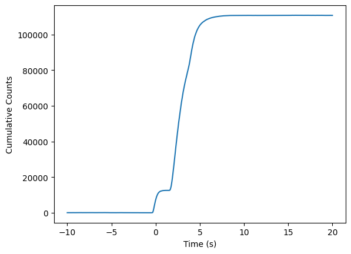
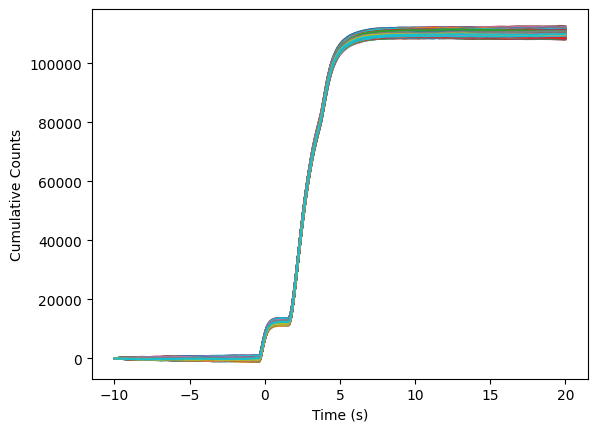
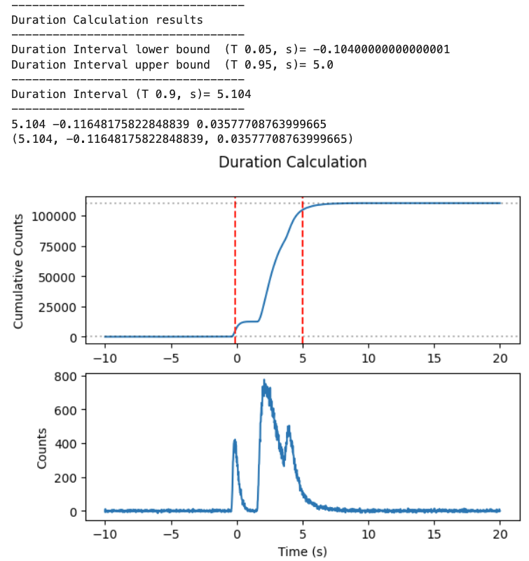

.. _core-phaii:
.. |TimeBins| replace:: :class:`~gdt.core.data_primitives.TimeBins`
.. _background_binned:
.. |BackgroundFitter| replace:: :class:`~gdt.core.background.fitter.BackgroundFitter`
.. _simulate:
.. |Simulate| replace:: :class:`~gdt.core.simulate`

*************************************************
Duration  (:mod:`gdt.core.duration`)
*************************************************

Durations are critical in the analysis of astrophysical transients. The duration module allows the user to pass a list
of |TimeBins| using detector data, and a separate list of BackgroundRates using the |BackgroundFitter| class, which
correspond to the detectors in the |TimeBins| list. The user is also required to pass a duration interval, a tuple with
a lower and upper bound that they wish to use. For example, to calculate the T90, they would enter a duration_interval
of (0.05,0.95).

The class is initialized using these three attributes, which are the user inputs:

>>> class Duration:
    >>>
    >>>def __init__(self, timebins_list, bkgds_list, duration_interval):
    >>>    # intializes with a list of TimeBins and BackgroundRates
    >>>    # this only checks that the inputs are valid

    >>>    self.timebins_list = timebins_list
    >>>    self.bkgds_list = bkgds_list
    >>>    self.duration_interval = duration_interval

Before using the calcuate method to perform the duration calculation using these objects, we have defined methods used
in that method to help with things like the error propagation and quantiles:

    >>>    def error_prop(self, a, b):
    >>>        # error propagation, multiplication.
    >>>        c = np.sqrt((a ** 2) + (b ** 2))
    >>>        return c

    >>>    def quantiles(self, tparam, confidence):
    >>>        # error propagation, multiplication.
    >>>        loconf = np.quantile(tparam, ((1 + confidence) / 2))
    >>>         uppconf = np.quantile(tparam, (1 - ((1 + confidence) / 2)))
    >>>         return loconf, uppconf

Other methods include some calculations of some repetitive calculations and their errors in the calculate methods:

    >>>    def findtparams(self, array, dur_per, tbins):
    >>>       paramloc = np.where(array <= dur_per * np.max(array))
    >>>        param = np.max(tbins[paramloc[0]])
    >>>        return param

    >>>    def findtparams_err(self, num_sims, array, dur_per, tbins):
    >>>        list_lo = []
    >>>        for ii in range(num_sims):
    >>>            param2 = self.findtparams(array[ii], dur_per, tbins)
    >>>            list_lo.append(param2)
    >>>        return list_lo

The calculate method performs the calculation using the previously given attributes and functions. The duration
calculation is performed by subtracting the background counts from the source counts, using the TimeBins and
BackgroundRates lists, which we have called 'timebins_list' and 'bkgds_list.' A loop runs over each item in the list,
creating a new list of centroids (usually time, x-axis) and a list of counts (y-axis). Plotting this will give
something like this:

.. image:: ./duration_figs/lc.png
    :height: 400

This is performed separately for both the TimeBins (Source) and the BackgroundRates (background) lists. After this has
been performed, the user will be left with a background-subtracted counts-based lightcurve, which can be plotted like this:

.. image:: ./duration_figs/back_sub_lc.png
    :height: 400

Then, numpy's cumulative sum function is used, which we result in an "s-curved" counts spectrum, with time along the
x-axis:

A 3-tuple is produced with the resulting duration, the positive error and the negative error. The errors are handled
in the method, 'calculate.'

    >>>    def calculate(self, num_sims, confidence):
    >>>        # Performs the calculation. The user must specify the duration interval they
    >>>        # want to calculate (e.g. (0.05, 0.95)). The user can also define the number
    >>>        # of sims and confidence region for the uncertainty calculation. This
    >>>        # will return a 3-tuple: (value, - error, + error)

The errors are calculated and propagated in the following way. Using the numpy.random.poisson routine, samples are drawn
from a Poisson distribution, using the y-axis (counts) in 'timebins_list', which is set as the parameter 'lambda/lam.'
The 'size' is the expected output shape, or number of simulations/samples, which is specified by the user with the
parameter 'num_sims.'

More information on how the samples are drawn from a Poisson distribution can be found here:
https://numpy.org/doc/stable/reference/random/generated/numpy.random.poisson.html

To calculate the background rates, the code does the following. It iterates over the items in the background list
'bkgds_list', provided by the user. For each item in the list, the count and count uncertainty of each item in the list
is pulled and saved in two new lists, 'list_bkg_cts' and 'list_bkg_cts_err.' The former list is summed and subtracted
from the counts in 'timebins_list', creating a background subtracted lightcurve. The cumulative sum routine is then run
over this array, which is effectively, the duration calculation.

The background counts (br) and errors (br_err) on the background are folded into a numpy.random.normal (Gaussian)
routine. The input parameters are the mean, sigma, and size. The sum of the background counts in each item of the
BackgroundRates list (bkgds_list) are treated as the mean input. The standard deviation, or spread in the width of the
mean counts, is the sum of the background errors from each of the items in the list, which have undergone error
propagation. The 'size' is the expected output shape, or number of simulations/samples, which is specified by the user
with the parameter 'num_sims.'

More information on how the samples are drawn from a Gaussian/normal distribution can be found here:
https://numpy.org/doc/stable/reference/random/generated/numpy.random.normal.html

The list of samples drawn from the poisson distribution, used to estimate the variance in the transient rate, is then
subtracted from the list of samples (defined by 'num_sims'), drawn from a normal distribution, which is used to estimate or
model the background. We then use numpy's cumulative sum routine to create a background-subtracted duration curve,
num_sims times. For example, if num_sims = 10,000, then we have 10,000 background-subtracted duration curves, which can be
plotted like this:

The code then identifies the lower and upper times in the code using the 'findtparams_err' method, which uses
 the number of simulations, and the 'duration_interval':

        >>>     f_err_lower = self.findtparams_err(num_sims, arr2, self.duration_interval[0], timebins2)
        >>>     f_err_higher = self.findtparams_err(num_sims, arr2, self.duration_interval[1], timebins2)

In the code above, the lists are used to create the lower and upper bounds (in this case, on the simulated duration curve).
The array 'arr2' is the list of cumulative sums or duration curves, and 'timebins2' 'is the list of TimeBin.centroids for each
detector.

The confidence region of the uncertainties that are calculated is provided by the user using the 'confidence' parameter.
For example, if the user wants the 95 % confidence region, then they would use 0.95. Similarly, if they want 1-sigma, they
would use 0.68. The code will take 1-((1+0.68)/2), for example, to determine the lower uncertainty on the calculated duration.

        >>>     tdiff_upp_lo_err = t_higher - self.quantiles(f_err_higher, confidence)[0]
        >>>     tdiff_upp_hi_err = t_higher - self.quantiles(f_err_higher, confidence)[1]

        >>>     tdiff_low_lo_err = t_lower - self.quantiles(f_err_lower, confidence)[0]
        >>>     tdiff_low_hi_err = t_lower - self.quantiles(f_err_lower, confidence)[1]

Above, we see in the first and second block of the codes how the uncertainty on the times of the upper and lower bounds
of the duration intervals are calculated, using the confidence parameter. These are subtracted from the calculated duration
to give upper and lower, asymmetric errors. The list of errors are then averaged and propagated into the final numbers
provided by the code in the 3-tuple.

Example
--------

For this example, a GRB is simulated. We import some useful software to create the GRB profile

>>> from gdt.core.temporal.duration import Duration
>>> import numpy as np
>>> from gdt.core.background.primitives import BackgroundSpectrum
>>> from gdt.core.simulate.profiles import linear
>>> from gdt.core.simulate.tte import TteBackgroundSimulator
>>> from gdt.core.spectra.functions import Band
>>> from gdt.core.simulate.profiles import norris
>>> from gdt.core.simulate.tte import TteSourceSimulator
>>> from gdt.core.data_primitives import ResponseMatrix
>>> from gdt.core.response import Rsp
>>> from gdt.core.tte import PhotonList
>>> from gdt.core.binning.unbinned import bin_by_time
>>> from gdt.core.background.fitter import BackgroundFitter
>>> from gdt.core.background.binned import Polynomial

We define the background simulated spectrum, providing a rate, exposure, etc..

>>> #inputs:
>>> rates = [17.5, 77.5, 37.5, 57.5]
>>> rate_uncert = [1.896, 1.889, 1.919, 1.66]
>>> emin = [4.60, 27.3, 102., 538.]
>>> emax = [27.3, 102., 538., 2000]
>>> exposure = 0.128
>>> back_spec = BackgroundSpectrum(rates, rate_uncert, emin, emax, exposure)
>>> back_sim = TteBackgroundSimulator(back_spec, 'Gaussian', linear, (40.0, 0.1), deadtime=1e-6)

We then create a simulated detector response matrix (DRM) to use with our simulated files for some generic MET.

>>> # 8 photon bins x 4 energy channels
>>> matrix = [[25.2, 0.0, 0.0, 0.0],
>>>          [51.8, 54.9, 0.0, 0.0],
>>>          [2.59, 82.0, 44.8, 0.0],
>>>          [3.10, 11.6, 77.0, 0.13],
>>>          [1.26, 6.21, 29.3, 14.6],
>>>          [0.45, 3.46, 13.8, 9.98],
>>>          [0.52, 4.39, 13.3, 3.93],
>>>          [0.79, 7.14, 16.1, 3.92]]
>>> emin = [5.00, 15.8, 50.0, 158., 500., 1581, 5000, 15811]
>>> emax = [15.8, 50.0, 158., 500., 1581, 5000, 15811, 50000]
>>> chanlo = [4.60, 27.3, 102., 538.]
>>> chanhi = [27.3, 102., 538., 2000]
>>> drm = ResponseMatrix(matrix, emin, emax, chanlo, chanhi)
>>>
>>> tstart = 524666421.47
>>> tstop = 524666521.47
>>> trigtime = 524666471.47
>>> rsp = Rsp.from_data(drm, start_time=tstart, stop_time=tstop, trigger_time=trigtime, detector='det0')

We then provide information on the energetics of our burst. Here, we use a Band function with some initial parameters.
We create a lightcurve using three Norris functions with varying parameters:

>>> # (amplitude, Epeak, alpha, beta)
>>> band_params = (0.1, 567.0, -0.7, -3.2)
>>> # (amplitude, tstart, trise, tdecay)
>>> norris_params = (1.5, 1.47, 0.5, 1.0)
>>> norris_params2 = (0.5, 3.47, 0.9, 0.3)
>>> norris_params3 = (0.8, -0.47, 0.5, 0.2)
>>> src_sim = TteSourceSimulator(rsp, Band(), band_params, norris, norris_params, deadtime=1e-6)
>>> src_sim2 = TteSourceSimulator(rsp, Band(), band_params, norris, norris_params2, deadtime=1e-6)
>>> src_sim3 = TteSourceSimulator(rsp, Band(), band_params, norris, norris_params3, deadtime=1e-6)
>>>
>>> back_tte = back_sim.to_tte(-10.0, 30.0)
>>> src_tte = src_sim.to_tte(-10.0, 30.0)
>>> src_tte2 = src_sim2.to_tte(-10.0, 30.0)
>>> src_tte3 = src_sim3.to_tte(-10.0, 30.0)

The resulting simulated file combines the background (which we have converted into a TTE format). We merge the simulated
source data using our Norris functions as well to create the final product.

>>> total_tte = PhotonList.merge([back_tte, src_tte, src_tte2, src_tte3])

A lot of this information on how to simulate the background and lightcurve in the Fermi GBM TTE data type can be found
here https://astro-gdt.readthedocs.io/en/latest/core/simulate/tte.html. This tutorial borrows heavily from this and the
reader is therefore encouraged to read over this documentation to learn about what more the |Simulate| package can provide.

Now, we use inputs we want to run with the calculate method in Duration. These include parameters such as the duration
interval we are interested in, the number of simulations for our error calculation, temporal resolution of the rebinned
data, energy and temporal ranges, etc.

>>> # src FILES INPUT ################
>>> duration_interval = (0.05, 0.95)
>>> num_sims = 10000
>>> confidence = 0.9
>>> nai_erange = (10.0, 1000.0)
>>> time_Res = 0.016  # in s
>>> view_range = (-10, 20)  # zoom in to this time range
>>> bkgd_range = [(-10, -2), (10, 20)]  # the background fit ranges

We converted our simulated TTE data into a PHA II object, and a Timebins object after integrating over some energy range
we are interested in. This creates the list of TimeBins objects (detectors) we use as our input in the duration class.
Here, we are using a list of one data (may assume one detector).

>>> tte = total_tte.to_phaii(bin_by_time, time_Res, time_ref=0.0).slice_time(view_range).slice_energy(nai_erange)
>>> phaii = tte.data.integrate_energy(nai_erange[0], nai_erange[1])
>>> timebins_list = [phaii]

We then create a list of BackroundRates objects for each Fermi-GBM detector (or our simulated data of one detector
in this case), fitting a second order polynomial over the data. The resulting list is created and called 'bkgds_list.'
We need to make sure both this bkgds_list and timebins_list are the same length and each item in the list has similar
dimensions.

>>> # Background FILES INPUT ################

>>> bf_phaii = BackgroundFitter.from_phaii(tte, Polynomial, time_ranges=bkgd_range)
>>> bf_phaii.fit(order=2)
>>> bkgds_phaiis = bf_phaii.interpolate_bins(tte.data.tstart, tte.data.tstop).integrate_energy(nai_erange[0], nai_erange[1])
>>> bkgds_list = [bkgds_phaiis]

Now that we have our list of inputs (timebins_list and bkgds_list), we can pass them into the duration code. First, we set a
duration_interval that we are interested in. For example, the T90 is the time taken to accumulate 90 % of the burst
fluence starting at the 5 % fluence level. So, our T90 start or lower bound is 0.05 and the upper bound will be
0.05 + 0.90 (0.95).

For the calculation, we input 10,000 samples to be simulated in order to calculate the errors, defined in the code as the
num_sims parameter. We can select our confidence region of the errors to be 90 % or 0.9.

>>> duration_interval = (0.05,0.95)
>>> num_sims = 10000
>>> confidence = 0.9

>>> duration = Duration(timebins_list,bkgds_list,duration_interval)
>>> duration.calculate(num_sims,confidence)

Plugging those in, the code returns:

>>> (5.136, -0.0973242004847716, 0.05768882040742386)

This is the T90 and the lower and upper errors, calculated at the 95 % confidence level. Similarly, if we wanted to look
at the T50 or the time taken to accumulate 50 % of the burst fluence starting at the 5 % fluence level. Our T50 start or
lower bound will be 0.25 and the upper bound will be 0.25 + 0.50 (0.75). We can change the number of simulations and
confidence parameter to be 1-sigma (0.68). Plugging those into the code returns:

>>> (1.7120000000000002, -0.016000000000000014, 0.016000000000000014)

The error bars show that they are restricted to the timing resolution of the data. Changing this to 4 ms (0.004 s) and
running the code again returns:

>>> (1.7080000000000002, -0.01649242250247055, 0.008944271909999366)

So, the T90 and T50 of this burst are 5.14 +0.058/-0.097 s and 1.708 +0.009/-0.016 s, respectively.

You can display this graphically by using some of the variables produced in the calculate method:

